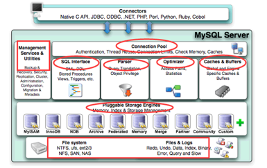

# 1. MySQL的基础架构

1. 连接层：
    - 客户端和连接服务，包含本地socket通信和大多数基于客户端服务器端工具的类似与TCP/IP通信，
   - 主要完成：连接处理，授权认证及相关方案，使用线程池，基于SSL安全连接，连接池：
2. sql层：
    - 核心服务功能：SQL接口，缓存查询，SQL分析和优化，内置函数执行，跨存储引擎的功能，如过程，函数等
3. 引擎层：
    - 负责MYSQL中数据的存储和提取，服务器通过API和存储引擎通信，可选择不同引擎
4. 存储层：
    - 数据存储在文件系统上，完成与存储引擎的交互

1. 连接管理与安全验证
   - 每个客户端都会建立一个与服务器连接的线程，服务器会有一个线程池来管理这些连接；
   - 如果客户端需要连接到MYSQL数据库还需要进行验证，包括用户名、密码、主机信息等
    
2. 解析器
    - 解析器的作用主要是**分析查询语句**，最终生成解析树；
        - 首先解析器会对查询语句的语法进行分析，分析语法是否有问题。
        - 还有[解析器会查询缓存]，如果在缓存中有对应的语句，就返回查询结果不进行接下来的优化执行操作。
         前提是缓存中的数据没有被修改， 当然如果被修改了也会被清出缓存。
3. 优化器
    - 优化器的作用主要是对[查询语句进行优化操作]，包括[选择合适的索引]，[数据的读取方式]，包括[获取查询的开销信息]，[统计信息]等， 
    - 这也是为什么图中会有优化器指向存储引擎的箭头。之前在别的文章没有看到优化器跟存储引擎之间的关系，
      在这里我个人的理解是因为优化器需要通过存储引擎获取查询的大致数据和统计信息。
4. 执行器
    - 执行器包括[执行查询语句，返回查询结果，生成执行计划]包括与存储引擎的一些处理操作

# 2 数据库的范式
## 2.1概念：
 创建表的规则，指导后期设计表的规则，一般满足三范式即可，
 - 还有巴斯-科德范式（BCNF）:
 - 第四范式（4NF）
 - 第五范式（5NF,完美范式）

## 2.2 数据库的三范式：
- 第一范式（1NF）:原子性
    - 表中每一列都是不可分隔的原子数据项，一个字段防止一个信息，表中[每一列都不可再拆分]，如果不是查询数据还需要进一步处理，影响效率
- 第二范式（2NF）:
    - 要求数据库表中每个记录都必须可以被唯一区分，选取一个能区分每个实体属性作为其唯一标识，
      即实体的属性完全依赖与主关键字, 如果不满足第二范式，数据会冗余，相同数据无法区分
    - **一张表只描述一件事**
- 第三范式（3NF）:
在2NF的基础上，任何非主属性不依赖于其他非主属性（在2NF上消除传递依赖），3NF是2NF上的一个子集，既满足3NF,又满足2NF，即3NF要求一个关系中不包含在其他关系已包含的非主关键字的信息；外键必须用主键做参考
三范式的好处：
1.减少数据的冗余
2.减少后期代码的工作量
三范式小结：
1NF:原子性 每列不可分割
2NF:不产生局部依赖，每列都完全依赖于主键，一张表值描述一件事
3NF：不产生传递依赖，所有列都直接依赖于主键，用外键关联（外键来源于其他主键）
反三范式：
为提高数据的性能增加冗余字段，提高查询性能，
能够一次查询更多信息，不然要分多次才能查询完整信息

2.3 select 语句执行顺序
SQL语句的执行顺序与代码编写顺序并不一样
代码编写顺序
1.select distinct 查询字段
2.From 表名
3.JOIN 表名
4.ON 连接时间
5.Where 查询条件
6.Group by 分组字段
7.Having 分组后条件
8.Order by 排序条件
9.Limit 查询其实位置 查询条数

执行顺序
FROM表名-->ON连接条件-->JOIN表名--->WHERE查询条件---->GROUP BY分组字段-->HAVING分组后条件-->SELECT字段-->ORDER BY排序条件--> LIMIT查询条数

查询来自杭州，且订单数少于2的客户 连接2张彪，保全客户信息左连接
SELECT c.sustomer_id, COUNT(o.order_id),total_orders
FROM tb_customer_c
LEFT JOIN tb_order_o
WHERE c.city = “杭州”
HAVING COUNT(o.order_id) < 2
ORDER BY total_orders DESC
执行顺序
1.先对多表进行关系，根据条件找出符合条件的记录
2.在符合条件的基础上再次对WHERE条件筛选
3.对筛选出来的条件进行分组操作
4.分组完成后，使用HAVING再次筛选出满足条件的记录
5.取所满足条件的记录
6.对取出的记录进行排序
7.最终从取出的记录，获取多少条显示（limit）

2.4 内外连接的区别
内连接概念：
内连接可以整合多张表，获取相关关系或者公共部分的记录，
笛卡尔集：
Select 列名 from 左表  右表；查询的记录是左表*右表
隐式内连接：
Select 列名 from 左表 右表 where 主表.主键=从表.从键
显示内连接：使用INNER JOIN ...ON ,此处可以省略INNER
Select 列名 from 左表 INNER JOIN 右表 ON 主表.主键=从表.从键
注意：显示内连接和隐式内连接的查询结果是一样的

三类内连接：
等值连接：ON A.id=B.id
不等值连接：ON A.id > B.id
自连接：SELECT * FROM A T1 INNER JOIN A T2 ON T1.id=T2.pid

左外连接概念：
外连接分为左外连接和右外连接
左外连接：在内连接的基础上，保证左表中所有记录都出现，
相应记录用NULL匹配 LEFT OUTER JOIN ...ON   OUTER可以省略
Select 列名 from 左表 LEFT JOIN 右表 ON 主表.主键=从表.从键

右外连接概念：
右外连接：在内连接的基础上，保证右表中所有记录都出现，
相应记录用NULL匹配 RIRHT OUTER JOIN ...ON   OUTER可以省略
Select 列名 from 左表 RIRHT JOIN 右表 ON 主表.主键=从表.从键

查询左表中独有数据：左连接 + where B.KEY IS NULL
Select 列名 from tableA A LEFT JOIN tableB B ON A.key = B.key where B.key IS NULL
查询右表中独有数据：右连接 + where A.KEY IS NULL
Selec列名 from tableA A RIGHT JOIN tableB B ON A.key = B.key where A.key IS NULL

全连接概念：FULL JOIN  全连接也就是左连接和右连接的并集
语句1：（mysql默认不支持 FULL JOIN， oracle支持）
Select 列名 from tableA A FULL OUTTER JOIN tableB B ON A.key = B.key
语句2：
Select 列名 from tableA A LEFT JOIN tableB B ON A.key = B.key(左连接)
UNION
Select 列名 from tableA A RIGHT JOIN tableB B ON A.key = B.key(右连接)

查询左、右表中独有数据：左表独有 UNION 右表独有
Select 列名 from tableA A LEFT JOIN tableB B ON A.key = B.key where B.key IS NULL
UNION
Select列名 from tableA A RIGHT JOIN tableB B ON A.key = B.key where A.key IS NULL
2.5 级联操作—外键
级联操作的概念：
在修改和删除主表主键的同时，更新或删除副表的外键值，成为级联操作

ON UPDATE CASCADE --级联更新，主键更新时，外键也会更新
ON DELETE CASCADE--级联删除，主键删除时，从表关联全部数据被直接删除
RISTRICT 和NO ACTION一样：限制子表有关联记录时，父表不能更新
SET NULL:父表在更新或删除是，子表对应字段SET null

示例：
CREATE TABLE employee {
Id INT PRIMARY KEY AUTO_INCREMENT,
NAME VARCHAR(32),
Dep_id INT,
--添加外键约束，并且添加级联更新 和级联删除
CONSTRAINT employee_dep_fk FOREIGN KEY(dep_id) REFERENCES department(id) ON UPDATE CASCADE ON DELETE CASCADE
}
department是主表，
Employee 是子表，id是外键，
