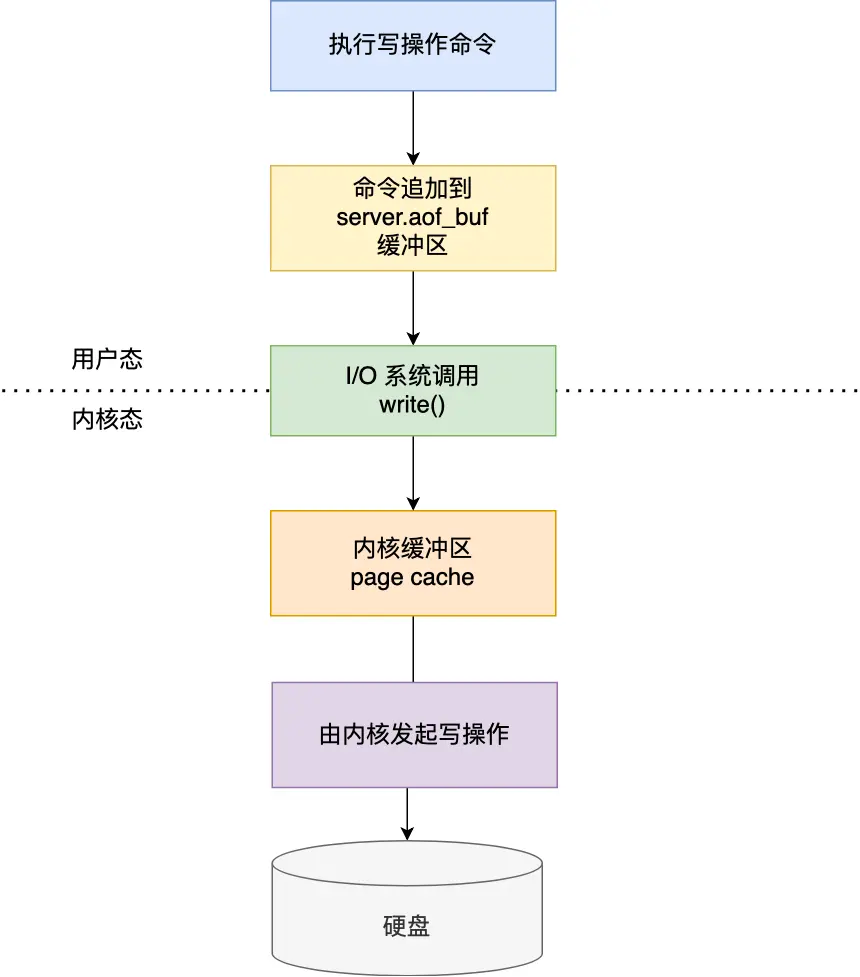
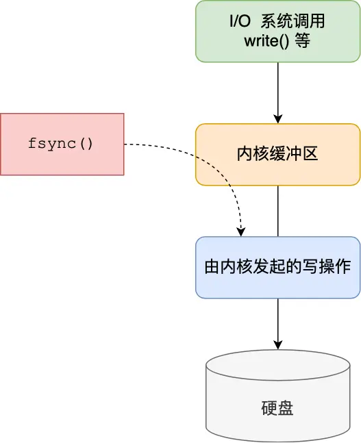
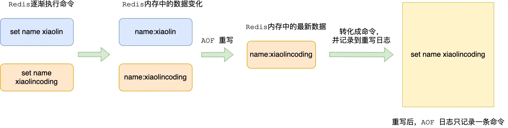
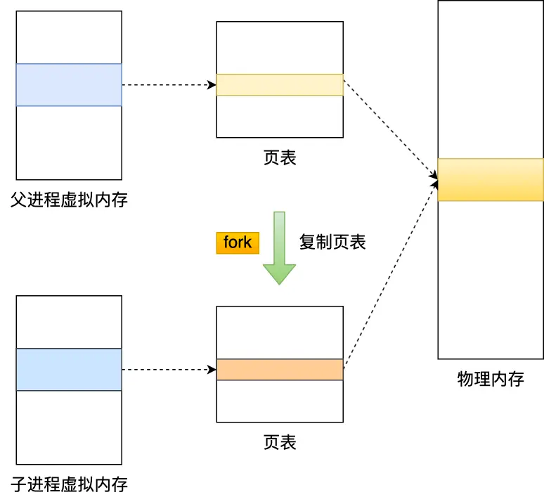
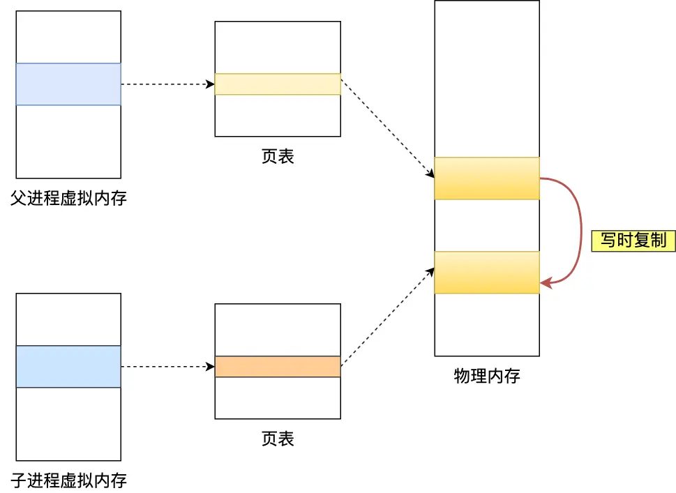
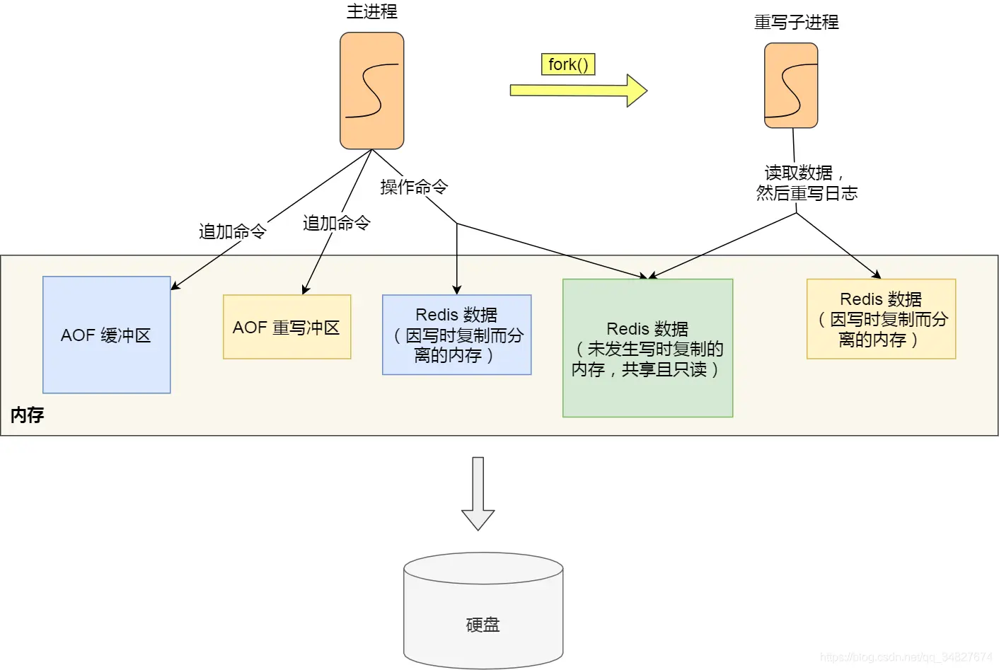
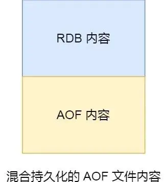

# 1. AOF 相关
## 1.1 AOF 原理
AOF 是一种写后日志，即先执行 Redis 命令，后记录日志


[写日志先后顺序的思考]
1. Redis [为了避免额外开销]，写 AOF 日志的时候不会对些命令语法检查
2. 如果先写日志再执行命令可能会记录错误的命令，恢复数据时，可能出错
3. 只有能执行成功的命令，才会被记录到日志中
4. [命令执行完后写日志不会阻塞当前的写操作]

### AOF的内容说明
```shell
# 举例
set test testValue
```

日志内容
```shell
*3
$3
set 
$4
test
$9
testVaule 
```
> Tips：其中 *3 表示有 3 个部分，$3 表示后面紧跟的键/值有 3 字节。

## AOF的潜在风险
1. 执行写操作命令和记录日志是两个过程，那当 Redis 在还没来得及将命令写入到硬盘时，服务器发生宕机了，这个[数据就会有丢失]的风险。

2. 由于写操作命令执行成功后才记录到 AOF 日志，所以不会阻塞当前写操作命令的执行，但是[可能会给「下一个」命令带来阻塞风险]。
   因为将命令写入到日志的这个操作也是在主进程完成的（执行命令也是在主进程），也就是说这两个操作是同步的。


如果在将日志内容写入到硬盘时，服务器的[硬盘的 I/O 压力太大]，就会导致写硬盘的速度很慢，进而阻塞住了，也就会导致后续的命令无法执行。

认真分析一下，其实这两个风险都有一个共性，都跟「 [AOF 日志写回硬盘的时机]」有关。

1. 如果刚执行完，日志没写就宕机，数据就有[丢失风险]
2. 在日志文件写入磁盘时，磁盘写压力大，[会导致写盘慢，后续的操作也无法执行]

3. 文件系统本身对文件大小有限制，无法保存过大的文件
4. 如果文件太大，之后再往里面追加命令记录的话，效率也会变低
5. 如果发生宕机，AOF 中记录的命令要一个个被重新执行，恢复起来缓慢影响业务

## AOF写入日志的过程
redis写入AOF的过程


我先来具体说说：
1. Redis 执行完写操作命令后，会将命令追加到 `server.aof_buf` 缓冲区；
2. 然后通过 write() 系统调用，将 aof_buf  缓冲区的数据写入到 AOF 文件，此时数据并没有写入到硬盘，而是拷贝到了内核缓冲区 page cache，
   等待内核将数据写入硬盘；
3. 具体[内核缓冲区的数据什么时候写入到硬盘，由内核决定]。

Redis 提供了 3 种写回硬盘的策略，控制的就是上面说的第三步的过程，即调用write的过程。

## AOF三种写入硬盘的机制
- **Always**，这个单词的意思是「总是」，所以它的意思是每次写操作命令执行完后，[同步将 AOF 日志数据写回硬盘]；
- **Everysec**，这个单词的意思是「每秒」，所以它的意思是每次写操作命令执行完后，[先将命令写入到 AOF 文件的内核缓冲区，
  然后每隔一秒将缓冲区里的内容写回到硬盘]；
- **No**，意味着不由 Redis 控制写回硬盘的时机，转交给操作系统控制写回的时机，也就是每次写操作命令执行完后，
  先将命令[写入到 AOF 文件的内核缓冲区，再由操作系统决定何时将缓冲区内容写回硬盘]。

这 3 种写回策略都无法能完美解决「主进程阻塞」和「减少数据丢失」的问题，因为两个问题是对立的，偏向于一边的话，就会要牺牲另外一边，原因如下：
- Always 策略的话，可以最大程度保证数据不丢失，但是由于它每执行一条写操作命令就同步将 AOF 内容写回硬盘，所以是不可避免会影响主进程的性能；
- No 策略的话，是交由操作系统来决定何时将 AOF 日志内容写回硬盘，相比于 Always 策略性能较好，但是操作系统写回硬盘的时机是不可预知的，如果 AOF 日志内容没有写回硬盘，一旦服务器宕机，就会丢失不定数量的数据。
- Everysec 策略的话，是折中的一种方式，避免了 Always 策略的性能开销，也比 No 策略更能避免数据丢失，当然如果上一秒的写操作命令日志没有写回到硬盘，发生了宕机，这一秒内的数据自然也会丢失。


大家根据自己的业务场景进行选择：
- 如果要高性能，就选择 No 策略；
- 如果要高可靠，就选择 Always 策略；
- 如果允许数据丢失一点，但又想性能高，就选择 Everysec 策略。

## AOF三种写入策略的机制
深入到源码后，你就会发现这三种策略只是在控制 `fsync()` 函数的调用时机。

当应用程序向文件写入数据时，内核通常先将数据复制到内核缓冲区中，然后排入队列，然后由内核决定何时写入硬盘。



如果想要应用程序向文件写入数据后，能立马将数据同步到硬盘，就可以调用 `fsync()` 函数，这样内核就会将内核缓冲区的数据直接写入到硬盘，
等到硬盘写操作完成后，该函数才会返回。

- Always 策略就是每次写入 AOF 文件数据后，就执行 fsync() 函数；
- Everysec 策略就会创建一个异步任务来执行 fsync() 函数；
- No 策略就是永不执行 fsync() 函数;

## 为什么AOF日志需要重写？
AOF 日志是一个文件，随着执行的写操作命令越来越多，文件的大小会越来越大。

如果当 AOF 日志文件过大就会[带来性能问题]，比如重启 Redis 后，[需要读 AOF 文件的内容以恢复数据，如果文件过大，整个恢复的过程就会很慢]。

所以，Redis 为了避免 AOF 文件越写越大，提供了 **AOF 重写机制**，当 AOF 文件的大小超过所设定的阈值后，Redis 就会启用 AOF 重写机制，来压缩 AOF 文件。

AOF 重写机制是在重写时，[读取当前数据库中的所有键值对，然后将每一个键值对用一条命令记录到「新的 AOF 文件」]，等到全部记录完后，
就将新的 AOF 文件替换掉现有的 AOF 文件。

举个例子，在没有使用重写机制前，假设前后执行了「*set name xiaolin*」和「*set name xiaolincoding*」这两个命令的话，
就会将这两个命令记录到 AOF 文件。



但是**在使用重写机制后，就会读取 name 最新的 value（键值对） ，然后用一条「set name xiaolincoding」命令记录到新的 AOF 文件**，之前的第一个命令就没有必要记录了，因为它属于「历史」命令，没有作用了。这样一来，一个键值对在重写日志中只用一条命令就行了。

重写工作完成后，就会将新的 AOF 文件覆盖现有的 AOF 文件，这就相当于压缩了 AOF 文件，使得  AOF 文件体积变小了。


然后，在通过 AOF 日志恢复数据时，只用执行这条命令，就可以直接完成这个键值对的写入了。

所以，重写机制的妙处在于，尽管某个键值对被多条写命令反复修改，**[最终也只需要根据这个「键值对」当前的最新状态，然后用一条命令去记录键值对]**，代替之前记录这个键值对的多条命令，这样就减少了 AOF 文件中的命令数量。最后在重写工作完成后，将新的 AOF 文件覆盖现有的 AOF 文件。

### 问题1: 为什么重写 AOF 的时候，不直接复用现有的 AOF 文件，而是先写到新的 AOF 文件再覆盖过去。

因为**[如果 AOF 重写过程中失败了，现有的 AOF 文件就会造成污染**，可能无法用于恢复使用。

所以 AOF 重写过程，先重写到新的 AOF 文件，重写失败的话，就直接删除这个文件就好，不会对现有的 AOF 文件造成影响。


## AOF 重写机制

1. AOF 重写机制就是[在重写时根据数据库的现状创建一个新的 AOF 文件]，然后对每一个键值对用一条命令记录它的写入
2. AOF 文件是以追加的方式，逐一记录接收到的写命令的，AOF 文件会记录相应的多条命令
3. 重写机制具有 [多变一] 功能，旧日志文件中的多条命令，在重写后的新日志中变成了一条命令

> Tips：举例：对一个列表先后做了 6 次修改操作后，列表的最后状态是[“D”, “C”, “N”]，此时，只用 LPUSH u:list “N”, “C”, "D"
> 这一条命令就能实现该数据的恢复，这就节省了五条命令的空间。

 
## AOF 重写机制引发的阻塞思考


1. 重写过程是由后台子进程 bgrewriteaof 来完成的，不会阻塞主线程
2. 一个拷贝：每次执行重写时，主线程 fork 出后台的 bgrewriteaof 子进程，
   bgrewriteaof 子进程就可以在不影响主线程的情况下，逐一把拷贝的数据写成操作，记入重写日志
3. 两处日志：如果有写操作，
   第一处日志就是指正在使用的 AOF 日志，Redis 会把这个操作写到它的缓冲区，即使宕机了，
   Ω这个 AOF 日志的操作仍然是齐全的，可以用于恢复第二处日志，就是指新的 AOF 重写日志，
   这个操作也会被写到重写日志的缓冲区，重写日志也不会丢失最新的操作

## AOF的后台重写
写入 AOF 日志的操作虽然是在主进程完成的，因为它写入的内容不多，所以一般不太影响命令的操作。

但是在触发 AOF 重写时，比如当 AOF 文件大于 64M 时，就会对 AOF 文件进行重写，这时是需要读取所有缓存的键值对数据，
并为每个键值对生成一条命令，然后将其写入到新的 AOF 文件，重写完后，就把现在的 AOF 文件替换掉。

这个过程其实是很耗时的，所以[重写的操作不能放在主进程里]。

所以，Redis 的**重写 AOF 过程是由后台子进程 *bgrewriteaof* 来完成的**，这么做可以达到两个好处：
- 子进程进行 AOF 重写期间，主进程可以继续处理命令请求，从而避免阻塞主进程；
- [子进程带有主进程的数据副本]（*数据副本怎么产生的后面会说*），这里使用子进程而不是线程，因为如果是使用线程，
  多线程之间会共享内存，那么在修改共享内存数据的时候，需要通过[加锁]来保证数据的安全，而这样就会降低性能。
  而使用子进程，创建子进程时，父子进程是共享内存数据的，不过这个共享的内存只能以只读的方式，而当父子进程任意一方修改了该共享内存，
  就会发生「写时复制」，于是父子进程就有了[独立的数据副本]，就不用加锁来保证数据安全。


子进程是怎么拥有主进程一样的数据副本的呢？

主进程在通过 `fork` 系统调用生成  bgrewriteaof 子进程时，操作系统会把主进程的「**页表**」复制一份给子进程，
这个页表记录着[虚拟地址和物理地址映射关系]，而不会复制物理内存，也就是说，两者的虚拟空间不同，但其对应的[物理空间是同一个]。



这样一来，子进程就共享了父进程的物理内存数据了，这样能够**[节约物理内存资源]**，页表对应的页表项的属性会标记该物理内存的权限为**[只读]**。

不过，当父进程或者子进程在向这个内存发起写操作时，CPU 就会触发**缺页中断**，这个缺页中断是由于违反权限导致的，
然后操作系统会在「缺页异常处理函数」里进行**物理内存的复制**，并[重新设置其内存映射关系]，将父子进程的内存读写权限设置为**可读写**，
最后才会对内存进行写操作，这个过程被称为「**写时复制 (*Copy On Write*)**」。



写时复制顾名思义，**在发生写操作的时候，操作系统才会去复制物理内存**，这样是为了防止 fork 创建子进程时，由于物理内存数据的复制时间过长而
导致父进程长时间阻塞的问题。

当然，操作系统复制父进程页表的时候，父进程也是阻塞中的，不过页表的大小相比实际的物理内存小很多，所以[通常复制页表的过程是比较快的]。

不过，如果父进程的内存数据非常大，那自然页表也会很大，这时父进程在通过 fork 创建子进程的时候，阻塞的时间也越久。

所以，有两个阶段会导致阻塞父进程：
- [创建子进程的途中]，由于要复制父进程的页表等数据结构，阻塞的时间跟页表的大小有关，页表越大，阻塞的时间也越长；
- 创建完子进程后，如果子进程或者父进程修改了共享数据，就会[发生写时复制]，这期间会拷贝物理内存，如果内存越大，自然阻塞的时间也越长；


触发重写机制后，主进程就会创建重写 AOF 的子进程，此时父子进程共享物理内存，重写子进程只会对这个内存进行只读，
重写 AOF 子进程会读取数据库里的所有数据，并逐一把内存数据的键值对转换成一条命令，再将命令记录到重写日志（新的 AOF 文件）。

但是子进程重写过程中，主进程依然可以正常处理命令。

如果此时**主进程修改了已经存在 key-value，就会发生写时复制，注意这里只会复制主进程修改的物理内存数据，没修改物理内存还是与子进程共享的**。

所以如果这个阶段修改的是一个 bigkey，也就是数据量比较大的 key-value 的时候，这时[复制的物理内存数据的过程就会比较耗时，有阻塞主进程的风险]。

还有个问题，重写 AOF 日志过程中，如果主进程修改了已经存在 key-value，此时这个 key-value 数据在子进程的内存数据就跟主进程的内存数据不一致了，这时要怎么办呢？

为了解决这种数据不一致问题，Redis 设置了一个 **AOF 重写缓冲区**，这个缓冲区在创建 bgrewriteaof 子进程之后开始使用。

在重写 AOF 期间，当 Redis 执行完一个写命令之后，它会**同时将这个写命令写入到「AOF 缓冲区」和「AOF 重写缓冲区」**。



也就是说，在 bgrewriteaof 子进程执行 AOF 重写期间，主进程需要执行以下三个工作：
- 执行客户端发来的命令；
- 将执行后的写命令追加到「AOF 缓冲区」；
- 将执行后的写命令追加到「AOF 重写缓冲区」；


当子进程完成 AOF 重写工作（*扫描数据库中所有数据，逐一把内存数据的键值对转换成一条命令，再将命令记录到重写日志*）后，
会向主进程发送一条信号，信号是进程间通讯的一种方式，且是异步的。

主进程收到该信号后，会调用一个信号处理函数，该函数主要做以下工作：
- 将 [AOF 重写缓冲区中的所有内容追加到新的 AOF 的文件中，使得新旧两个 AOF 文件所保存的数据库状态一致；]
- 新的 AOF 的文件进行改名，覆盖现有的 AOF 文件。


信号函数执行完后，主进程就可以继续像往常一样处理命令了。

在整个 AOF 后台重写过程中，[除了发生写时复制会对主进程造成阻塞，还有信号处理函数执行时也会对主进程造成阻塞]，在其他时候，AOF 后台重写都不会阻塞主进程。


## AOF 存在的问题
### 1.内存开销
由图1可以看到，在AOFRW期间，主进程会将fork之后的数据变化写进aof_rewrite_buf中，
aof_rewrite_buf和aof_buf中的内容绝大部分都是重复的，因此这将带来额外的内存冗余开销。
在Redis INFO中的aof_rewrite_buffer_length字段可以看到当前时刻aof_rewrite_buf占用的内存大小。
如下面显示的，在高写入流量下aof_rewrite_buffer_length几乎和aof_buffer_length占用了同样大的内存空间，几乎浪费了一倍的内存。

```
aof_pending_rewrite:0
 
aof_buffer_length:35500
 
aof_rewrite_buffer_length:34000
 
aof_pending_bio_fsync:0
```

当aof_rewrite_buf占用的内存大小超过一定阈值时，我们将在Redis日志中看到如下信息。
可以看到，aof_rewrite_buf占用了100MB的内存空间且主进程和子进程之间传输了2135MB的数据（
子进程在通过pipe读取这些数据时也会有内部读buffer的内存开销）。 对于内存型数据库Redis而言，这是一笔不小的开销。
```
3351:M 25 Jan 2022 09:55:39.655 * Background append only file rewriting started by pid 6817
3351:M 25 Jan 2022 09:57:51.864 * AOF rewrite child asks to stop sending diffs.
6817:C 25 Jan 2022 09:57:51.864 * Parent agreed to stop sending diffs. Finalizing AOF...
6817:C 25 Jan 2022 09:57:51.864 * Concatenating 2135.60 MB of AOF diff received from parent.
3351:M 25 Jan 2022 09:57:56.545 * Background AOF buffer size: 100 MB
```
### 2. CPU开销
CPU的开销主要有三个地方，分别解释如下：

1. 在AOFRW期间，主进程需要花费CPU时间向aof_rewrite_buf写数据，并[使用eventloop事件循环向子进程发送aof_rewrite_buf中的数据]：
2. 在子进程执行重写操作的后期，[会循环读取pipe]中主进程发送来的增量数据，然后追加写入到临时AOF文件：
3. 在子进程完成重写操作后，主进程会在[backgroundRewriteDoneHandler] 中进行收尾工作。
   其中一个任务就是将在重写期间aof_rewrite_buf中没有消费完成的数据写入临时AOF文件。
   如果aof_rewrite_buf中遗留的数据很多，这里也将消耗CPU时间。
   
AOFRW带来的CPU开销可能会造成Redis在执行命令[时出现RT上的抖动，甚至造成客户端超时的问题]。

### 3. 磁盘IO开销

如前文所述，在AOFRW期间，主进程除了[会将执行过的写命令写到aof_buf之外，还会写一份到aof_rewrite_buf中。]
aof_buf中的数据最终会被写入到当前使用的旧AOF文件中，产生磁盘IO。
同时，aof_rewrite_buf中的数据也会被写入重写生成的新AOF文件中，产生磁盘IO。因此，[同一份数据会产生两次磁盘IO]。

## AOF的校验机制

AOF 校验机制是 Redis 在启动时对 AOF 文件进行检查，以判断文件是否完整，是否有损坏或者丢失的数据。这个机制的原理其实非常简单，
就是通过使用一种叫做 [校验和（checksum）] 的数字来验证 AOF 文件。这个校验和是通过对整个 AOF 文件内容进行[CRC64] 算法计算得出的数字。
如果文件内容发生了变化，那么校验和也会随之改变。因此，Redis 在启动时会比较计算出的校验和与文件末尾保存的校验和（ 计算的时候会把最后一
行保存校验和的内容给忽略点），从而判断 AOF 文件是否完整。如果发现文件有问题，Redis 就会拒绝启动并提供相应的错误信息。
AOF 校验机制十分简单有效，可以提高 Redis 数据的可靠性。类似地，RDB 文件也有类似的校验机制来保证 RDB 文件的正确性，


# RDB
1.1 持久化过程中保存的内容?
-  将当前数据状态进行保存，快照形式，存储数据结构，存储格式简单，关注点在数据
-  将数据操作过程进行保存，日志形式，存储操作过程，存储格式复杂，关注点在过程

1.2 RDB—save
-  手动执行一次的保存操作（save指令会阻塞redis服务器，线上环境不使用）

1.3 RDB—bgsave
-  手动后台执行保存操作（但不是立即执行，防止数据量过大阻塞）
-  谁执行？ 		Redis操作者（用户）；redis服务器控制指令执行
-  什么时间？ 	即时（随机进行）；合理的时间执行
-  做什么？ 		保存数据
   注意：bgsave命令是针对save阻塞问题作出的优化，redis内部所有的涉及到save的命令都是bgsave（save基本被放弃）

1.4 RDB之配置执行
-  反复执行保存指令，忘记了怎么办？ 不知道数据产生了多少变化，何时保存
-  谁执行？ 		redis服务器控制指令执行（基于条件）
   -  什么时间？ 	满足条件
-  做什么？ 		保存数据  
   指定时间内，变化达到多少次才会执行；second与changes相互配合

1.5 RDB之save与bgsave对比
方式	Save	Bgsave
读写	同步	异步
阻塞客户端指令	是	否
额外消耗内存	否	是
启动新进程	否	是

1.6 RDB的特殊启动方式
-  全量复制-----------------------------主从复制的
   -  服务器运行过程中重启-----------debug reload
-  关闭服务器时指定保存数据-----shutdown save

## 2. 执行快照时数据能被修改吗？可以 写时复制--copy on write
那问题来了，执行 bgsave 过程中，由于是交给子进程来构建 RDB 文件，主线程还是可以继续工作的，此时主线程可以修改数据吗？

如果不可以修改数据的话，那这样性能一下就降低了很多。如果可以修改数据，又是如何做到到呢？

直接说结论吧，执行 bgsave 过程中，Redis 依然**可以继续处理操作命令**的，也就是数据是能被修改的。

那具体如何做到到呢？关键的技术就在于**写时复制技术（Copy-On-Write, COW）。**

执行 bgsave 命令的时候，会通过 `fork()` 创建子进程，此时子进程和父进程是共享同一片内存数据的，因为创建子进程的时候，
会复制父进程的页表，但是页表指向的物理内存还是一个。


只有在发生修改内存数据的情况时，物理内存才会被复制一份。


这样的目的是为了减少创建子进程时的性能损耗，从而加快创建子进程的速度，毕竟创建子进程的过程中，是会阻塞主线程的。

所以，创建 bgsave 子进程后，由于共享父进程的所有内存数据，于是就可以直接读取主线程（父进程）里的内存数据，并将数据写入到 RDB 文件。

当主线程（父进程）对这些共享的内存数据也都是只读操作，那么，主线程（父进程）和 bgsave 子进程相互不影响。

但是，如果主线程（父进程）要**修改共享数据里的某一块数据**（比如键值对 `A`）时，就会发生写时复制，于是这块数据的**物理内存就会被复制一份（键值对 `A'`）**，然后**主线程在这个数据副本（键值对 `A'`）进行修改操作**。与此同时，**bgsave 子进程可以继续把原来的数据（键值对 `A`）写入到 RDB 文件**。

就是这样，Redis 使用 bgsave 对当前内存中的所有数据做快照，这个操作是由 bgsave 子进程在后台完成的，执行时不会阻塞主线程，这就使得主线程同时可以修改数据。

细心的同学，肯定发现了，bgsave 快照过程中，如果主线程修改了共享数据，**发生了写时复制后，RDB 快照保存的是原本的内存数据**，而主线程刚修改的数据，是没办法在这一时间写入 RDB 文件的，只能交由下一次的 bgsave 快照。

所以 Redis 在使用 bgsave 快照过程中，如果主线程修改了内存数据，不管是否是共享的内存数据，RDB 快照都无法写入主线程刚修改的数据，因为此时主线程（父进程）的内存数据和子进程的内存数据已经分离了，子进程写入到 RDB 文件的内存数据只能是原本的内存数据。

如果系统恰好在 RDB 快照文件创建完毕后崩溃了，那么 Redis 将会丢失主线程在快照期间修改的数据。

另外，写时复制的时候会出现这么个极端的情况。

在 Redis 执行 RDB 持久化期间，刚 fork 时，主进程和子进程共享同一物理内存，但是途中主进程处理了写操作，修改了共享内存，
于是当前被修改的数据的物理内存就会被复制一份。

那么极端情况下，**[如果所有的共享内存都被修改，则此时的内存占用是原先的 2 倍。]**

所以，针对写操作多的场景，我们要留意下快照过程中内存的变化，防止内存被占满了。

## RDB 和 AOF 合体

尽管 RDB 比 AOF 的数据恢复速度快，但是快照的频率不好把握：

- 如果频率太低，两次快照间一旦服务器发生宕机，就可能会比较多的数据丢失；
- 如果频率太高，频繁写入磁盘和创建子进程会带来额外的性能开销。

那有没有什么方法不仅有 RDB 恢复速度快的优点和，又有 AOF 丢失数据少的优点呢？

当然有，那就是将 RDB 和 AOF 合体使用，这个方法是在 Redis 4.0 提出的，该方法叫**混合使用 AOF 日志和内存快照**，也叫混合持久化。

如果想要开启混合持久化功能，可以在 Redis 配置文件将下面这个配置项设置成 yes：

```plain
aof-use-rdb-preamble yes
```

混合持久化工作在 **AOF 日志重写过程**。

当开启了混合持久化时，在 AOF 重写日志时，`fork` 出来的重写子进程会先将与主线程共享的内存数据以 RDB 方式写入到 AOF 文件，然后主线程处理的操作命令会被记录在重写缓冲区里，重写缓冲区里的增量命令会以 AOF 方式写入到 AOF 文件，写入完成后通知主进程将新的含有 RDB 格式和 AOF 格式的 AOF 文件替换旧的的 AOF 文件。

也就是说，使用了混合持久化，AOF 文件的**前半部分是 RDB 格式的全量数据，后半部分是 AOF 格式的增量数据**。



这样的好处在于，重启 Redis 加载数据的时候，由于前半部分是 RDB 内容，这样**加载的时候速度会很快**。

加载完 RDB 的内容后，才会加载后半部分的 AOF 内容，这里的内容是 Redis 后台子进程重写 AOF 期间，主线程处理的操作命令， 可以使得**数据更少的丢失**。


# redis 大KEY对AOF日志影响
1. Alaways策略时

在使用 Always 策略的时候，主线程在执行完命令后，会把数据写入到 AOF 日志文件，然后会调用 fsync() 函数，
将内核缓冲区的数据直接写入到硬盘，等到硬盘写操作完成后，该函数才会返回。

当使用 Always 策略的时候，如果写入是一个大 Key，[主线程在执行 fsync() 函数的时候，阻塞的时间会比较久]，因为当写入的数据量很大的时候，
数据同步到硬盘这个过程是很耗时的。

2. Everysec 和NO 策略 均不影响
当使用 Everysec 策略的时候，由于是异步执行 fsync() 函数，所以大 Key 持久化的过程（数据同步磁盘）不会影响主线程。

当使用 No 策略的时候，由于永不执行 fsync() 函数，所以大 Key 持久化的过程不会影响主线程

# redis大KEY对AOF重写和RDB的影响

当 AOF 日志写入了很多的大 Key，AOF 日志文件的大小会很大，那么很快就会触发 **AOF 重写机制**。

AOF 重写机制和 RDB 快照（bgsave 命令）的过程，都会分别通过 `fork()` 函数创建一个子进程来处理任务。

在创建子进程的过程中，操作系统会把父进程的「页表」复制一份给子进程，这个页表记录着虚拟地址和物理地址映射关系，而不会复制物理内存，
也就是说，[两者的虚拟空间不同，但其对应的物理空间]是同一个。


这样一来，子进程就共享了父进程的物理内存数据了，这样能够节约物理内存资源，页表对应的页表项的属性会标记该物理内存的权限为**只读**。

随着 Redis 存在越来越多的大 Key，那么 Redis 就会占用很多内存，对应的页表就会越大。

在通过  `fork()`  函数创建子进程的时候，虽然不会复制父进程的物理内存，但是**内核会把父进程的页表复制一份给子进程，如果页表很大，
那么这个复制过程是会很耗时的，那么在执行 fork 函数的时候就会发生阻塞现象**。

而且，fork 函数是由 Redis 主线程调用的，如果 [fork 函数发生阻塞]，那么意味着就会阻塞 Redis 主线程。由于 Redis 执行命令是在主线程处理的，
所以当 Redis 主线程发生阻塞，就无法处理后续客户端发来的命令。

我们可以执行 `info` 命令获取到 latest_fork_usec 指标，表示 Redis 最近一次 fork 操作耗时。

```sql
# 最近一次 fork 操作耗时
latest_fork_usec:315
```
如果 fork 耗时很大，比如超过 1 秒，则需要做出优化调整：
- 单个实例的内存占用控制在 10 GB 以下，这样 fork 函数就能很快返回。
-  如果 Redis 只是当作纯缓存使用，不关心 Redis 数据安全性问题，可以考虑关闭 AOF 和 AOF 重写，这样就不会调用 fork 函数了。
- 在主从架构中，要适当调大 repl-backlog-size，避免因为  repl_backlog_buffer 不够大，导致主节点频繁地使用全量同步的方式，全量同步的时候，是会创建 RDB 文件的，也就是会调用 fork 函数。


> 那什么时候会发生物理内存的复制呢？


当父进程或者子进程在向共享内存发起写操作时，CPU 就会触发**缺页中断**，这个缺页中断是由于违反权限导致的，然后操作系统会在「缺页异常处理函数」里进行物理内存的复制，并重新设置其内存映射关系，将父子进程的内存读写权限设置为可读写，最后才会对内存进行写操作，这个过程被称为「**写时复制 (Copy On Write)**」。


写时复制顾名思义，在发生写操作的时候，操作系统才会去复制物理内存，这样是为了防止 fork 创建子进程时，由于物理内存数据的复制时间过长而导致父进程长时间阻塞的问题。

如果创建完子进程后，**父进程对共享内存中的大 Key 进行了修改，那么内核就会发生写时复制，会把物理内存复制一份，由于大 Key 占用的物理内存是比较大的，那么在复制物理内存这一过程中，也是比较耗时的，于是父进程（主线程）就会发生阻塞**。

所以，有两个阶段会导致阻塞父进程：

- 创建子进程的途中，由于要复制父进程的页表等数据结构，阻塞的时间跟页表的大小有关，页表越大，阻塞的时间也越长；
- 创建完子进程后，如果子进程或者父进程修改了共享数据，就会发生写时复制，这期间会拷贝物理内存，如果内存越大，自然阻塞的时间也越长；

这里额外提一下，如果 **Linux 开启了内存大页，会影响 Redis 的性能的**。

Linux 内核从 2.6.38 开始支持内存大页机制，该机制支持 2MB 大小的内存页分配，而常规的内存页分配是按 4KB 的粒度来执行的。


如果采用了内存大页，那么即使客户端请求只修改 100B 的数据，[在发生写时复制后]，Redis 也需要拷贝 2MB 的大页。相反，如果是常规内存页机制，只用拷贝 4KB。

两者相比，你可以看到，每次写命令引起的**复制内存页单位放大了 512 倍，会拖慢写操作的执行时间，最终导致 Redis 性能变慢**。

那该怎么办呢？很简单，关闭内存大页（默认是关闭的）。

禁用方法如下：

```shell
echo never >  /sys/kernel/mm/transparent_hugepage/enabled
```


## 总结

当 AOF 写回策略配置了 Always 策略，如果写入是一个大 Key，主线程在执行 fsync() 函数的时候，阻塞的时间会比较久，因为当写入的数据量很大的时候，数据同步到硬盘这个过程是很耗时的。


AOF 重写机制和 RDB 快照（bgsave 命令）的过程，都会分别通过 `fork()` 函数创建一个子进程来处理任务。会有两个阶段会导致阻塞父进程（主线程）：

- 创建子进程的途中，由于要复制父进程的页表等数据结构，阻塞的时间跟页表的大小有关，页表越大，阻塞的时间也越长；
- 创建完子进程后，如果父进程修改了共享数据中的大 Key，就会发生写时复制，这期间会拷贝物理内存，由于大 Key 占用的物理内存会很大，那么在复制物理内存这一过程，就会比较耗时，所以有可能会阻塞父进程。

大 key 除了会影响持久化之外，还会有以下的影响。

- 客户端超时阻塞。由于 Redis 执行命令是单线程处理，[然后在操作大 key 时会比较耗时]，那么就会阻塞 Redis， 从客户端这一视角看，就是很久很久都没有响应。

- 引发网络阻塞。每次获取大 key 产生的网络流量较大，如果一个 key 的大小是 1 MB，每秒访问量为 1000，那么每秒会产生 1000MB 的流量， 这对于普通千兆网卡的服务器来说是灾难性的。

- 阻塞工作线程。[如果使用 del 删除大 key 时，会阻塞工作线程]， 这样就没办法处理后续的命令。

- [内存分布不均]。集群模型在 slot 分片均匀情况下，会出现数据和查询倾斜情况，部分有大 key 的 Redis 节点占用内存多，QPS 也会比较大。

如何避免大 Key 呢？

最好在设计阶段，就把大 key 拆分成一个一个小 key。或者，定时检查 Redis 是否存在大 key，如果该大 key 是可以删除的，不要使用 DEL 命令删除，
因为该命令删除过程会阻塞主线程，而是用 [unlink ]命令（Redis 4.0+）删除大 key，因为该命令的删除过程是异步的，不会阻塞主线程。

