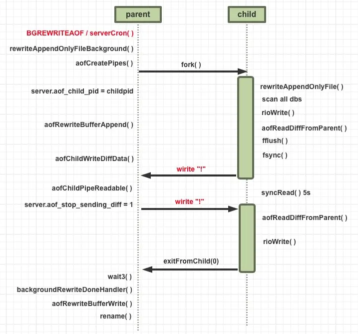
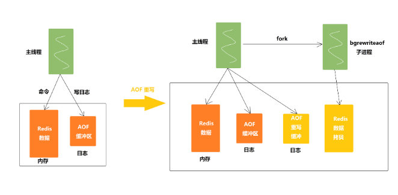

# AOF 相关
##1.

## AOF 原理
AOF 是一种写后日志，即先执行 Redis 命令，后记录日志


[写日志先后顺序的思考]
1. Redis 为了避免额外开销，写 AOF 日志的时候不会对些命令语法检查
2. 如果先写日志再执行命令可能会记录错误的命令，恢复数据时，可能出错
3. 只有能执行成功的命令，才会被记录到日志中
4. 命令执行完后写日志不会阻塞当前的写操作

### AOF的内容说明
```shell
# 举例
set test testValue
```

日志内容
```shell
*3
$3
set 
$4
test
$9
testVaule 
```
> Tips：其中 *3 表示有 3 个部分，$3 表示后面紧跟的键/值有 3 字节。


## AOF的潜在风险
1. 如果刚执行完，日志没写就宕机，数据就有[丢失风险]
2. 在日志文件写入磁盘时，磁盘写压力大，[会导致写盘慢，后续的操作也无法执行]

3. 文件系统本身对文件大小有限制，无法保存过大的文件
4. 如果文件太大，之后再往里面追加命令记录的话，效率也会变低
5. 如果发生宕机，AOF 中记录的命令要一个个被重新执行，恢复起来缓慢影响业务

## AOF 重写机制

1. AOF 重写机制就是[在重写时根据数据库的现状创建一个新的 AOF 文件]，然后对每一个键值对用一条命令记录它的写入
2. AOF 文件是以追加的方式，逐一记录接收到的写命令的，AOF 文件会记录相应的多条命令
3. 重写机制具有 [多变一] 功能，旧日志文件中的多条命令，在重写后的新日志中变成了一条命令

> Tips：举例：对一个列表先后做了 6 次修改操作后，列表的最后状态是[“D”, “C”, “N”]，此时，只用 LPUSH u:list “N”, “C”, "D"这一条命令就能实现该数据的恢复，这就节省了五条命令的空间。

 
## AOF 重写机制引发的阻塞思考



1. 重写过程是由后台子进程 bgrewriteaof 来完成的，不会阻塞主线程
2. 一个拷贝：每次执行重写时，主线程 fork 出后台的 bgrewriteaof 子进程，
   bgrewriteaof 子进程就可以在不影响主线程的情况下，逐一把拷贝的数据写成操作，记入重写日志
3. 两处日志：如果有写操作，
   第一处日志就是指正在使用的 AOF 日志，Redis 会把这个操作写到它的缓冲区，即使宕机了，
   Ω这个 AOF 日志的操作仍然是齐全的，可以用于恢复第二处日志，就是指新的 AOF 重写日志，
   这个操作也会被写到重写日志的缓冲区，重写日志也不会丢失最新的操作

## AOF 存在的问题
### 1.内存开销
由图1可以看到，在AOFRW期间，主进程会将fork之后的数据变化写进aof_rewrite_buf中，
aof_rewrite_buf和aof_buf中的内容绝大部分都是重复的，因此这将带来额外的内存冗余开销。
在Redis INFO中的aof_rewrite_buffer_length字段可以看到当前时刻aof_rewrite_buf占用的内存大小。
如下面显示的，在高写入流量下aof_rewrite_buffer_length几乎和aof_buffer_length占用了同样大的内存空间，几乎浪费了一倍的内存。

```
aof_pending_rewrite:0
 
aof_buffer_length:35500
 
aof_rewrite_buffer_length:34000
 
aof_pending_bio_fsync:0
```

当aof_rewrite_buf占用的内存大小超过一定阈值时，我们将在Redis日志中看到如下信息。
可以看到，aof_rewrite_buf占用了100MB的内存空间且主进程和子进程之间传输了2135MB的数据（
子进程在通过pipe读取这些数据时也会有内部读buffer的内存开销）。 对于内存型数据库Redis而言，这是一笔不小的开销。
```
3351:M 25 Jan 2022 09:55:39.655 * Background append only file rewriting started by pid 6817
3351:M 25 Jan 2022 09:57:51.864 * AOF rewrite child asks to stop sending diffs.
6817:C 25 Jan 2022 09:57:51.864 * Parent agreed to stop sending diffs. Finalizing AOF...
6817:C 25 Jan 2022 09:57:51.864 * Concatenating 2135.60 MB of AOF diff received from parent.
3351:M 25 Jan 2022 09:57:56.545 * Background AOF buffer size: 100 MB
```
### 2. CPU开销
CPU的开销主要有三个地方，分别解释如下：

1. 在AOFRW期间，主进程需要花费CPU时间向aof_rewrite_buf写数据，并[使用eventloop事件循环向子进程发送aof_rewrite_buf中的数据]：
2. 在子进程执行重写操作的后期，[会循环读取pipe]中主进程发送来的增量数据，然后追加写入到临时AOF文件：
3. 在子进程完成重写操作后，主进程会在[backgroundRewriteDoneHandler] 中进行收尾工作。
   其中一个任务就是将在重写期间aof_rewrite_buf中没有消费完成的数据写入临时AOF文件。
   如果aof_rewrite_buf中遗留的数据很多，这里也将消耗CPU时间。
   
AOFRW带来的CPU开销可能会造成Redis在执行命令[时出现RT上的抖动，甚至造成客户端超时的问题]。

### 3. 磁盘IO开销

如前文所述，在AOFRW期间，主进程除了[会将执行过的写命令写到aof_buf之外，还会写一份到aof_rewrite_buf中。]
aof_buf中的数据最终会被写入到当前使用的旧AOF文件中，产生磁盘IO。
同时，aof_rewrite_buf中的数据也会被写入重写生成的新AOF文件中，产生磁盘IO。因此，[同一份数据会产生两次磁盘IO]。