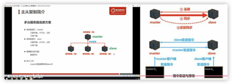
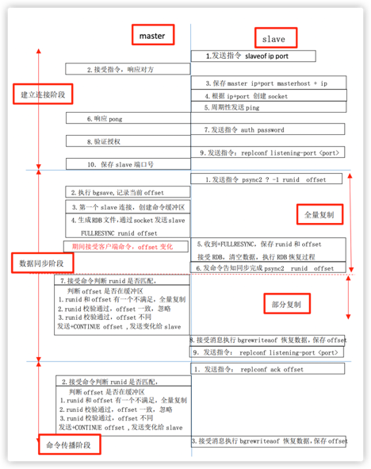
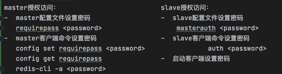
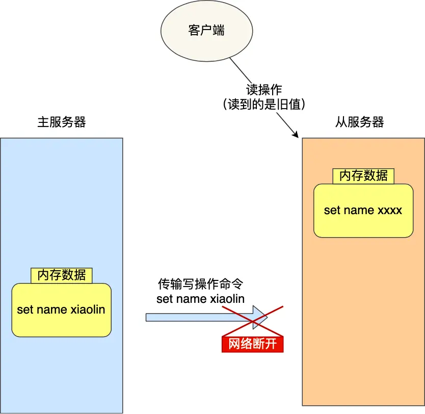
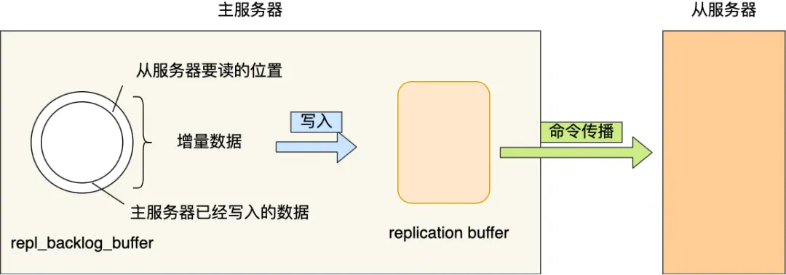
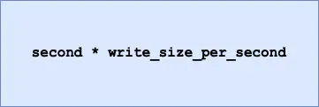

## 1. 主从复制的概念
- 概念
  - 将master中的数据及时，有效的复制到slave中
- 特征：
  - 一个master可以有多个slave， 一个slave只能有一个master
- master：	
   - 写数据
   - 执行写操作，将出现变化的数据写入slave
   - 读数据 
- slave 
  - 读数据 
  - 写数据（禁止） 
  - 读数据（可忽略）
   
## 2. 为什么需要主从复制
- 单机redis的风险与问题
   - 机器故障：（硬盘故障 系统崩溃）
   - 本质：数据丢失，会对业务造成灾难性打击
- 容量瓶颈：内存不足，无限升级内存
  - 本质：穷 硬件条件跟不上 

结论：为避免单点redis服务器故障（业务标注99.999%，一年宕机5.25分钟）;
   准备多台服务器，相互连通，数据复制多个副本存在不同服务器上，连接在一起，并保证数据同步，
实现redis的[**高可用 和数据冗余备份**]

   
## 3. 主从复制的作用
-  读写分离：master写，slave读，提高服务器的读写负载能力
-  负载均衡，基于主从结构，配合[读写分离]，由slave分担master负载，
   通过多个从节点分担数据，读取负载，[提高并发量和吞吐量]
-  故障恢复：master出现问题，slave提供服务，实现故障快速恢复
-  数据冗余：实现数据热备份，是持久化之外的一种数据冗余方式
-  高可用基石：基于主从复制，构建哨兵模式与集群，实现redis高可用方案
 
## 4. 主从复制的过程(3个阶段)
-  建立连接阶段
-  数据同步阶段
-  命令传播阶段
   


## 4.1 建立连接阶段
- 建立连接方法一：[客户端发送命令]
   - slaveof <masterip><masterport> 
   - redis 5.0 之后 replicaof  <masterip> <masterport>

- 建立连接方法二：[启动服务器参数:] redis-server –slaverof <masterip><masterport>
   - redis-server /redis-4.0.0/conf/redis-6380.conf –slaverof 127.0.0.1 6379
   
- 建立连接方法三：[服务器配置]：slaveof <masterip><masterport>
  
   slave系统信息                  				    master系统信息
   master_link_down_since_seconds 			    slave_listening_port(多个)
   masterhost  masterport

- 断开连接方法: 客户端发送 slaveof no one

### 4.1.1 建立连接阶段工作流程：
1. 设置master地址 端口，保存
2. 建立socket连接 
3. 发送ping命令（定时器任务）
4. 身份验证
5. 发送slave端口信息

连接成功
- slave：保存master地址 端口
- master：保存slave端口

## 4.2 数据同步阶段
1. slave初次连接master后，复制master中所有数据到slave
2. 将slave的数据库更新成master当前的数据库状态
   1.	请求同步数据
   2.	创建RDB同步数据
   3.	恢复RDB同步数据
   4.	请求部分同步数据
   5.	恢复部分同步数据
   6.	数据同步过程完成

此时：
- slave具有master端的全部数据，包括RDB过程接受的数据
- master端 保存了当前数据同步的位置offset

> 注意：
1. 复制缓冲区大小设定不合理，会导致数据溢出，如果全量复制周期太长，进行部分复制时，
   已经出现[缓冲区数据丢失情况]，必须进行第二次全量复制，陷入死循环
      ```repl-backlog-size 128mb```
   因此master单机内存[占用主机内存不应过大，50%~70%]，剩下的用于执行bgsave和创建复制缓冲区
2. 为避免slave全量复制，部分复制时服务器响应阻塞或者数据不同步，关闭此时对外服务
   ```slave-server-stale-data yes|no```
3. 数据同步阶段，master发送给slave的信息可以把master看做slave的一个客户端，主动向slave发送命令
4. 多个slave同时对master请求数据同步，[master发送RDB数据增多，会对带宽造成冲击]，master带宽不足，
   因此同步需要根据业务需求适量错峰
5. slave过多时，建议调整拓扑结构，[有一主多从变为树状结构]，中间节点既是master又是slave ，
   此时注意由于层级深度，slave与最顶层的master间数据同步延迟大，[数据一致性变差]，谨慎使用

## 4.3 命令传播阶段
**命令传播阶段概念**
-  当master的状态被修改后，导致主从数据库状态不一致，此时需要让主从同步到一致状态，
   同步的动作就是命令传播
-  master将接受到的数据变更命令发送给slave，slave接受命令后执行
   
命令传播阶段出现断网现象
-  网络闪断闪连          忽略
-  短时间网络中断        部分复制
-  长时间网络中断         全量复制
   
**部分复制的三个核心要素**
-  服务器的运id  run_id  每一台服务器每次运行的身份识别码，每次运行都不一样
   -  组成：40位字符，一个随机的十六进制字符
   -  作用：用于在服务器间传输，识别身份
   -  实现方式：：run_id是服务器启动时自动生成，master首次连接slave时，会发送自己的run_id，slave保存此ID，
      通过info server命令查询节点的run_id

-  主服务器的复制积压缓冲区
   -  是一个FIFO的队列，用于存储服务器执行过的命令，每次传播命令，master都会记录，
      并存储在复制缓冲区，大小[默认是1M，且固定]；如果队列元素大于大长度，最先入队的出队
   -  组成：[偏移量 + 字节值]
   -  工作原理：
      1. 通过offset 区分不同slave当前数据传播的差异
      2. master记录已发送的消息对应的offset
      3. slave 记录已接收信息对应的offset
   - 作用：用于保存master收到的所有指令，仅影响数据变更的指令（set select）；
   - 数据来源：当master收到主客户端的指令时，不仅执行指令，还存储到缓冲区
-  主从服务器的复制偏移量
   -  一个数字，描述复制缓冲区的指令字节位置
   -  分类：
      1. master复制偏移量：记录发送给所有slave的指令字节对应的位置（多个，对应slave）
      2. slave复制偏移量：记录slave接受master发送的指令字节对应的位置（1个）
   -  数据来源：
      1. master：发送一次记录一次
      2. slave：接受一次记录一次
   -  作用：
      同步信息，对比master与slave的差异，当slave断线后，恢复数据使用
## 5. redis 授权访问




## 6. 心跳机制
概念
-  在命令传播阶段，**[master与slave需要进行信息交换，使用心跳机制保证双方在线]**
   
- master心跳
   -  指令： PING
       -  周期：由**repl-ping-slave-period**决定，默认10s
   -  作用：判断slave 是否在线
   -  查询： INFO replication  获取slave最后一次连接时间间隔，lag项维持在0/1视正常 
- slave心跳
   -  指令： REPLCONF ACK [offset]
       -  周期：1s
   -  作用：
      1. 汇报slave的复制偏移量，获取最新数据变更指令；
      2. 判断master是否在线 
- 注意事项
   -  当slave[多数掉线或延迟过高]时，master为保障数据稳定性，拒绝所有信息同步操作
      ```min-slaves-to-write 2; min-slaves-max-lag 8(延迟)```
      当slave数量小于2，或所有slave延迟大于等于8s，强制关闭master写功能，停止同步
   -  slave的数量和延迟 由[REPLICONF ACK offset]命令确认

## 7. 主从复制常见问题
### 7.1 频繁的全量复制（重启导致的全量复制）
- 问题： 随着系统运行，master数据量越来越大，[一旦master重启，runid变化]，导致全部slave全量复制
-  解决方案：
   1. master内部创建master_replid变量，用runid相同策略生成 长41位发送所有slave
   2. master关闭执行 [shutdown save], 进行RDB持久化将runid和offset保存RDB中
      repl_id, repl_offset  通过redis-check-rdb命令可以查看该信息
   3. master重启后加载rdb文件，恢复数据
      重启后，将RDB文件中保存的repl_id repl_offset加载内存中
      master_repl_id = repl_id, master_repl_offset = repl-offset
      可以通过info命令查看该信息
- 作用：
   - 本机保存上次run_id, 重启后恢复该值，使所有slave认为它还是以前的master

### 7.2 频繁的全量复制（缓冲区过小引起的全量复制）
- 问题： 网络环境不佳，出现网络中断，slave不提供服务
- 原因：复制缓冲区过小，断网后slave的offset越界，出发全量复制
-  解决方案：
   1. 修改复制缓冲区大小repl-backlog-size
-  如何计算复制缓冲区大小：
   1. 测算master到slave的重连平均时长second
   2. 获取master平均每秒产生写命令数据总量，write_size_per_second
   3. 最优复制缓冲区空间 = 2 * second * write_size_per_second

### 7.3 频繁的网络中断1
- 问题： master的CPU占用过高，或slave频繁断开连接
- 原因：
  1. slave每秒发送REPLCONF ACK命令到master
  2. slave接到慢查询时（key * hgetall等），会占用大量CPU性能
  3. 此时master每秒调用复制定时函数replicationcron(),比对slave发现长时间没回应
-  结果：
   1. master的各种资源（输出缓冲区，带宽，连接等）严重被占用
-  解决方案：
   1．通过设置合理的超时时间，确认是否释放slave  repl-timeout
   该参数定义了超时时间的阈值（默认60s），超过该值，释放slave
   
### 7.4 频繁的网络中断2
- 问题： slave与master断开
- 原因：
  1. master发送ping指令频度较低
  2. master设定超时时间较短
  3. ping指令在网络中存在丢包
-  解决方案：
   1．提高ping指令发送的频度 ```repl-ping-slave-period```
      超时时间至少是ping指令频度的**5~10倍**，否则slave很容易判定超时
        数据不一致问题
   
- 问题：多个slave获取相同数据不同步
- 原因：
  1. 网络信息不同步，数据发送有延迟
-  解决方案：
   1． 优化主从间网络环境，通常放在同一个机房部署，若使用云服务器需要注意此现象
2. 监控主从节点延迟（offset判断），如果slave延迟过大，暂时屏蔽程序对该slave数据访问
   ```slave-serve-stale-data yes|no```
   开启后进响应info slaveof等少数命令（慎用，除非对数据一致性要求很高）

## 8. 增量复制

主从服务器在完成第一次同步后，就会基于**长连接**进行命令传播。

可是，网络总是不按套路出牌的嘛，说延迟就延迟，说断开就断开。

如果主从服务器间的网络连接断开了，那么就无法进行命令传播了，
这时从服务器的数据就没办法和主服务器保持一致了，客户端就可能从「从服务器」读到旧的数据。



那么问题来了，如果此时断开的网络，又恢复正常了，要怎么继续保证主从服务器的数据一致性呢？

在 Redis 2.8 之前，如果主从服务器在命令同步时出现了网络断开又恢复的情况，
从服务器就会和主服务器[重新进行一次全量复制]，很明显这样的开销太大了，必须要改进一波。

所以，从 Redis 2.8 开始，网络断开又恢复后，从主从服务器会采用**增量复制**的方式继续同步，
也就是只会把网络断开期间主服务器接收到的写操作命令，同步给从服务器。

网络恢复后的增量复制过程如下图：


主要有三个步骤：

- 从服务器在恢复网络后，会发送 psync 命令给主服务器，此时的 psync 命令里的 offset 参数不是 -1；
- 主服务器收到该命令后，然后用 CONTINUE 响应命令告诉从服务器接下来采用增量复制的方式同步数据；
- 然后主服务将主从服务器断线期间，所执行的写命令发送给从服务器，然后从服务器执行这些命令。

那么关键的问题来了，**主服务器怎么知道要将哪些[增量数据]发送给从服务器呢？**

答案藏在这两个东西里：

- **repl_backlog_buffer**，是一个「**环形**」缓冲区，用于主从服务器断连后，从中找到差异的数据；
- **replication offset**，标记上面那个缓冲区的同步进度，主从服务器都有各自的偏移量，
  主服务器使用 master_repl_offset 来记录自己「*写*」到的位置，
  从服务器使用 slave_repl_offset 来记录自己「*读*」到的位置。

那 repl_backlog_buffer 缓冲区是什么时候写入的呢？

在主服务器进行命令传播时，不仅会将写命令发送给从服务器，还会将写命令写入到 repl_backlog_buffer 
缓冲区里，因此 这个缓冲区里会保存着最近传播的写命令。

网络断开后，当从服务器重新连上主服务器时，从服务器会通过 psync 命令将自己的复制偏移量 slave_repl_offset 
发送给主服务器，主服务器根据自己的 master_repl_offset 和 slave_repl_offset 之间的差距，
然后来决定对从服务器执行哪种同步操作：

- 如果判断出从服务器要读取的数据还在 repl_backlog_buffer 缓冲区里， 那么主服务器将采用**增量同步**的方式；
- 相反，如果判断出从服务器要读取的数据已经不存在
  repl_backlog_buffer 缓冲区里，那么主服务器将采用**全量同步**的方式。

当主服务器在 repl_backlog_buffer 中找到主从服务器差异（增量）的数据后，
就会将增量的数据写入到 replication buffer 缓冲区，这个缓冲区我们前面也提到过，
它是缓存将要传播给从服务器的命令。



repl_backlog_buffer 缓行缓冲区的默认大小是 1M，并且由于它是一个环形缓冲区，所以当缓冲区写满后，主服务器继续写入的话，就会覆盖之前的数据。因此，当主服务器的写入速度远超于从服务器的读取速度，缓冲区的数据一下就会被覆盖。

那么在网络恢复时，如果从服务器想读的数据已经被覆盖了，主服务器就会采用全量同步，这个方式比增量同步的性能损耗要大很多。

因此，**为了避免在网络恢复时，主服务器频繁地使用全量同步的方式，我们应该调整下 repl_backlog_buffer 缓冲区大小，尽可能的大一些**，减少出现从服务器要读取的数据被覆盖的概率，从而使得主服务器采用增量同步的方式。

那 repl_backlog_buffer 缓冲区具体要调整到多大呢？

repl_backlog_buffer 最小的大小可以根据这面这个公式估算。



我来解释下这个公式的意思：

- second 为从服务器断线后重新连接上主服务器所需的平均 时间 (以秒计算)。
- write_size_per_second 则是主服务器平均每秒产生的写命令数据量大小。

举个例子，如果主服务器平均每秒产生 1 MB 的写命令，而从服务器断线之后平均要 5 秒才能重新连接主服务器。

那么 repl_backlog_buffer 大小就不能低于 5 MB，否则新写地命令就会覆盖旧数据了。

当然，为了应对一些突发的情况，可以将 repl_backlog_buffer 的大小设置为此基础上的 2 倍，也就是 10 MB。

关于 repl_backlog_buffer 大小修改的方法，只需要修改配置文件里下面这个参数项的值就可以。

```shell
repl-backlog-size 1mb
```

## 总结

主从复制共有三种模式：**全量复制、基于长连接的命令传播、增量复制**。

主从服务器第一次同步的时候，就是采用全量复制，此时主服务器会有两个耗时的地方，分别是生成 RDB 文件和
传输 RDB 文件。为了避免过多的从服务器和主服务器进行全量复制，可以把一部分从服务器升级为「经理角色」，
让它也有自己的从服务器，通过这样可以分摊主服务器的压力。

第一次同步完成后，主从服务器都会维护着一个长连接，主服务器在接收到写操作命令后，就会通过这个连接将写
命令传播给从服务器，来保证主从服务器的数据一致性。

如果遇到网络断开，增量复制就可以上场了，不过这个还跟 [repl_backlog_size] 这个大小有关系。

如果它配置的过小，主从服务器网络恢复时，可能发生「从服务器」想读的数据已经被覆盖了，那么这时就会导致
主服务器采用全量复制的方式。所以为了避免这种情况的频繁发生，要调大这个参数的值，以降低主从服务器断开后
全量同步的概率。


## 9 面试题

### 9.1 Redis 主从节点是长连接还是短链接？

长连接

### 9.2 怎么判断 Redis 某个节点是否正常工作？

Redis 判断节点是否正常工作，基本都是通过互相的 ping-pong 心跳检测机制，如果有一半以上的节点去
ping 一个节点的时候没有 pong 回应，集群就会认为这个节点挂掉了，会断开与这个节点的连接。

Redis 主从节点发送的心跳间隔是不一样的，而且作用也有一点区别：
- Redis 主节点默认[每隔 10 秒]对从节点发送 ping 命令，判断从节点的存活性和连接状态，
  可通过参数 repl-ping-slave-period 控制发送频率。
- Redis 从节点每隔 1 秒发送replconf ack {offset}命令，给主节点上报自身当前的复制偏移量，目的是为了：
   - 实时监测主从节点网络状态；
   - 上报自身复制偏移量，检查复制数据是否丢失，如果从节点数据丢失，再从主节点的复制缓冲区中拉取丢失数据。

### 9.3 主从复制架构中，过期 key 如何处理？

主节点处理了一个 key 或者通过淘汰算法淘汰了一个 key，这个时间主节点[模拟一条 del 命令]发送给从节点，
从节点收到该命令后，就进行删除 key 的操作。

### 9.4 Redis 是同步复制还是异步复制？

Redis 主节点每次收到写命令之后，先写到内部的缓冲区，然后异步发送给从节点。

### 9.5 主从复制中两个 Buffer(replication buffer、repl backlog buffer) 有什么区别？

replication buffer、repl backlog buffer 区别如下：
- 出现的阶段不一样：
   - repl backlog buffer 是在[增量复制阶]段出现，**一个主节点只分配一个 repl backlog buffer**；
   - replication buffer 是在全量复制阶段和增量复制阶段都会出现，**主节点会给每个新连接的从节点，
     分配一个 replication buffer**；
- 这两个 Buffer 都有大小限制的，当缓冲区满了之后，发生的事情不一样：
   - 当 repl backlog buffer 满了，因为是[环形结构]，会直接**覆盖起始位置数据**;
   - 当 replication buffer 满了，会[导致连接断开，删除缓存，从节点重新连接]，**重新开始全量复制**。

### 9.6 如何应对主从数据不一致？
> 为什么会出现主从数据不一致？

主从数据不一致，就是指客户端从从节点中读取到的值和主节点中的最新值并不一致。

之所以会出现主从数据不一致的现象，是**因为主从节点间的命令复制是异步进行的**，
所以无法实现强一致性保证（主从数据时时刻刻保持一致）。

具体来说，在主从节点命令传播阶段，主节点收到新的写命令后，会发送给从节点。但是，
[主节点并不会等到从节点实际执行完命令后，再把结果返回给客户端]，而是主节点自己在本地执行完命令后，
就会向客户端返回结果了。如果从节点还没有执行主节点同步过来的命令，主从节点间的数据就不一致了。

> 如何如何应对主从数据不一致？

第一种方法，尽量保证主从节点间的网络连接状况良好，避免主从节点在不同的机房。

第二种方法，可以开发一个外部程序来监控主从节点间的复制进度。具体做法：

- Redis 的 INFO replication 命令可以查看主节点接收写命令的进度信息（master_repl_offset）
  和从节点复制写命令的进度信息（slave_repl_offset），所以，我们就可以开发一个监控程序，
  先用 INFO replication 命令查到主、从节点的进度，然后，我们用 master_repl_offset 
  减去 slave_repl_offset，这样就能得到从节点和主节点间的复制进度差值了。
- 如果某个从节点的进度差值大于我们预设的阈值，我们可以让客户端不再和这个从节点连接进行数据读取，
  这样就可以减少读到不一致数据的情况。不过，为了避免出现客户端和所有从节点都不能连接的情况，
  我们需要把复制进度差值的阈值设置得大一些。

### 9.7 主从切换如何减少数据丢失？

主从切换过程中，产生数据丢失的情况有两种：
- 异步复制同步丢失
- 集群产生脑裂数据丢失
我们[不可能保证数据完全不丢失，只能做到使得尽量少的数据丢失]。

#### 异步复制同步丢失

对于 Redis 主节点与从节点之间的数据复制，是异步复制的，当客户端发送写请求给主节点的时候，
客户端会返回 ok，接着主节点将写请求异步同步给各个从节点，但是如果此时主节点还没来得及同步
给从节点时发生了断电，那么主节点内存中的数据会丢失。

> 减少异步复制的数据丢失的方案

Redis 配置里有一个参数 min-slaves-max-lag，表示一旦所有的从节点数据复制和同步的延迟都
超过了 min-slaves-max-lag 定义的值，那么[主节点就会拒绝接收任何请求]

假设将 min-slaves-max-lag 配置为 10s 后，根据目前 master->slave 的复制速度，
如果数据同步完成所需要时间超过 10s，就会认为 master 未来宕机后损失的数据会很多，master 
就拒绝写入新请求。这样就能将 master 和 slave 数据差控制在 10s 内，即使 master 
宕机也只是这未复制的 10s 数据。

那么对于客户端，当客户端发现 master 不可写后，我们可以采取降级措施，
将数据暂时写入本地缓存和磁盘中，在一段时间（等 master 恢复正常）后重新写入 master 来保证数据不丢失，
也可以将数据写入 kafka 消息队列，等 master 恢复正常，再隔一段时间去消费 kafka 中的数据，
让将数据重新写入 master。

#### 集群产生脑裂数据丢失

先来理解集群的脑裂现象，这就好比一个人有两个大脑，那么到底受谁控制呢？

那么在 Redis 中，集群脑裂产生数据丢失的现象是怎样的呢？

在 Redis 主从架构中，部署方式一般是「一主多从」，主节点提供写操作，从节点提供读操作。

如果主节点的网络突然发生了问题，它与所有的从节点都失联了，但是此时的主节点和客户端的网络是正常的，
这个客户端并不知道 Redis 内部已经出现了问题，还在照样的向这个失联的主节点写数据（过程 A），
此时这些数据被主节点缓存到了缓冲区里，因为主从节点之间的网络问题，这些数据都是无法同步给从节点的。

这时，哨兵也发现主节点失联了，它就认为主节点挂了（但实际上主节点正常运行，只是网络出问题了），
于是哨兵就会在从节点中选举出一个 leeder 作为主节点，这时集群就有两个主节点了  —— **脑裂出现了**。

这时候网络突然好了，哨兵因为之前已经选举出一个新主节点了，它就会把旧主节点降级为从节点（A），
然后从节点（A）会向新主节点请求数据同步，**因为第一次同步是全量同步的方式，
此时的从节点（A）会清空掉自己本地的数据，然后再做全量同步。
所以，之前客户端在[过程 A 写入的数据就会丢失了，也就是集群产生脑裂数据丢失的问题]**。

总结一句话就是：由于网络问题，集群节点之间失去联系。
主从数据不同步；重新平衡选举，产生两个主服务。等网络恢复，旧主节点会降级为从节点，
再与新主节点进行同步复制的时候，由于会从节点会清空自己的缓冲区，所以导致之前客户端写入的数据丢失了。

> 减少脑裂的数据丢的方案

当主节点发现「从节点下线的数量太多」，或者「网络延迟太大」的时候，那么主节点会禁止写操作，
直接把错误返回给客户端。

在 Redis 的配置文件中有两个参数我们可以设置：

- min-slaves-to-write x，主节点必须要有至少 x 个从节点连接，如果小于这个数，主节点会禁止写数据。
- min-slaves-max-lag x，主从数据复制和同步的延迟不能超过 x 秒，如果超过，主节点会禁止写数据。

我们可以把 min-slaves-to-write 和 min-slaves-max-lag 这两个配置项搭配起来使用，
分别给它们设置一定的阈值，假设为 N 和 T。

这两个配置项组合后的要求是，**主节点连接的从节点中至少有 N 个从节点，「并且」主节点进行数据
复制时的 ACK 消息延迟不能超过 T 秒**，否则，主节点就不会再接收客户端的写请求了。

即使原主节点是假故障，它在假故障期间也无法响应哨兵心跳，也不能和从节点进行同步，
自然也就无法和从节点进行 ACK 确认了。这样一来，min-slaves-to-write 和 min-slaves-max-lag 
的组合要求就无法得到满足，**原主节点就会被限制接收客户端写请求，客户端也就不能在原主节点中写入新数据了**。

**等到新主节点上线时，就只有新主节点能接收和处理客户端请求，此时，新写的数据会被直接写到新主节点中。而原主节点会被哨兵降为从节点，即使它的数据被清空了，也不会有新数据丢失。我再来给你举个例子。**

假设我们将 min-slaves-to-write 设置为 1，把 min-slaves-max-lag 设置为 12s，把哨兵的 down-after-milliseconds 设置为 10s，主节点因为某些原因卡住了 15s，导致哨兵判断主节点客观下线，开始进行主从切换。同时，因为原主节点卡住了 15s，没有一个从节点能和原主节点在 12s 内进行数据复制，原主节点也无法接收客户端请求了。这样一来，主从切换完成后，也只有新主节点能接收请求，不会发生脑裂，也就不会发生数据丢失的问题了。

### 主从如何做到故障自动切换？

主节点挂了，从节点是无法自动升级为主节点的，这个过程需要人工处理，在此期间 Redis 无法对外提供写操作。

此时，Redis 哨兵机制就登场了，哨兵在发现主节点出现故障时，由哨兵自动完成故障发现和故障转移，
并通知给应用方，从而实现高可用性。
