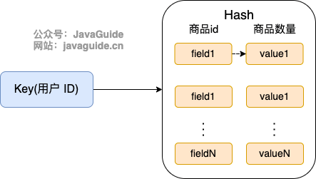
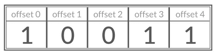
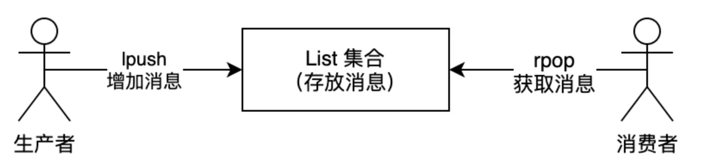
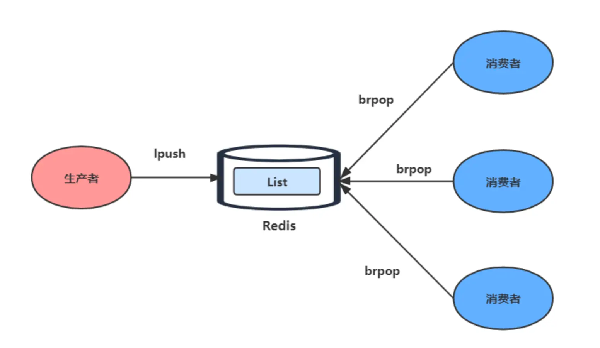

# 1. Redis的应用场景
（1）计数器
对String进行自增自减运算，从而实现计数器功能。Redis 这种内存型数据库的读写性能非常高，很适合存储频繁读写的计数量。
（2）缓存
将热点数据放到内存中，设置内存的最大使用量以及淘汰策略来保证缓存的命中率。
（3）会话缓存
可以使用 Redis 来统一存储多台应用服务器的会话信息。当应用服务器不再存储用户的会话信息，也就不再具有状态，一个用户可以请求任意一个应用服务器，从而更容易实现高可用性以及可伸缩性。
（4）全页缓存（FPC）
除基本的会话token之外，Redis还提供很简便的FPC平台。以Magento为例，Magento提供一个插件来使用Redis作为全页缓存后端。此外，对WordPress的用户来说，Pantheon有一个非常好的插件 wp-redis，这个插件能帮助你以最快速度加载你曾浏览过的页面。
（5）查找表
例如 DNS 记录就很适合使用 Redis 进行存储。查找表和缓存类似，也是利用了 Redis 快速的查找特性。但是查找表的内容不能失效，而缓存的内容可以失效，因为缓存不作为可靠的数据来源。
（6）消息队列(发布/订阅功能)
List 是一个双向链表，可以通过 lpush 和 rpop 写入和读取消息。不过最好使用 Kafka、RabbitMQ 等消息中间件。
（7）分布式锁实现
在分布式场景下，无法使用单机环境下的锁来对多个节点上的进程进行同步。可以使用 Redis 自带的 SETNX 命令实现分布式锁，除此之外，还可以使用官方提供的 RedLock 分布式锁实现。
（8）其它
Set 可以实现交集、并集等操作，从而实现共同好友等功能。ZSet 可以实现有序性操作，从而实现排行榜等功能

# 2. redis 除了做缓存外还可以做什么
1. 分布式锁：通过 Redis 来做分布式锁是一种比较常见的方式。通常情况下，我们都是基于 Redisson 来实现分布式锁。 
2. 限流：一般是通过 Redis + Lua 脚本的方式来实现限流。 
3. 消息队列：Redis 自带的 list 数据结构可以作为一个简单的队列使用。
   Redis 5.0 中增加的 stream 类型的数据结构更加适合用来做消息队列。它比较类似于 Kafka，
   有[主题和消费组]的概念，支持[消息持久化以及 ACK] 机制。
4. 延时队列：Redisson 内置了延时队列（基于 sorted set 实现的）。
5. 分布式 Session ：利用 string 或者 hash 保存 Session 数据，所有的服务器都可以访问。
6. 复杂业务场景：通过 Redis 以及 Redis 扩展（比如 Redisson）提供的数据结构，
   我们可以很方便地完成很多复杂的业务场景比如
   1. 通过 bitmap 统计活跃用户、
   2. 通过 sorted set 维护排行榜。
    
# 3. 存储对象是hash好还是String好

String 存储的是[序列化后的对象数据，存放的是整个对象]。
Hash 是对对象的每个字段单独存储，可以获取部分字段的信息，也可以修改或者添加部分字段，节省网络流量。
如果对象中某些字段[需要经常变动或者经常需要单独查询对象中的个别字段]信息，Hash 就非常适合。

String 存储相对来说[更加节省内存]， 缓存相同数量的对象数据，String 消耗的内存约是 Hash 的一半。
并且，存储具有多层嵌套的对象时也方便很多。如果系统对性能和资源消耗非常敏感的话，
String 就非常适合。在[绝大部分情况，我们建议使用 String 来存储对象数据即可]！

# 4. 购物车是用hash好还是String好？
由于购物车中的商品频繁修改和变动，购物车信息建议[使用 Hash ]存储：
- 用户 id 为 key
- 商品 id 为 field，商品数量为 value


那用户购物车信息的维护具体应该怎么操作呢？
1. 用户添加商品就是往 Hash 里面增加新的 field 与 value；
2. 查询购物车信息就是遍历对应的 Hash；
3. 更改商品数量直接修改对应的 value 值（直接 set 或者做运算皆可）；
4. 删除商品就是删除 Hash 中对应的 field；
5. 清空购物车直接删除对应的 key 即可。

# 5. 使用 Redis 实现一个排行榜怎么做？
Redis 中有一个叫做 sorted set 的数据结构经常被用在各种排行榜的场景，比如直播间送礼物的排行榜、
朋友圈的微信步数排行榜、王者荣耀中的段位排行榜、话题热度排行榜等等。相关的一些 Redis 命令: 
ZRANGE (从小到大排序)、 ZREVRANGE （从大到小排序）、ZREVRANK (指定元素排名)。

# 6. 使用 Set 实现抽奖系统怎么做？
如果想要使用 Set 实现一个简单的抽奖系统的话，直接使用下面这几个命令就可以了：
1. SADD key member1 member2 ...：向指定集合添加一个或多个元素。
2. SPOP key count：随机移除并获取指定集合中一个或多个元素，适合[不允许重复中奖的场景]。
3. SRANDMEMBER key count : 随机获取[指定集合中指定数量的元素]，[适合允许重复中奖的场景]

# 7. 使用 Bitmap 统计活跃用户怎么做？
Bitmap 存储的是连续的二进制数字（0 和 1），通过 Bitmap, 只需要一个 bit 位来表示某个元素对应的值或者
状态，key 就是对应元素本身 。我们知道 8 个 bit 可以组成一个 byte，所以 Bitmap 本身会极大的节省储存空间。
你可以将 Bitmap 看作是一个存储二进制数字（0 和 1）的数组，数组中每个元素的下标叫做 offset（偏移量）



如果想要使用 Bitmap 统计活跃用户的话，可以使用日期（精确到天）作为 key，然后用户 ID 为 offset，
如果当日活跃过就设置为 1。

初始化数据：
```
> SETBIT 20210308 1 1
(integer) 0
> SETBIT 20210308 2 1
(integer) 0
>SETBIT 20210309 1 1
(integer) 0
```
统计 20210308~20210309 总活跃用户数:
```
 > BITOP and desk1 20210308 20210309
(integer) 1
> BITCOUNT desk1
(integer) 1
```
统计 20210308~20210309 在线活跃用户数:
```
> BITOP or desk2 20210308 20210309
(integer) 1
> BITCOUNT desk2
(integer) 2
```


# 8. 使用 HyperLogLog 统计页面 UV 怎么做？

使用 HyperLogLog 统计页面 UV 主要需要用到下面这两个命令：

- `PFADD key element1 element2 ...`：添加一个或多个元素到 HyperLogLog 中。
- `PFCOUNT key1 key2`：获取一个或者多个 HyperLogLog 的唯一计数。

1、将访问指定页面的每个用户 ID 添加到 `HyperLogLog` 中。

```bash
PFADD PAGE_1:UV USER1 USER2 ...... USERn
```

2、统计指定页面的 UV。

```bash
PFCOUNT PAGE_1:UV
```


# 3. 消息队列

消息队列在存取消息时，必须要满足三个需求，分别是**[消息保序、处理重复的消息和保证消息可靠性]**。

Redis 的 [List 和 Stream] 两种数据类型，就可以满足消息队列的这三个需求。我们先来了解下基于 List 的消息队列实现方法，后面在介绍 Stream 数据类型时候，在详细说说 Stream。

*1、如何满足消息保序需求？*

List 本身就是按先进先出的顺序对数据进行存取的，所以，如果使用 List 作为消息队列保存消息的话， 就已经能满足消息保序的需求了。

List 可以使用 LPUSH + RPOP（或者反过来，RPUSH+LPOP）命令实现消息队列。



- 生产者使用 `LPUSH key value[value...]` 将消息插入到队列的头部，如果 key 不存在则会创建一个空的队列再插入消息。

- 消费者使用 `RPOP key` 依次读取队列的消息，先进先出。

不过，在消费者读取数据时，有一个潜在的性能风险点。

在生产者往 List 中写入数据时，List [并不会主动地通知消费者有新消息写入]，如果消费者想要及时处理消息，
就需要在程序中不停地调用 `RPOP` 命令（比如使用一个 while(1) 循环）。如果有新消息写入，RPOP 命令就会返回结果，
否则，RPOP 命令返回空值，再继续循环。

所以，即使没有新消息写入 List，消费者也要[不停地调用 RPOP 命令]，这就会导致消费者程序的 CPU 一直消耗在执行 RPOP 命令上，带来不必要的性能损失。

为了解决这个问题，Redis 提供了 BRPOP 命令。
**BRPOP 命令也称为阻塞式读取，客户端在没有读到队列数据时，自动阻塞，直到有新的数据写入队列，
再开始读取新数据**。和消费者程序自己不停地调用 RPOP 命令相比，这种方式能节省 CPU 开销。


*2、如何处理重复的消息？*

消费者要实现重复消息的判断，需要 2 个方面的要求：

- 每个消息都有一个全局的 ID。
- 消费者要记录已经处理过的消息的 ID。当收到一条消息后，消费者程序就可以对比收到的消息 ID 和记录的已处理过的消息 ID，来判断当前收到的消息有没有经过处理。
  如果已经处理过，那么，消费者程序就不再进行处理了。

但是 **List 并不会为每个消息生成 ID 号，所以我们[需要自行为每个消息生成一个全局唯一 ID]**，
生成之后，我们在用 LPUSH 命令把消息插入 List 时，需要在消息中包含这个全局唯一 ID。

例如，我们执行以下命令，就把一条全局 ID 为 111000102、库存量为 99 的消息插入了消息队列：

```shell
> LPUSH mq "111000102:stock:99"
(integer) 1
```

*3、如何保证消息可靠性？*

当消费者程序从 List 中读取一条消息后，List 就不会再留存这条消息了。所以，如果消费者程序在处理消息的过程出现了故障或宕机，
就会导致消息没有处理完成，那么，消费者程序再次启动后，就[没法再次从 List 中读取消息]了。

为了留存消息，List 类型提供了 `BRPOPLPUSH` 命令，这个命令的**作用是让消费者程序从一个 List 中读取消息，
同时，Redis 会把这个消息再插入到另一个 List（可以叫作备份 List）留存**。

这样一来，如果消费者程序读了消息但没能正常处理，等它重启后，就可以从备份 List 中重新读取消息并进行处理了。

好了，到这里可以知道基于 List 类型的消息队列，满足消息队列的三大需求（消息保序、处理重复的消息和保证消息可靠性）。

- 消息保序：使用 LPUSH + RPOP；
- 阻塞读取：使用 BRPOP；
- 重复消息处理：生产者自行实现全局唯一 ID；
- 消息的可靠性：使用 BRPOPLPUSH

> List 作为消息队列有什么缺陷？

**List 不支持多个消费者消费同一条消息**，因为一旦消费者拉取一条消息后，这条消息就从 List 中删除了，无法被其它消费者再次消费。

要实现一条消息可以被多个消费者消费，那么就要将多个消费者组成一个消费组，使得多个消费者可以消费同一条消息，
但是 **List 类型并[不支持消费组]的实现**。

这就要说起 Redis 从 5.0 版本开始提供的 Stream 数据类型了，Stream 同样能够满足消息队列的三大需求，
而且它还支持「消费组」形式的消息读取。