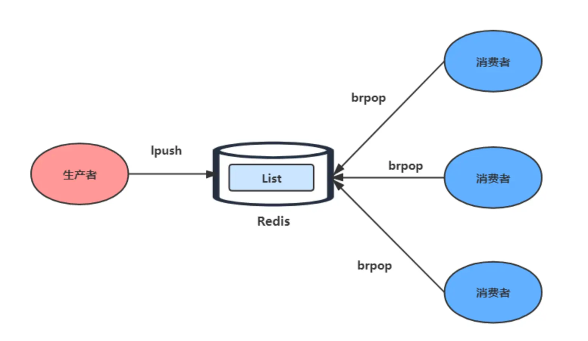

Redis 五种数据类型的应用场景：
- String 类型的应用场景：缓存对象、常规计数、分布式锁、共享 session 信息等。
- List 类型的应用场景：消息队列（有两个问题：1. 生产者需要自行实现全局唯一 ID；2. 不能以消费组形式消费数据）等。
- Hash 类型：缓存对象、购物车等。
- Set 类型：聚合计算（并集、交集、差集）场景，比如点赞、共同关注、抽奖活动等。
- Zset 类型：排序场景，比如排行榜、电话和姓名排序等。

Redis 后续版本又支持四种数据类型，它们的应用场景如下：

-  BitMap（2.2 版新增）：二值状态统计的场景，比如签到、判断用户登陆状态、连续签到用户总数等；
- HyperLogLog（2.8 版新增）：海量数据基数统计的场景，比如百万级网页 UV 计数等；
- GEO（3.2 版新增）：存储地理位置信息的场景，比如滴滴叫车；
- Stream（5.0 版新增）：消息队列，相比于基于 List 类型实现的消息队列，有这两个特有的特性：自动生成全局唯一消息 ID，支持以消费组形式消费数据。

针对 Redis 是否适合做消息队列，关键看你的业务场景：

- 如果你的业务场景足够简单，对于数据丢失不敏感，而且消息积压概率比较小的情况下，把 Redis 当作队列是完全可以的。
- 如果你的业务有海量消息，消息积压的概率比较大，并且不能接受数据丢失，那么还是用专业的消息队列中间件吧。


# String
## 1.命令及基础应用
字符串
- 存储的数据：单个数据，最简单的数据存储类型，也是最常用的数据存储类型
- 存储数据的格式：一个存储空间保存一个数据
- 存储内容：通常使用字符串，如果字符串以整数形式展示，可以作为数字操作使用
  
字符串的常用命令
```shell
set key value # get key  设置指定 key 的值；获取指定 key 的值
mset key1 value1 key2 value2 # mget key1[key2] 设置多个key值；获取多个 key
strlen key  # 获取字符个数字符串长度
append key value    # 追加信息到原始信息后部，如果原始信息存在就追加，否则新建
                    # 尽量选择mset操作多数据，节省空间（即指令的传输时间）
incr key                  #将 key 所储存的值加上1
incrby key increment      #将 key 所储存的值加上给定的增量值
incrbyfloat key increment #将 key 所储存的值加上给定的浮点增量值
decr key                  #将 key 所储存的值减1
decr key increment        #将 key 所储存的值减去给定的增量值
```
注意：
1. String在redis内部默认就是一个字符串，遇到增减操作时会转成整数计算 
2. Redis所有的操作都是原子性的，采用单线程处理所有业务，无需考虑并发
3. 按数值进行操作的数据，如果不能转成数值，或超越上限（LONG）报错
4. 数据最大存储量:[512MB]
5. 数值计算的最大范围: java中long的最大值

字符串的应用
1. redis 应用于各种结构型和非结构型高热度数据访问加速
   - 主页高频访问信息显示控制，例如新浪微博大 V 主页显示粉丝数和微博数量

## string 的内部实现
内部实现主要是 int 和 [**SDS（简单动态字符串）**]
字符串对象的内部编码（encoding）有 3 种 ：int、raw和 embstr。

### long
如果一个字符串对象保存的是整数值，并且这个整数值可以用`long`类型来表示，
那么字符串对象会将整数值保存在字符串对象结构的`ptr`属性里面（将`void*`转换成 long），
并将字符串对象的编码设置为`int`。

### embtr
如果字符串对象保存的是一个字符串，并且这个字符申的长度小于等于 32 字节（redis 2.+版本），
那么字符串对象将使用一个[简单动态字符串（SDS）]来保存这个字符串，并将对象的编码设置为`embstr`，
`embstr`编码是专门用于保存短字符串的一种优化编码方式：


### raw
如果字符串对象保存的是一个字符串，并且这个字符串的长度大于 32 字节（redis 2.+版本），
那么字符串对象将使用一个简单动态字符串（SDS）来保存这个字符串，并将对象的编码设置为`raw`：


### 总结
注意，embstr 编码和 raw 编码的边界在 redis 不同版本中是不一样的：
- redis 2.+ 是 32 字节
- redis 3.0-4.0 是 39 字节
- redis 5.0 是 44 字节

## embstr 和raw的区别
1.相同点
    -`embstr`和`raw`编码都会使用`SDS`来保存值，
2. 不同点
    - `embstr`会[通过一次内存分配函数]来分配[一块连续的内存空间]来保存`redisObject`和`SDS`，
    - `raw`编码会通过[调用两次内存分配函数来分别分配两块空间]来保存`redisObject`和`SDS`。
    
## embstr 的优缺点
Redis 这样做会有很多好处：
- `embstr`编码将创建字符串对象所需的内存分配次数从 `raw` 编码的两次降低为一次；
- 释放 `embstr`编码的字符串对象同样只需要调用一次内存释放函数；
- 因为`embstr`编码的字符串对象的所有数据都保存在一块连续的内存里面可以[更好的利用 CPU 缓存提升性能]。

但是 embstr 也有缺点的：
- 如果字符串的[长度增加需要重新分配内存]时，整个 redisObject 和 sds 都需要重新分配空间，
- **embstr 编码的字符串对象实际上是[只读的]**，redis 没有为 embstr 编码的字符串对象编写任何相应的修改程序。 
  当我们对 embstr 编码的字符串对象执行任何修改命令（例如 append）时，
  程序会先将对象的编码从 [embstr 转换成 raw]，然后再执行修改命令。
  
## SDS 字符串的优势
1. SDS 不仅可以保存文本数据，还可以保存二进制数据。
   因为 SDS 使用 len 属性的值而不是空字符来判断字符串是否结束， 并且 SDS 的所有 API 都会以处理二进制的方式来处理 SDS 存放在 buf[] 数组里的数据。所以 SDS 不光能存放文本数据，而且能保存图片、音频、视频、压缩文件这样的二进制数据。
2. SDS 获取字符串长度的时间复杂度是 O(1)。因为 C 语言的字符串并不记录自身长度，所以获取长度的复杂度为 O(n)；而 SDS 结构里用 len 属性记录了字符串长度，所以复杂度为 O(1)。
3. Redis 的 SDS API 是安全的，拼接字符串不会造成缓冲区溢出。因为 SDS 在拼接字符串之前会检查 SDS 空间是否满足要求，如果空间不够会自动扩容，所以不会导致缓冲区溢出的问题。

## 应用场景
### 1.缓存
使用 String 来缓存对象有两种方式：

- 直接缓存整个对象的 JSON，命令例子： `SET user:1 '{"name":"xiaolin", "age":18}'`。
- 采用将 key 进行分离为 user:ID:属性，采用 MSET 存储，用 MGET 获取各属性值，命令例子： `MSET user:1:name xiaolin user:1:age 18 user:2:name xiaomei user:2:age 20`。

### 2.常规计数
因为 Redis 处理命令是单线程，所以执行命令的过程是原子的。因此 String 数据类型适合计数场景，
比如计算[访问次数、点赞、转发、库存数量]等等。
比如计算文章的阅读量：
```shell
# 初始化文章的阅读量
> SET aritcle:readcount:1001 0
OK
#阅读量+1
> INCR aritcle:readcount:1001
(integer) 1
#阅读量+1
> INCR aritcle:readcount:1001
(integer) 2
#阅读量+1
> INCR aritcle:readcount:1001
(integer) 3
# 获取对应文章的阅读量
> GET aritcle:readcount:1001
"3"
```
### 3.分布式锁
SET 命令有个 NX 参数可以实现「key 不存在才插入」，可以用它来实现分布式锁：
- 如果 key 不存在，则显示插入成功，可以用来表示加锁成功；
- 如果 key 存在，则会显示插入失败，可以用来表示加锁失败。

一般而言，还会对分布式锁加上过期时间，分布式锁的命令如下：

```shell
SET lock_key unique_value NX PX 10000
```
- lock_key 就是 key 键；
- unique_value 是[客户端生成的唯一的标识]；
- NX 代表只在 lock_key 不存在时，才对 lock_key 进行设置操作；
- PX 10000 表示设置 lock_key 的[过期时间为 10s，这是为了避免客户端发生异常而无法释放锁]。

而解锁的过程就是将 lock_key 键删除，但不能乱删，要保证执行操作的客户端就是加锁的客户端。
所以，解锁的时候，我们要先判断锁的 unique_value 是否为加锁客户端，是的话，才将 lock_key 键删除。

可以看到，解锁是有两个操作，这时就[需要 Lua 脚本来保证解锁的原子性]，
因为 Redis 在执行 Lua 脚本时，可以以[原子性]的方式执行，保证了锁释放操作的原子性。

```Lua
// 释放锁时，先比较 unique_value 是否相等，避免锁的误释放
if redis.call("get",KEYS[1]) == ARGV[1] then
    return redis.call("del",KEYS[1])
else
    return 0
end
```

这样一来，就通过使用 SET 命令和 Lua 脚本在 Redis 单节点上完成了分布式锁的加锁和解锁。
### 共享 Session 信息
通常我们在开发后台管理系统时，会使用 Session 来保存用户的会话(登录)状态，
这些 Session 信息会被保存在服务器端，但[这只适用于单系统应用]，如果是分布式系统此模式将不再适用。

例如用户一的 Session 信息被存储在服务器一，但第二次访问时用户一被分配到服务器二，
这个时候服务器并没有用户一的 Session 信息，就会出现需要重复登录的问题 ，问题在于[分布式系统每次会把请求随机分配到不同的服务器]。

分布式系统单独存储 Session 流程图


因此，我们需要借助 Redis 对这些 Session 信息进行统一的存储和管理，这样无论请求发送到那台服务器，服务器都会去同一个 Redis 获取相关的 Session 信息，这样就解决了分布式系统下 Session 存储的问题。

分布式系统使用同一个 Redis 存储 Session 流程图：


# Hash
## 1.命令及基础应用
- 新的存储需求：对[一系列的数据进行编组]，方便管理，典型应用存储对象信息
- 需要的存储结构：一个存储空间保存多个键值对数据
- 底层使用hash类型：底层使用哈希表
  如果field数量较少，存储结构优化为数组； 否则就是hashMap结构
  
   Hash类型操作的注意事项
-  hash类型下的value只能存储字符串，不存在嵌套，如果未获取到数据，则为nil
-  hash类型十分贴近对象的数据存储形式，并且可以灵活添加删除对象属性
   但hash设计初衷不是为了存储大量对象而设计的，不可滥用，不可作为对象列表使用
-  每个hash可以存储 2^32 -1个键值对
-  hgetall 可以获取全部属性，但是[如果内部field过多，访问效率变低]。有可能成为瓶颈

## 2.内部实现
Hash 类型的底层数据结构是由[**压缩列表或哈希表**]实现的：

- 如果哈希类型元素个数小于 `512` 个（默认值，可由 `hash-max-ziplist-entries` 配置），
  所有值小于 `64` 字节（默认值，可由 `hash-max-ziplist-value` 配置）的话，
  Redis 会使用**压缩列表**作为 Hash 类型的底层数据结构；
  
- 如果哈希类型元素不满足上面条件，Redis 会使用**哈希表**作为 Hash 类型的 底层数据结构。

**在 Redis 7.0 中，压缩列表数据结构已经废弃了，交由 [listpack] 数据结构来实现了**。
## 3. 应用场景
### 缓存对象
Hash 类型的（key，field，value）的结构与对象的（对象 id，属性，值）的结构相似，也可以用来存储对象。

我们可以使用如下命令，将用户对象的信息存储到 Hash 类型：

```shell
# 存储一个哈希表uid:1的键值
> HMSET uid:1 name Tom age 15
2
# 存储一个哈希表uid:2的键值
> HMSET uid:2 name Jerry age 13
2
# 获取哈希表用户id为1中所有的键值
> HGETALL uid:1
1) "name"
2) "Tom"
3) "age"
4) "15"
```

在介绍 String 类型的应用场景时有所介绍，[String + Json] 也是存储对象的一种方式，
那么存储对象时，到底用 String + json 还是用 Hash 呢？

一般[对象用 String + Json] 存储，对象中[某些频繁变化的属性]可以考虑抽出来用 Hash 类型存储。

#### 购物车

以用户 id 为 key，商品 id 为 field，商品数量为 value，恰好构成了购物车的 3 个要素，如下图所示。


涉及的命令如下：

- 添加商品：`HSET  cart:{用户id}  {商品id}  1`
- 添加数量：`HINCRBY  cart:{用户id}  {商品id}  1`
- 商品总数：`HLEN  cart:{用户id}`
- 删除商品：`HDEL  cart:{用户id}  {商品id}`
- 获取购物车所有商品：`HGETALL  cart:{用户id}`

当前仅仅是将商品 ID 存储到了 Redis 中，在回显商品具体信息的时候，还需要拿着商品 id 查询一次数据库， 获取完整的商品的信息。


# list
## 1.命令及基础应用
- 新的存储需求：存储多个数据，并对数据进入存储空间的顺序进行区分
- 需要的存储结构：一个存储空间保存多个数据，且通过数据体现进入顺序
- 底层使用list类型：底层使用双向链表存储结构实现

List类型的基本数据操作
-  lpush key value1 [value2]    rpush key value1 [value2]: l r 代表向左/向右插入
-  lrange key start stop         获取列表指定范围内的元素
-  lindex key index             通过索引获取列表中的元素
-  llen key 				     获取链表长度
-  lpop/rpop  key              移除列表的第/最后一个元素，返回值为移除的元素
-  lrem key count value 			删除指定数据
-  redis应用于具有操作先后顺序的数据控制

## 2. 内部实现
List 类型的底层数据结构是由**双向链表或压缩列表**实现的：

- 如果列表的元素个数小于 `512` 个（默认值，可由 `list-max-ziplist-entries` 配置），
  列表每个元素的值都小于 `64` 字节（默认值，可由 `list-max-ziplist-value` 配置），
  Redis 会使用**压缩列表**作为 List 类型的底层数据结构；
- 如果列表的元素不满足上面的条件，Redis 会使用**双向链表**作为 List 类型的底层数据结构；

但是**在 Redis 3.2 版本之后，List 数据类型底层数据结构就[只由 quicklist 实现]了，替代了双向链表和压缩列表**。

##3. 应用场景
### 应用于最新消息展示

### 消息队列

消息队列在存取消息时，必须要满足三个需求，分别是**[消息保序、处理重复的消息和保证消息可靠性]**。

Redis 的 [List 和 Stream] 两种数据类型，就可以满足消息队列的这三个需求。我们先来了解下基于 List 的消息队列实现方法，后面在介绍 Stream 数据类型时候，在详细说说 Stream。

*1、如何满足消息保序需求？*

List 本身就是按先进先出的顺序对数据进行存取的，所以，如果使用 List 作为消息队列保存消息的话， 就已经能满足消息保序的需求了。

List 可以使用 LPUSH + RPOP（或者反过来，RPUSH+LPOP）命令实现消息队列。


- 生产者使用 `LPUSH key value[value...]` 将消息插入到队列的头部，如果 key 不存在则会创建一个空的队列再插入消息。

- 消费者使用 `RPOP key` 依次读取队列的消息，先进先出。

不过，在消费者读取数据时，有一个潜在的性能风险点。

在生产者往 List 中写入数据时，List [并不会主动地通知消费者有新消息写入]，如果消费者想要及时处理消息，
就需要在程序中不停地调用 `RPOP` 命令（比如使用一个 while(1) 循环）。如果有新消息写入，RPOP 命令就会返回结果，
否则，RPOP 命令返回空值，再继续循环。

所以，即使没有新消息写入 List，消费者也要[不停地调用 RPOP 命令]，这就会导致消费者程序的 CPU 一直消耗在执行 RPOP 命令上，带来不必要的性能损失。

为了解决这个问题，Redis 提供了 BRPOP 命令。
**BRPOP 命令也称为阻塞式读取，客户端在没有读到队列数据时，自动阻塞，直到有新的数据写入队列，
再开始读取新数据**。和消费者程序自己不停地调用 RPOP 命令相比，这种方式能节省 CPU 开销。


*2、如何处理重复的消息？*

消费者要实现重复消息的判断，需要 2 个方面的要求：

- 每个消息都有一个全局的 ID。
- 消费者要记录已经处理过的消息的 ID。当收到一条消息后，消费者程序就可以对比收到的消息 ID 和记录的已处理过的消息 ID，来判断当前收到的消息有没有经过处理。
  如果已经处理过，那么，消费者程序就不再进行处理了。

但是 **List 并不会为每个消息生成 ID 号，所以我们[需要自行为每个消息生成一个全局唯一 ID]**，
生成之后，我们在用 LPUSH 命令把消息插入 List 时，需要在消息中包含这个全局唯一 ID。

例如，我们执行以下命令，就把一条全局 ID 为 111000102、库存量为 99 的消息插入了消息队列：

```shell
> LPUSH mq "111000102:stock:99"
(integer) 1
```

*3、如何保证消息可靠性？*

当消费者程序从 List 中读取一条消息后，List 就不会再留存这条消息了。所以，如果消费者程序在处理消息的过程出现了故障或宕机，
就会导致消息没有处理完成，那么，消费者程序再次启动后，就[没法再次从 List 中读取消息]了。

为了留存消息，List 类型提供了 `BRPOPLPUSH` 命令，这个命令的**作用是让消费者程序从一个 List 中读取消息，
同时，Redis 会把这个消息再插入到另一个 List（可以叫作备份 List）留存**。

这样一来，如果消费者程序读了消息但没能正常处理，等它重启后，就可以从备份 List 中重新读取消息并进行处理了。

好了，到这里可以知道基于 List 类型的消息队列，满足消息队列的三大需求（消息保序、处理重复的消息和保证消息可靠性）。

- 消息保序：使用 LPUSH + RPOP；
- 阻塞读取：使用 BRPOP；
- 重复消息处理：生产者自行实现全局唯一 ID；
- 消息的可靠性：使用 BRPOPLPUSH

> List 作为消息队列有什么缺陷？

**List 不支持多个消费者消费同一条消息**，因为一旦消费者拉取一条消息后，这条消息就从 List 中删除了，无法被其它消费者再次消费。

要实现一条消息可以被多个消费者消费，那么就要将多个消费者组成一个消费组，使得多个消费者可以消费同一条消息，
但是 **List 类型并[不支持消费组]的实现**。

这就要说起 Redis 从 5.0 版本开始提供的 Stream 数据类型了，Stream 同样能够满足消息队列的三大需求，
而且它还支持「消费组」形式的消息读取。


# set
## 1.命令及基础应用
- 新的存储需求：存储大量的数据，在查询方面提供更高的效率
- 需要的存储结构：能够保存大量的数据，高效的内部存储机制便于查询
- 底层使用HashMap，但是仅仅存储键，不存储值（nil）并且不允许重复

Set类型的基本数据操作
-  Sadd key member1 [member2]  添加数据
-  smembers key               获取全部数据
-  scard key                   获取集合总数据
-  sismember key member		 判断是否包含指定数据
-  srem  key member1 [mem2]    删除数据
-  srandmember key [count] 			随机获取集合中指定数量的数据
-  spop key                        随机获取集合中某个数据，并移除
   
Set类型的基本数据操作的注意事项
-  set类型[不允许数据重复]，如果添加的数据在set中已经存在，讲只保留一份
-  set与hash的存储结构虽然相同，但是[无法启用hash中存储值得空间]

Set类型应用场景
-  redis应用于随机推荐类信息检索， 如热点歌单 新闻  旅游路线 app 大v推荐等
-  redis应用于同类信息的关联搜索 二度关联搜索 深度关联搜索


## 2.Set 类型和 List 类型的区别如下：
- List 可以存储重复元素，Set 只能存储非重复元素；
- List 是按照元素的先后顺序存储元素的，而 Set 则是无序方式存储元素的。

## 3. 内部实现

Set 类型的底层数据结构是由**哈希表或整数集合**实现的：
- 如果集合中的元素都是整数且元素个数小于 `512` （默认值，`set-maxintset-entries`配置）个，
  Redis 会使用**整数集合**作为 Set 类型的底层数据结构；
- 如果集合中的元素不满足上面条件，则 Redis 使用**哈希表**作为 Set 类型的底层数据结构。

## 4. 常用命令
Set 常用操作：
```shell
# 往集合key中存入元素，元素存在则忽略，若key不存在则新建
SADD key member [member ...]
# 从集合key中删除元素
SREM key member [member ...] 
# 获取集合key中所有元素
SMEMBERS key
# 获取集合key中的元素个数
SCARD key

# 判断member元素是否存在于集合key中
SISMEMBER key member

# 从集合key中随机选出count个元素，元素不从key中删除
SRANDMEMBER key [count]
# 从集合key中随机选出count个元素，元素从key中删除
SPOP key [count]
```
Set 运算操作：
```shell
# 交集运算
SINTER key [key ...]
# 将交集结果存入新集合destination中
SINTERSTORE destination key [key ...]

# 并集运算
SUNION key [key ...]
# 将并集结果存入新集合destination中
SUNIONSTORE destination key [key ...]

# 差集运算
SDIFF key [key ...]
# 将差集结果存入新集合destination中
SDIFFSTORE destination key [key ...]
```
## 5.应用场景

集合的主要几个特性，无序、不可重复、支持并交差等操作。

因此 Set 类型比较适合用来[数据去重和保障数据的唯一性]，还可以用来统计多个集合的[交集、错集和并集]等，
当我们存储的数据是无序并且需要去重的情况下，比较适合使用集合类型进行存储。

但是要提醒你一下，这里有一个潜在的风险。**Set 的差集、并集和交集的计算复杂度较高，
在数据量较大的情况下，如果直接执行这些计算，会导致 Redis 实例[阻塞]**。

在主从集群中，为了避免主库因为 Set 做聚合计算（交集、差集、并集）时导致主库被阻塞，
我们可以选择一个[从库完成聚合统计]，或者把数据返回给客户端，由客户端来完成聚合统计。

###1. 点赞

Set 类型可以保证一个用户只能点一个赞，这里举例子一个场景，key 是文章 id，value 是用户 id。

`uid:1` 、`uid:2`、`uid:3`   三个用户分别对 article:1 文章点赞了。

```shell
# uid:1 用户对文章 article:1 点赞
> SADD article:1 uid:1
(integer) 1
# uid:2 用户对文章 article:1 点赞
> SADD article:1 uid:2
(integer) 1
# uid:3 用户对文章 article:1 点赞
> SADD article:1 uid:3
(integer) 1
```

`uid:1` 取消了对 article:1 文章点赞。

```plain
> SREM article:1 uid:1
(integer) 1
```

获取  article:1 文章所有点赞用户 :

```shell
> SMEMBERS article:1
1) "uid:3"
2) "uid:2"
```

获取 article:1 文章的点赞用户数量：

```shell
> SCARD article:1
(integer) 2
```

判断用户 `uid:1` 是否对文章 article:1 点赞了：

```shell
> SISMEMBER article:1 uid:1
(integer) 0  # 返回0说明没点赞，返回1则说明点赞了
```

###2. 共同关注

Set 类型支持交集运算，所以可以用来计算共同关注的好友、公众号等。

key 可以是用户 id，value 则是已关注的公众号的 id。

`uid:1` 用户关注公众号 id 为 5、6、7、8、9，`uid:2`  用户关注公众号 id 为 7、8、9、10、11。

```shell
# uid:1 用户关注公众号 id 为 5、6、7、8、9
> SADD uid:1 5 6 7 8 9
(integer) 5
# uid:2  用户关注公众号 id 为 7、8、9、10、11
> SADD uid:2 7 8 9 10 11
(integer) 5
```

`uid:1`  和 `uid:2`  共同关注的公众号：

```shell
# 获取共同关注
> SINTER uid:1 uid:2
1) "7"
2) "8"
3) "9"
```

给  `uid:2`   推荐 `uid:1` 关注的公众号：

```shell
> SDIFF uid:1 uid:2
1) "5"
2) "6"
```

验证某个公众号是否同时被  `uid:1`   或  `uid:2`   关注：

```shell
> SISMEMBER uid:1 5
(integer) 1 # 返回1，说明关注了
> SISMEMBER uid:2 5
(integer) 0 # 返回0，说明没关注
```

###3. 抽奖活动

存储某活动中中奖的用户名，Set 类型因为有去重功能，可以保证同一个用户不会中奖两次。

key 为抽奖活动名，value 为员工名称，把所有员工名称放入抽奖箱：

```shell
>SADD lucky Tom Jerry John Sean Marry Lindy Sary Mark
(integer) 5
```

如果允许重复中奖，可以使用 SRANDMEMBER 命令。

```shell
# 抽取 1 个一等奖：
> SRANDMEMBER lucky 1
1) "Tom"
# 抽取 2 个二等奖：
> SRANDMEMBER lucky 2
1) "Mark"
2) "Jerry"
# 抽取 3 个三等奖：
> SRANDMEMBER lucky 3
1) "Sary"
2) "Tom"
3) "Jerry"
```

如果不允许重复中奖，可以使用 SPOP 命令。

```shell
# 抽取一等奖1个
> SPOP lucky 1
1) "Sary"
# 抽取二等奖2个
> SPOP lucky 2
1) "Jerry"
2) "Mark"
# 抽取三等奖3个
> SPOP lucky 3
1) "John"
2) "Sean"
3) "Lindy"
```

# sorted-set
## 1.命令及基础应用
- 新的存储需求：排序有利于数据有效展示，需要提供一种可根据自身特征进排序的方式
- 需要的存储结构：新的存储模型，可以保存可排序的数据
-  sorted_set:在set存储的基础上添加可排序字段

   
Sorted_Set类型数据操作的注意事项
-  score保存的数据存储空间是64位，
-  score也可以保存双精度double值，基于双精度浮点数特征，可能丢失精度，慎重使用
-  sorted_set底层存储的还是基于set结构，因此数据不能重复，否则score 会被覆盖

-  zadd key score1 member1 [score2 member2]     添加数据
-  zrange key start stop [withscores]            获取部分数据
-  zrerange key start stop [withscores]          获取部分数据（逆序）
-  zrangebyscore key min max [withscores][LIMIT]  按条件获取数据
-  zrevrangebyscore key min max [withscores]     按条件获取数据（逆序）
-  zem  key member1 [mem2]                  删除数据
-  zremrangebyrank key start stop             条件删除数据
-  zremrangebyscore key min max             条件删除数据
-  zcard key                                 获取集合数据总量
-  zcount key min max                        获取集合数据总量
-  zinterstore destination numkeys key [key]     获取集合交集
-  zunionstore destination numkeys key [key]    获取集合并集
-  zrank key member                         获取数据对应的索引（排名）
-  zrevrank key member                      获取数据对应的索引（排名）逆序
-  zscore key member					      获取score值
-  zincrby key increment member			  修改score值 

## 2. 内部实现
Zset 类型的底层数据结构是由**[压缩列表或跳表]**实现的：

- 如果有序集合的元素个数小于 `128` 个，并且每个元素的值小于 `64` 字节时，
  Redis 会使用**压缩列表**作为 Zset 类型的底层数据结构；
- 如果有序集合的元素不满足上面的条件，Redis 会使用**跳表**作为 Zset 类型的底层数据结构；

**在 Redis 7.0 中，压缩列表数据结构已经废弃了，交由 listpack 数据结构来实现了。**


##3. 应用场景


Zset 类型（Sorted Set，有序集合）可以根据元素的权重来排序，我们可以自己来决定每个元素的权重值。
比如说，我们可以根据元素插入 Sorted Set 的时间确定权重值，先插入的元素权重小，后插入的元素权重大。

在面对需要展示最新列表、排行榜等场景时，如果数据更新频繁或者需要分页显示，可以优先考虑使用 Sorted Set。
###1. 排行榜

有序集合比较典型的使用场景就是排行榜。例如学生成绩的排名榜、游戏积分排行榜、视频播放排名、 电商系统中商品的销量排名等。

我们以博文点赞排名为例，小林发表了五篇博文，分别获得赞为 200、40、100、50、150。

```shell
# arcticle:1 文章获得了200个赞
> ZADD user:xiaolin:ranking 200 arcticle:1
(integer) 1
# arcticle:2 文章获得了40个赞
> ZADD user:xiaolin:ranking 40 arcticle:2
(integer) 1
# arcticle:3 文章获得了100个赞
> ZADD user:xiaolin:ranking 100 arcticle:3
(integer) 1
# arcticle:4 文章获得了50个赞
> ZADD user:xiaolin:ranking 50 arcticle:4
(integer) 1
# arcticle:5 文章获得了150个赞
> ZADD user:xiaolin:ranking 150 arcticle:5
(integer) 1
```

文章 arcticle:4 新增一个赞，可以使用 ZINCRBY 命令（为有序集合 key 中元素 member 的分值加上 increment）：

```shell
> ZINCRBY user:xiaolin:ranking 1 arcticle:4
"51"
```

查看某篇文章的赞数，可以使用 ZSCORE 命令（返回有序集合 key 中元素个数）：

```shell
> ZSCORE user:xiaolin:ranking arcticle:4
"50"
```

获取小林文章赞数最多的 3 篇文章，可以使用 ZREVRANGE 命令（倒序获取有序集合 key 从 start 下标到 stop 下标的元素）：

```shell
# WITHSCORES 表示把 score 也显示出来
> ZREVRANGE user:xiaolin:ranking 0 2 WITHSCORES
1) "arcticle:1"
2) "200"
3) "arcticle:5"
4) "150"
5) "arcticle:3"
6) "100"
```

获取小林 100 赞到 200 赞的文章，可以使用 ZRANGEBYSCORE 命令（返回有序集合中指定分数区间内的成员，分数由低到高排序）：

```shell
> ZRANGEBYSCORE user:xiaolin:ranking 100 200 WITHSCORES
1) "arcticle:3"
2) "100"
3) "arcticle:5"
4) "150"
5) "arcticle:1"
6) "200"
```

### 电话、姓名排序

使用有序集合的 `ZRANGEBYLEX` 或 `ZREVRANGEBYLEX` 可以帮助我们实现电话号码或姓名的排序，我们以 `ZRANGEBYLEX` （返回指定成员区间内的成员，按 key 正序排列，分数必须相同）为例。

**注意：不要在分数不一致的 SortSet 集合中去使用 ZRANGEBYLEX 和 ZREVRANGEBYLEX 指令，因为获取的结果会不准确。**

*1、电话排序*

我们可以将电话号码存储到 SortSet 中，然后根据需要来获取号段：

```shell
> ZADD phone 0 13100111100 0 13110114300 0 13132110901 
(integer) 3
> ZADD phone 0 13200111100 0 13210414300 0 13252110901 
(integer) 3
> ZADD phone 0 13300111100 0 13310414300 0 13352110901 
(integer) 3
```

获取所有号码：

```shell
> ZRANGEBYLEX phone - +
1) "13100111100"
2) "13110114300"
3) "13132110901"
4) "13200111100"
5) "13210414300"
6) "13252110901"
7) "13300111100"
8) "13310414300"
9) "13352110901"
```

获取 132 号段的号码：

```shell
> ZRANGEBYLEX phone [132 (133
1) "13200111100"
2) "13210414300"
3) "13252110901"
```

*2、姓名排序*

```shell
> zadd names 0 Toumas 0 Jake 0 Bluetuo 0 Gaodeng 0 Aimini 0 Aidehua 
(integer) 6
```

获取所有人的名字：

```shell
> ZRANGEBYLEX names - +
1) "Aidehua"
2) "Aimini"
3) "Bluetuo"
4) "Gaodeng"
5) "Jake"
6) "Toumas"
```

获取名字中大写字母 A 开头的所有人：

```shell
> ZRANGEBYLEX names [A (B
1) "Aidehua"
2) "Aimini"
```

获取名字中大写字母 C 到 Z 的所有人：

```shell
> ZRANGEBYLEX names [C [Z
1) "Gaodeng"
2) "Jake"
3) "Toumas"
```


# bitMap
## 1.命令及基础应用

BitMaps类型的基础操作
-  getbit key offset     获取指定key对应偏移量上的bit值
-  setbit key offset value设置指定key对应偏移量上的bit值，value只能是0、1
-  bitop op destkey  key1 key2对指定key按位进行交 并 非 异或操作，destkey保存结果
   op:and or not xor(异或)
-  bitcount key [start end] 统计key中1的数量

### 内部实现

Bitmap 本身是用 [String 类型]作为底层数据结构实现的一种统计二值状态的数据类型。

String 类型是会保存为二进制的字节数组，所以，Redis 就把字节数组的[每个 bit 位]利用起来，
用来表示一个元素的二值状态，你可以把 Bitmap 看作是一个 bit 数组。

### 常用命令

bitmap 基本操作：

```shell
# 设置值，其中value只能是 0 和 1
SETBIT key offset value
# 获取值
GETBIT key offset
# 获取指定范围内值为 1 的个数
# start 和 end 以字节为单位
BITCOUNT key start end
```
bitmap 运算操作：
```shell
# BitMap间的运算
# operations 位移操作符，枚举值
  AND 与运算 &
  OR 或运算 |
  XOR 异或 ^
  NOT 取反 ~
# result 计算的结果，会存储在该key中
# key1 … keyn 参与运算的key，可以有多个，空格分割，not运算只能一个key
# 当 BITOP 处理不同长度的字符串时，较短的那个字符串所缺少的部分会被看作 0。返回值是保存到 destkey 的字符串的长度（以字节byte为单位），和输入 key 中最长的字符串长度相等。
BITOP [operations] [result] [key1] [keyn…]

# 返回指定key中第一次出现指定value(0/1)的位置
BITPOS [key] [value]
```

## 应用场景

Bitmap 类型非常适合二值状态统计的场景，这里的二值状态就是指集合元素的取值就只有 0 和 1 两种，
在记录[海量数据]时，Bitmap 能够有效地节省内存空间。

### 1. 签到统计

在签到打卡的场景中，我们只用记录签到（1）或未签到（0），所以它就是非常典型的二值状态。

签到统计时，每个用户一天的签到用 1 个 bit 位就能表示，一个月（假设是 31 天）的签到情况用 31 个 bit 位就可以，而一年的签到也只需要用 365 个 bit 位，根本不用太复杂的集合类型。

假设我们要统计 ID 100 的用户在 2022 年 6 月份的签到情况，就可以按照下面的步骤进行操作。

第一步，执行下面的命令，记录该用户 6 月 3 号已签到。
```shell
SETBIT uid:sign:100:202206 2 1
```
第二步，检查该用户 6 月 3 日是否签到。
```shell
GETBIT uid:sign:100:202206 2 
```
第三步，统计该用户在 6 月份的签到次数。
```shell
BITCOUNT uid:sign:100:202206
```
这样，我们就知道该用户在 6 月份的签到情况了。

> 如何统计这个月首次打卡时间呢？

Redis 提供了 `BITPOS key bitValue [start] [end]`指令，返回数据表示 Bitmap 中第一个值为 `bitValue` 的 offset 位置。

在默认情况下，命令将检测整个位图，用户可以通过可选的 `start` 参数和 `end` 参数指定要检测的范围。
所以我们可以通过执行这条命令来获取 userID = 100 在 2022 年 6 月份**首次打卡**日期：
```apache
BITPOS uid:sign:100:202206 1
```
需要注意的是，因为 offset 从 0 开始的，所以我们需要将返回的 value + 1。

###2. 判断用户登陆态
Bitmap 提供了 `GETBIT、SETBIT` 操作，通过一个偏移值 offset 对 bit 数组的
offset 位置的 bit 位进行读写操作，需要注意的是 offset 从 0 开始。

只需要一个 key = login_status 表示存储用户登陆状态集合数据，将用户 ID 作为 offset，
在线就设置为 1，下线设置 0。通过 `GETBIT`判断对应的用户是否在线。50000 万 用户只需要 6 MB 的空间。

假如我们要判断 ID = 10086 的用户的登陆情况：
第一步，执行以下指令，表示用户已登录。
```shell
SETBIT login_status 10086 1
```
第二步，检查该用户是否登陆，返回值 1 表示已登录。
```apache
GETBIT login_status 10086
```
第三步，登出，将 offset 对应的 value 设置成 0。
```shell
SETBIT login_status 10086 0
```

### 3. 连续签到用户总数

如何统计出这连续 7 天连续打卡用户总数呢？

我们把每天的日期作为 Bitmap 的 key，userId 作为 offset，若是打卡则将 offset 位置的 bit 设置成 1。

key 对应的集合的每个 bit 位的数据则是一个用户在该日期的打卡记录。

一共有 7 个这样的 Bitmap，如果我们能对这 7 个 Bitmap 的对应的 bit 位做 『与』运算。
同样的 UserID offset 都是一样的，当一个 userID 在 7 个 Bitmap 对应对应的 offset 位置的 bit = 1 就说明该用户 7 天连续打卡。

结果保存到一个新 Bitmap 中，我们再通过 `BITCOUNT` 统计 bit = 1 的个数便得到了连续打卡 7 天的用户总数了。

Redis 提供了 `BITOP operation destkey key [key ...]`这个指令用于对一个或者多个 key 的 Bitmap 进行位元操作。

- `operation` 可以是 `and`、`OR`、`NOT`、`XOR`。当 BITOP 处理不同长度的字符串时，较短的那个字符串所缺少的部分会被看作 `0` 。空的 `key` 
  也被看作是包含 `0` 的字符串序列。

假设要统计 3 天连续打卡的用户数，则是将三个 bitmap 进行 AND 操作，并将结果保存到 destmap 中，接着对 destmap 执行 BITCOUNT 统计，如下命令：

```shell
# 与操作
BITOP AND destmap bitmap:01 bitmap:02 bitmap:03
# 统计 bit 位 =  1 的个数
BITCOUNT destmap
```

即使一天产生一个亿的数据，Bitmap 占用的内存也不大，大约占 12 MB 的内存（10^8/8/1024/1024），
7 天的 Bitmap 的内存开销约为 84 MB。同时我们最好给 Bitmap 设置过期时间，让 Redis 删除过期的打卡数据，节省内存。


# hypelog
## 1.命令及基础应用
Redis HyperLogLog 是 Redis 2.8.9 版本新增的数据类型，是一种用于「统计基数」的数据集合类型，
基数统计就是指统计一个集合中不重复的元素个数。但要注意，HyperLogLog 是统计规则是基于概率完成的，
不是非常准确，标准误算率是 0.81%。

所以，简单来说 HyperLogLog **[提供不精确的去重计数]**。

HyperLogLog 的优点是，在输入元素的数量或者体积非常非常大时，[计算基数所需的内存空间总是固定且很小的]。

在 Redis 里面，**每个 HyperLogLog 键只需要花费 12 KB 内存，就可以计算接近 `2^64` 个不同元素的基数**
，和元素越多就越耗费内存的 Set 和 Hash 类型相比，HyperLogLog 就[非常节省空间]。

这什么概念？举个例子给大家对比一下。

用 Java 语言来说，一般 long 类型占用 8 字节，而 1 字节有 8 位，即：1 byte = 8 bit，
即 long 数据类型最大可以表示的数是：`2^63-1`。对应上面的`2^64`个数，假设此时有`2^63-1`这么多个数，
从 `0 ~ 2^63-1`，按照`long`以及`1k = 1024 字节`的规则来计算内存总数，就是：`((2^63-1) * 8/1024)K`，这是很庞大的一个数，存储空间远远超过`12K`，而 `HyperLogLog` 却可以用 `12K` 就能统计完。

HyperLogLog类型基本操作 （独立信息统计）
-  pfadd key element [element] 添加数据
-  pfcount key [key]      统计数据
-  pfmerge destkey sourcekey[sourcekey] 合并数据（合并后占用数据内存12k）
   注意：用于进行基数统计，不是集合不保存数据，记录数量而不是具体数据
   2.核心是基数估算算法，最终存在一定误差，标准误差0.81%
   3.耗空间极小，每个占用12k用于标记基数（pfadd随着基数增加而增大，最大12k）

[HyperLogLog](https://en.wikipedia.org/wiki/HyperLogLog)。
##2. 应用场景
### 百万级网页 UV 计数

Redis HyperLogLog  优势在于只需要花费 12 KB 内存，就可以计算接近 2^64 个元素的基数，
和元素越多就越耗费内存的 Set 和 Hash 类型相比，HyperLogLog 就非常节省空间。

所以，非常适合统计百万级以上的网页 UV 的场景。

在统计 UV 时，你可以用 PFADD 命令（用于向 HyperLogLog 中添加新元素）把访问页面的每个用户都添加到 
HyperLogLog 中。

```shell
PFADD page1:uv user1 user2 user3 user4 user5
```
接下来，就可以用 PFCOUNT 命令直接获得 page1 的 UV 值了，这个命令的作用就是返回 
HyperLogLog 的统计结果。

```shell
PFCOUNT page1:uv
```

不过，有一点需要你注意一下，HyperLogLog 的统计规则是基于概率完成的，
所以它给出的统计结果是有一定误差的，标准误算率是 0.81%。

这也就意味着，你使用 HyperLogLog 统计的 UV 是 100 万，但实际的 UV 可能是 101 万。
虽然误差率不算大，但是，如果你需要[精确统计结果]的话，最好还是继续用 Set 或 Hash 类型。

# GEO
## 1.命令及基础应用
Redis GEO 是 Redis 3.2 版本新增的数据类型，主要用于[存储地理位置信息]，并对存储的信息进行操作。

在日常生活中，我们越来越依赖搜索“附近的餐馆”、在打车软件上叫车，这些都离不开基于位置信息服务
（Location-Based Service，LBS）的应用。LBS 应用访问的数据是和人或物关联的一组经纬度信息，
而且要能查询相邻的经纬度范围，[GEO 就非常适合应用在 LBS 服务的场景]中。

##2. 内部实现

GEO 本身并没有设计新的底层数据结构，而是直接使用了 [Sorted Set] 集合类型。

GEO 类型使用 GeoHash 编码方法实现了经纬度到 Sorted Set 中元素权重分数的转换，
这其中的两个关键机制就是「对二维地图做区间划分」和「对区间进行编码」。一组经纬度落在某个区间后，
就用区间的编码值来表示，并把编码值作为 Sorted Set 元素的权重分数。

这样一来，我们就可以把经纬度保存到 Sorted Set 中，利用 Sorted Set 
提供的“[按权重进行有序范围查找]”的特性，实现 LBS 服务中频繁使用的“搜索附近”的需求。

##2. 常用命令
```shell
# 存储指定的地理空间位置，可以将一个或多个经度(longitude)、纬度(latitude)、位置名称(member)添加到指定的 key 中。
GEOADD key longitude latitude member [longitude latitude member ...]

# 从给定的 key 里返回所有指定名称(member)的位置（经度和纬度），不存在的返回 nil。
GEOPOS key member [member ...]

# 返回两个给定位置之间的距离。
GEODIST key member1 member2 [m|km|ft|mi]

# 根据用户给定的经纬度坐标来获取指定范围内的地理位置集合。
GEORADIUS key longitude latitude radius m|km|ft|mi [WITHCOORD] [WITHDIST] [WITHHASH] [COUNT count] [ASC|DESC] [STORE key] [STOREDIST key]
```

## 3. 应用场景

### 滴滴叫车

这里以滴滴叫车的场景为例，介绍下具体如何使用 GEO 命令：GEOADD 和 GEORADIUS 这两个命令。

假设车辆 ID 是 33，经纬度位置是（116.034579，39.030452），
我们可以用一个 GEO 集合保存所有车辆的经纬度，集合 key 是 cars:locations。

执行下面的这个命令，就可以把 ID 号为 33 的车辆的当前经纬度位置存入 GEO 集合中：

```shell
GEOADD cars:locations 116.034579 39.030452 33
```

当用户想要寻找自己附近的网约车时，LBS 应用就可以使用 GEORADIUS 命令。

例如，LBS 应用执行下面的命令时，Redis 会根据输入的用户的经纬度信息（116.054579，39.030452），
查找以这个经纬度为中心的 5 公里内的车辆信息，并返回给 LBS 应用。

```shell
GEORADIUS cars:locations 116.054579 39.030452 5 km ASC COUNT 10
```

# stream
## 1. 介绍
Redis Stream 是 Redis 5.0 版本新增加的数据类型，Redis 专门为消息队列设计的数据类型。
在 Redis 5.0 Stream 没出来之前，消息队列的实现方式都有着各自的缺陷，例如：
- 发布订阅模式，[不能持久化也就无法可靠的保存消息]，并且对于离线重连的客户端不能读取历史消息的缺陷；
- List 实现消息队列的方式[不能重复消费]，一个消息消费完就会被删除，而且[生产者需要自行实现全局唯一 ID]。

基于以上问题，Redis 5.0 便推出了 Stream 类型也是此版本最重要的功能， 用于完美地实现消息队列，
它支持消息的[持久化、支持自动生成全局唯一 ID、支持 ack 确认消息的模式、支持消费组模式]等，
让消息队列更加的稳定和可靠。

### 常见命令

Stream 消息队列操作命令：

- XADD：插入消息，保证有序，可以自动生成全局唯一 ID；
- XLEN：查询消息长度；
- XREAD：用于读取消息，可以按 ID 读取数据；
- XDEL：根据消息 ID 删除消息；
- DEL：删除整个 Stream；
- XRANGE：读取区间消息
- XREADGROUP：按消费组形式读取消息；
- XPENDING 和 XACK：
    - XPENDING 命令可以用来查询每个消费组内所有消费者「已读取、但尚未确认」的消息；
    -  XACK 命令用于向消息队列确认消息处理已完成；

##2. 应用场景

###3. 消息队列

生产者通过 XADD 命令插入一条消息：

```shell
# 表示让 Redis 为插入的数据自动生成一个全局唯一的 ID
# 往名称为 mymq 的消息队列中插入一条消息，消息的键是 name，值是 xiaolin
> XADD mymq * name xiaolin
"1654254953808-0" # 返回唯一ID 
```

插入成功后会返回全局唯一的 ID："1654254953808-0"。消息的全局唯一 ID 由两部分组成：

- 第一部分“1654254953808”是数据插入时，以[毫秒为单位计算的当前服务器时间]；
- 第二部分表示插入消息在当前毫秒内的消息序号，这是从 0 开始编号的。
  例如，“1654254953808-0”就表示在“1654254953808”毫秒内的第 1 条消息。

消费者通过 XREAD 命令从消息队列中读取消息时，可以指定一个消息 ID，并从这个消息 ID 的下一条消息开始进行读取（注意是输入消息 ID 的下一条信息开始读取，不是查询输入 ID 的消息）。

```shell
# 从 ID 号为 1654254953807-0 的消息开始，读取后续的所有消息（示例中一共 1 条）。
> XREAD STREAMS mymq 1654254953807-0
1) 1) "mymq"
   2) 1) 1) "1654254953808-0"
         2) 1) "name"
            2) "xiaolin"
```

如果**想要实现[阻塞读]（当没有数据时，阻塞住），可以调用 XRAED 时设定 BLOCK 配置项**，
实现类似于 [BRPOP] 的阻塞读取操作。

比如，下面这命令，设置了 BLOCK 10000 的配置项，10000 的单位是毫秒，表明 XREAD 在读取最新消息时，
如果没有消息到来，XREAD 将阻塞 10000 毫秒（即 10 秒），然后再返回。

```shell
# 命令最后的“$”符号表示读取最新的消息
> XREAD BLOCK 10000 STREAMS mymq $
(nil)
(10.00s)
```

Stream 的基础方法，使用 xadd 存入消息和 xread 循环阻塞读取消息的方式可以实现简易版的消息队列，
交互流程如下图所示：


> 前面介绍的这些操作 List 也支持的，接下来看看 Stream 特有的功能。

Stream 可以以使用 **XGROUP 创建消费组**，创建消费组之后，Stream 可以使用 XREADGROUP 命令让消费组内的消费者读取消息。

创建两个消费组，这两个消费组消费的消息队列是 mymq，都指定从第一条消息开始读取：

```shell
# 创建一个名为 group1 的消费组，0-0 表示从第一条消息开始读取。
> XGROUP CREATE mymq group1 0-0
OK
# 创建一个名为 group2 的消费组，0-0 表示从第一条消息开始读取。
> XGROUP CREATE mymq group2 0-0
OK
```

消费组 group1 内的消费者  consumer1 从 mymq 消息队列中读取所有消息的命令如下：

```shell
# 命令最后的参数“>”，表示从第一条尚未被消费的消息开始读取。
> XREADGROUP GROUP group1 consumer1 STREAMS mymq >
1) 1) "mymq"
   2) 1) 1) "1654254953808-0"
         2) 1) "name"
            2) "xiaolin"
```

**消息队列中的消息一旦被消费组里的一个消费者读取了，就不能再被该消费组内的其他消费者读取了，
即[同一个消费组里的消费者不能消费同一条消息]**。

比如说，我们执行完刚才的 XREADGROUP 命令后，再执行一次同样的命令，此时读到的就是空值了：

```shell
> XREADGROUP GROUP group1 consumer1 STREAMS mymq >
(nil)
```

但是，**不同消费组的消费者可以消费同一条消息（但是有前提条件，创建消息组的时候，
不同消费组指定了相同位置开始读取消息）**。

比如说，刚才 group1 消费组里的 consumer1 消费者消费了一条 id 为 1654254953808-0 的消息，
现在用 group2 消费组里的 consumer1 消费者消费消息：

```shell
> XREADGROUP GROUP group2 consumer1 STREAMS mymq >
1) 1) "mymq"
   2) 1) 1) "1654254953808-0"
         2) 1) "name"
            2) "xiaolin"
```

因为我创建两组的消费组都是从第一条消息开始读取，所以可以看到第二组的消费者依然可以消费 id 
为 1654254953808-0 的这一条消息。因此，不同的消费组的消费者可以消费同一条消息。

使用消费组的目的是让组内的多个消费者共同分担读取消息，所以，我们通常会让每个消费者读取部分消息，
从而实现消息读取负载在多个消费者间是均衡分布的。

例如，我们执行下列命令，让 group2 中的 consumer1、2、3 各自读取一条消息。

```shell
# 让 group2 中的 consumer1 从 mymq 消息队列中消费一条消息
> XREADGROUP GROUP group2 consumer1 COUNT 1 STREAMS mymq >
1) 1) "mymq"
   2) 1) 1) "1654254953808-0"
         2) 1) "name"
            2) "xiaolin"
# 让 group2 中的 consumer2 从 mymq 消息队列中消费一条消息
> XREADGROUP GROUP group2 consumer2 COUNT 1 STREAMS mymq >
1) 1) "mymq"
   2) 1) 1) "1654256265584-0"
         2) 1) "name"
            2) "xiaolincoding"
# 让 group2 中的 consumer3 从 mymq 消息队列中消费一条消息
> XREADGROUP GROUP group2 consumer3 COUNT 1 STREAMS mymq >
1) 1) "mymq"
   2) 1) 1) "1654256271337-0"
         2) 1) "name"
            2) "Tom"
```

> 基于 Stream 实现的消息队列，如何保证消费者在发生故障或宕机再次重启后，仍然可以读取未处理完的消息？

Streams 会自动使用内部队列（也称为 [PENDING List]）留存消费组里每个消费者读取的消息，
直到消费者使用 XACK 命令通知 Streams“消息已经处理完成”。

消费确认增加了消息的可靠性，一般在业务处理完成之后，需要执行 XACK 命令确认消息已经被消费完成，
整个流程的执行如下图所示：


如果消费者没有成功处理消息，它就不会给 Streams 发送 XACK 命令，消息仍然会留存。此时，**消费者可以在重启后，用 XPENDING 命令查看已读取、但尚未确认处理完成的消息**。

例如，我们来查看一下 group2 中各个消费者已读取、但尚未确认的消息个数，命令如下：

```shell
127.0.0.1:6379> XPENDING mymq group2
1) (integer) 3
2) "1654254953808-0"  # 表示 group2 中所有消费者读取的消息最小 ID
3) "1654256271337-0"  # 表示 group2 中所有消费者读取的消息最大 ID
4) 1) 1) "consumer1"
      2) "1"
   2) 1) "consumer2"
      2) "1"
   3) 1) "consumer3"
      2) "1"
```

如果想查看某个消费者具体读取了哪些数据，可以执行下面的命令：

```shell
# 查看 group2 里 consumer2 已从 mymq 消息队列中读取了哪些消息
> XPENDING mymq group2 - + 10 consumer2
1) 1) "1654256265584-0"
   2) "consumer2"
   3) (integer) 410700
   4) (integer) 1
```

可以看到，consumer2 已读取的消息的 ID 是 1654256265584-0。

**一旦消息 1654256265584-0 被 consumer2 处理了，consumer2 就可以使用 XACK 命令通知 Streams，然后这条消息就会被删除**。

```shell
> XACK mymq group2 1654256265584-0
(integer) 1
```

当我们再使用 XPENDING 命令查看时，就可以看到，consumer2 已经没有已读取、但尚未确认处理的消息了。

```shell
> XPENDING mymq group2 - + 10 consumer2
(empty array)
```

好了，基于 Stream 实现的消息队列就说到这里了，小结一下：

- 消息保序：XADD/XREAD
- 阻塞读取：XREAD block
- 重复消息处理：Stream 在使用  XADD 命令，会自动生成全局唯一 ID；
- 消息可靠性：内部使用 PENDING List 自动保存消息，使用 XPENDING 命令查看消费组已经读取但是未被确认的消息，消费者使用 XACK 确认消息；
- 支持消费组形式消费数据

##  Redis 基于 Stream 消息队列与专业的消息队列有哪些差距？

一个专业的消息队列，必须要做到两大块：

- 消息不丢。
- 消息可堆积。

*1、Redis Stream 消息会丢失吗？*

使用一个消息队列，其实就分为三大块：**生产者、队列中间件、消费者**，所以要保证消息就是保证三个环节都不能丢失数据。


Redis Stream 消息队列能不能保证三个环节都不丢失数据？

- Redis 生产者会不会丢消息？生产者会不会丢消息，取决于生产者对于异常情况的处理是否合理。从消息被生产出来，然后提交给 MQ 的过程中，只要能正常收到（MQ 中间件）的 ack 确认响应，就表示发送成功，所以只要处理好返回值和异常，如果返回异常则进行消息重发，那么这个阶段是不会出现消息丢失的。
- Redis 消费者会不会丢消息？不会，因为 Stream（MQ 中间件）会自动使用内部队列（也称为 PENDING List）留存消费组里每个消费者读取的消息，但是未被确认的消息。消费者可以在重启后，用 XPENDING 命令查看已读取、但尚未确认处理完成的消息。等到消费者执行完业务逻辑后，再发送消费确认 XACK 命令，也能保证消息的不丢失。
- Redis 消息中间件会不会丢消息？**会**，Redis 在以下 2 个场景下，都会导致数据丢失：
    - AOF 持久化配置为每秒写盘，但这个写盘过程是异步的，Redis 宕机时会存在数据丢失的可能
    - 主从复制也是异步的，[主从切换时，也存在丢失数据的可能](https://xiaolincoding.com/redis/cluster/master_slave_replication.html#redis-%E4%B8%BB%E4%BB%8E%E5%88%87%E6%8D%A2%E5%A6%82%E4%BD%95%E5%87%8F%E5%B0%91%E6%95%B0%E6%8D%AE%E4%B8%A2%E5%A4%B1)。

可以看到，[Redis 在队列中间件环节无法保证消息不丢]。像 RabbitMQ 或 Kafka 这类专业的队列中间件，
在使用时是部署一个集群，生产者在发布消息时，队列中间件通常会写「多个节点」，也就是有多个副本，
这样一来，即便其中一个节点挂了，也能保证集群的数据不丢失。

*2、Redis Stream 消息可堆积吗？*

Redis 的数据都存储在内存中，这就意味着一旦发生消息积压，则会导致 Redis 的内存持续增长，
如果超过机器内存上限，就会面临被 OOM 的风险。

所以 Redis 的 Stream 提供了[可以指定队列最大长度的功能，就是为了避免这种情况发生。

当指定队列最大长度时，队列长度超过上限后，旧消息会被删除，只保留固定长度的新消息。
这么来看，Stream 在消息积压时，如果指定了最大长度，还是[有可能丢失消息的]。

但 Kafka、RabbitMQ 专业的消息队列它们的数据都是存储在磁盘上，当消息积压时， 无非就是多占用一些磁盘空间。

因此，把 Redis 当作队列来使用时，会面临的 2 个问题：

- Redis 本身可能会丢数据；
- [面对消息挤压，内存资源会紧张]；

所以，能不能将 Redis 作为消息队列来使用，关键看你的业务场景：

- 如果你的业务场景足够简单，对于数据丢失不敏感，而且消息积压概率比较小的情况下， 把 Redis 当作队列是完全可以的。
- 如果你的业务有海量消息，消息积压的概率比较大，并且不能接受数据丢失，那么还是用专业的消息队列中间件吧。


## 补充：Redis 发布/订阅机制为什么不可以作为消息队列？

发布订阅机制存在以下缺点，都是跟丢失数据有关：

1. 发布/订阅机制没有基于任何数据类型实现，所以[不具备「数据持久化」]的能力，
   也就是发布/订阅机制的相关操作，不会写入到 RDB 和 AOF 中，当 Redis 宕机重启，
   发布/订阅机制的数据也会全部丢失。
2. 发布订阅模式是[“发后既忘”]的工作模式，如果有订阅者离线重连之后不能消费之前的历史消息。
3. 当[消费端有一定的消息积压]时，也就是生产者发送的消息，消费者消费不过来时，
   如果超过 32M 或者是 60s 内持续保持在 8M 以上，消费端会被强行断开，这
   个参数是在配置文件中设置的，默认值是 `client-output-buffer-limit pubsub 32mb 8mb 60`。

所以，发布/订阅机制只适合即时通讯的场景， 比如[构建哨兵集群](https://xiaolincoding.com/redis/cluster/sentinel.html#%E5%93%A8%E5%85%B5%E9%9B%86%E7%BE%A4%E6%98%AF%E5%A6%82%E4%BD%95%E7%BB%84%E6%88%90%E7%9A%84)的场景采用了发布/订阅机制。

