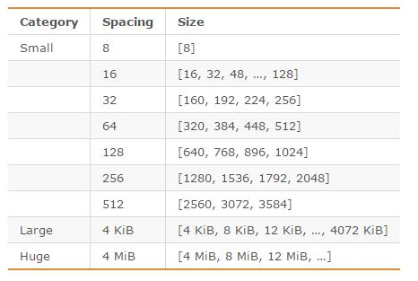

# 1.什么是redis
Remote Dictionary Server 是用c语言开发的一个完全开源的，遵守 BSD 协议，是一个高性能的 key-value 数据库。
除此之外，Redis 支持事务 、持久化、LUA脚本、LRU驱动事件、多种集群方案。
每秒可以处理超过 10万次读写操作，是已知性能最快的Key-Value DB。

应用场景
1.	数据模型比较简单
2.	需要灵活性更强的IT系统
3.	数据库的性能要求高
4.	不需要高度的数据一致性（事务支持不是很好）

# 2.redis优点
- **性能极高** – Redis能读的速度是110000次/s,写的速度是81000次/s
- **原子** – Redis的所有操作都是原子性的，意思就是要么成功执行要么失败完全不执行。单个操作是原子性的。多个操作也支持事务，即原子性，通过MULTI和EXEC指令起来
- **丰富的数据类型** Redis不仅仅支持简单的key-value类型的数据，同时还提供list，set，zset，hash等
- **丰富的特性** – Redis还支持 publish/subscribe, 通知, key 过期等等特性
- 支持主从复制，持久化，事务等

# 3.redis缺点
-  数据库容量受到物理内存的限制,不能用作海量数据的高性能读写
-  主要局限在较小数据量的高性能操作和运算上
-  redis不具备自动容错和恢复功能，主机从机的宕机都会导致前端部分读写请求失败，需要等待机器重启或者手动切换前端的IP才能恢复
-  Redis 较难支持在线扩容，在集群容量达到上限时在线扩容会变得很复杂。为避免这一问题，
   运维人员在系统上线时必须确保有足够的空间，这对资源造成了很大的浪费。
   
# 4.Redis和memecache的区别
## 共同点
1. 都是基于内存的数据库，一般都用来当做缓存使用。
1. 都有过期策略。
1. 两者的性能都非常高。

## 不同点
- Redis 支持的**数据类型更丰富, 应用场景更多**（String、Hash、List、Set、ZSet），而 Memcached 只支持最简单的 key-value 数据类型；
- Redis 支持**数据的持久化**，可以将内存中的数据保持在磁盘中，重启的时候可以再次加载进行使用，而 Memcached 没有持久化功能，数据全部存在内存之中，Memcached 重启或者挂掉后，数据就没了；
- Redis 原生支持**集群模式**，Memcached 没有原生的集群模式，需要依靠客户端来实现往集群中分片写入数据；
- Redis 支持**发布订阅模型、Lua 脚本、事务**等功能，而 Memcached 不支持；
- Memcached 过期数据的删除策略只用了惰性删除，而 Redis 同时使用了惰性删除与定期删除
- Memcached 是多线程，非阻塞 IO 复用的网络模型；
  Redis 使用单线程的多路 IO 复用模型。 （Redis 6.0 针对网络数据的读写引入了多线程）
  
# 5. 为什么要用redis做缓存

1、高性能

假如用户第一次访问数据库中的某些数据的话，这个过程是比较慢，毕竟是从硬盘中读取的。但是，如果说，
用户访问的数据属于高频数据并且不会经常改变的话，那么我们就可以很放心地将该用户访问的数据存在缓存中。这样有什么好处呢？ 
那就是保证用户下一次再访问这些数据的时候就可以直接从缓存中获取了。操作缓存就是直接操作内存，所以速度相当快。

2、高并发

一般像 MySQL 这类的数据库的 QPS 大概都在 1w 左右（4 核 8g） ，但是使用 Redis 缓存之后很容易达到 10w+，
甚至最高能达到 30w+（就单机 Redis 的情况，Redis 集群的话会更高）。
由此可见，直接操作缓存能够承受的数据库请求数量是远远大于直接访问数据库的，所以我们可以考虑把数据库中的部分数据转移到缓存中去，
这样用户的一部分请求会直接到缓存这里而不用经过数据库。进而，我们也就提高了系统整体的并发

# 5. Jedis和Redisson的区别
Jedis是Redis的Java实现的客户端，其API提供了比较全面的Redis命令的支持；

Redisson实现了分布式和可扩展的Java数据结构，Redisson的宗旨是促进使用者对Redis的关注分离，从而让使用者能够将精力更集中地放在处理业务逻辑上

和Jedis相比，功能较为简单，不支持字符串操作，不支持排序、事务、管道、分区等Redis特性。

# 6. redis常见的性能问题
1. master最好不要做任何持久化工作，包括内存快照和AOF日志文件，特别是不要启用内存快照做持久化。
2. 如果数据比较关键，某个Slave开启AOF备份数据，策略为每秒同步一次。
3. 为了主从复制的速度和连接的稳定性，Slave和Master最好在同一个局域网内。
4. 尽量避免在压力较大的主库上增加从库 
5. Master调用BGREWRITEAOF重写AOF文件，AOF在重写的时候会占大量的CPU和内存资源，导致服务load过高，出现短暂服务暂停现象。
6. 为了Master的稳定性，主从复制不要用图状结构，用单向链表结构更稳定，即主从关系为：Master<–Slave1<–Slave2<–Slave3…，
   这样的结构也方便解决单点故障问题，实现Slave对Master的替换，也即，如果Master挂了，可以立马启用Slave1做Master，其他不变。

# 7. 为什么要做redis分区？
1. 分区可以让[Redis管理更大的内存]，Redis将可以使用所有机器的内存。如果没有分区，你最多只能使用一台机器的内存。
2. 分区使Redis的[计算能力通过简单地增加计算机得到成倍提升]，Redis的网络带宽也会随着计算机和网卡的增加而成倍增长

# 8. 你知道有哪些Redis分区实现方案？
1. [客户端分区] 就是在客户端就已经决定数据会被存储到哪个redis节点或者从哪个redis节点读取。大多数客户端已经实现了客户端分区。
2. [代理分区]  意味着客户端将请求发送给代理，然后代理决定去哪个节点写数据或者读数据。代理根据分区规则决定请求哪些Redis实例，
   然后根据Redis的响应结果返回给客户端。redis和memcached的一种代理实现就是Twemproxy
3. [查询路由(Query routing)] 的意思是客户端随机地请求任意一个redis实例，然后由Redis将请求转发给正确的Redis节点。
   Redis Cluster实现了一种混合形式的查询路由，但并不是直接将请求从一个redis节点转发到另一个redis节点
   ，而是在客户端的帮助下直接redirected到正确的redis节点。

# 9. Redis分区有什么缺点？
1.[涉及多个key的操作通常不会被支持]。例如你不能对两个集合求交集，因为他们可能被存储到不同的Redis实例（实际上这种情况也有办法，但是不能直接使用交集指令）。
2.[同时操作多个key,则不能使用Redis事务].
3.分区使用的[粒度是key]，不能使用一个非常长的排序key存储一个数据集
4.当使用分区的时候，[数据处理会非常复杂]，例如为了备份你必须从不同的Redis实例和主机同时收集RDB / AOF文件。
5.分区时[动态扩容或缩容可能非常复杂]。Redis集群在运行时增加或者删除Redis节点，能做到最大程度对用户透明地数据再平衡，但其他一些客户端分区或者代理分区方法则不支持这种特性。然而，有一种预分片的技术也可以较好的解决这个问题

# 10 RESP是什么？
刚刚上面你有提到redis通讯协议(RESP )，能解释下什么是RESP？有什么特点？

RESP 是redis客户端和服务端之前使用的一种通讯协议；

RESP 的特点：实现简单、快速解析、可读性好

1. For Simple Strings the first byte of the reply is "+" 回复
2. For Errors the first byte of the reply is "-" 错误
3. For Integers the first byte of the reply is ":" 整数
4. For Bulk Strings the first byte of the reply is "$" 字符串
5. For Arrays the first byte of the reply is "*" 数组

# 11 redis 内存碎片
## 11.1 什么是内存碎片
你可以将内存碎片简单地理解为那些不可用的空闲内存。
举个例子：操作系统为你分配了 32 字节的连续内存空间，而你存储数据实际只需要使用 24 字节内存空间，
那这多余出来的 8 字节内存空间如果后续没办法再被分配存储其他数据的话，就可以被称为内存碎片


内存碎片不会影响redis的性能，但是会增加内存消耗

## 11.2 为什么会产生内存碎片？
1. 频繁修改 Redis 中的数据也会产生内存碎片。

当 Redis 中的某个数据删除时，Redis 通常不会轻易释放内存给操作系统。
这个在 Redis 官方文档中也有对应的原话:

2. Redis 存储数据的时候向操作系统申请的内存空间可能会大于数据实际需要的存储空间
   
以下是这段 Redis 官方的原话：
```
To store user keys, Redis allocates at most as much memory as the maxmemory 
setting enables (however there are small extra allocations possible)
```
Redis 使用 zmalloc 方法(Redis 自己实现的内存分配方法)进行内存分配的时候，
除了要分配 size 大小的内存之外，还会多分配 PREFIX_SIZE 大小的内存。zmalloc 方法源码如下
（源码地址：https://github.com/antirez/redis-tools/blob/master/zmalloc.c）
```c
void *zmalloc(size_t size) {
   // 分配指定大小的内存
   void *ptr = malloc(size+PREFIX_SIZE);
   if (!ptr) zmalloc_oom_handler(size);
#ifdef HAVE_MALLOC_SIZE
   update_zmalloc_stat_alloc(zmalloc_size(ptr));
   return ptr;
#else
   *((size_t*)ptr) = size;
   update_zmalloc_stat_alloc(size+PREFIX_SIZE);
   return (char*)ptr+PREFIX_SIZE;
#endif
}
```



当程序申请的内存最接近某个固定值时，jemalloc 会给它分配相应大小的空间，就比如说程序需要申请 17 字节的内存，
jemalloc 会直接给它分配 32 字节的内存，这样会导致有 15 字节内存的浪费。不过，jemalloc 
专门针对内存碎片问题做了优化，一般**不会存在过度碎片化**的问题。

## 11.3 如何查看redis的内存碎片率

Redis 内存碎片率的计算公式：
`mem_fragmentation_ratio （内存碎片率）=
used_memory_rss (操作系统实际分配给 Redis 的物理内存空间大小)
/ used_memory(Redis 内存分配器为了存储数据实际申请使用的内存空间大小)`

也就是说，mem_fragmentation_ratio （内存碎片率）的**值越大代表内存碎片率越严重**。一
定不要误认为used_memory_rss 减去 used_memory值就是内存碎片的大小！！！
这不仅包括内存碎片，还包括[其他进程开销，以及共享库、堆栈等的开销]。
很多小伙伴可能要问了：“多大的内存碎片率才是需要清理呢？”。通常情况下，我们认为 
mem_fragmentation_ratio > 1.5 的话才需要清理内存碎片。 [mem_fragmentation_ratio > 1.5 ]
意味着你使用 Redis 存储实际大小 2G 的数据需要使用大于 3G 的内存。

## 11.4 如何清理Redis的内存碎片
Redis4.0-RC3 版本以后自带了内存整理，可以避免内存碎片率过大的问题。
直接通过 config set 命令将 activedefrag 配置项设置为 yes 即可。
```config set activedefrag yes```

具体什么时候清理需要通过下面两个参数控制：
- 内存碎片占用空间达到 500mb 的时候开始清理
  ```config set active-defrag-ignore-bytes 500mb```
- 内存碎片率大于 1.5 的时候开始清理
   ```config set active-defrag-threshold-lower 50```
  
通过 Redis 自动内存碎片清理机制[可能会对 Redis 的性能产生影响]，我们可以通过下面
两个参数来减少对 Redis 性能的影响：

- 内存碎片清理所占用 CPU 时间的比例不低于 20%
```config set active-defrag-cycle-min 20```
- 内存碎片清理所占用 CPU 时间的比例不高于 50%
```config set active-defrag-cycle-max 50```
另外，重启节点可以做到内存碎片重新整理。如果你采用的是高可用架构的 Redis 集群的话，
  你可以[将碎片率过高的主节点转换为从节点]，以便进行安全重启.
