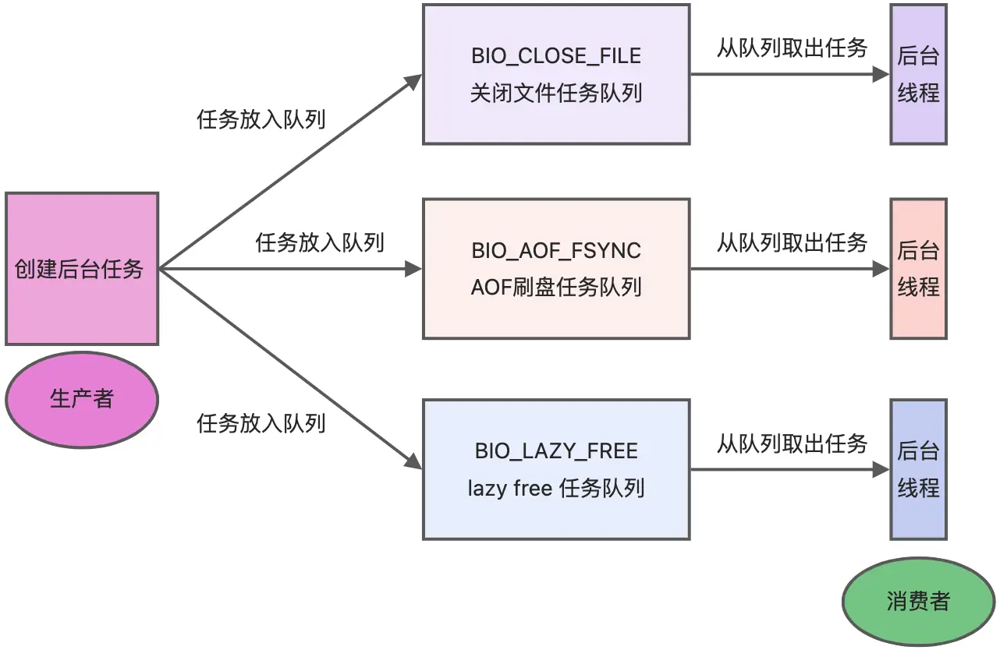
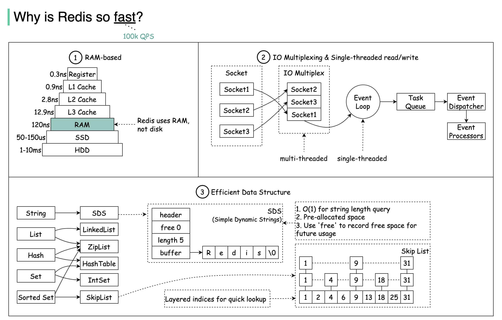
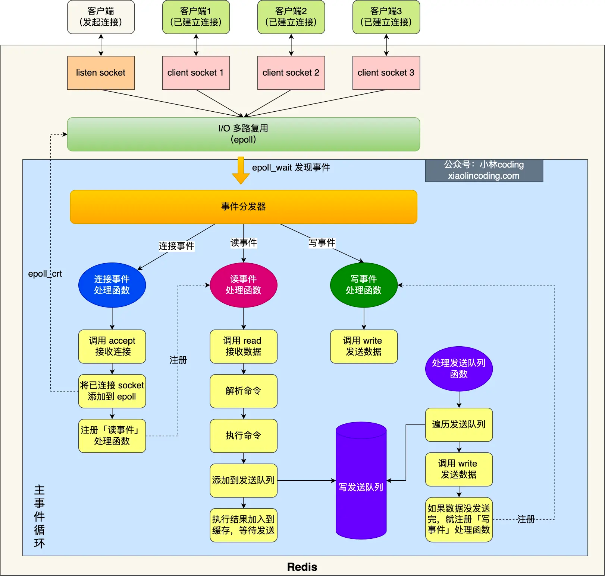
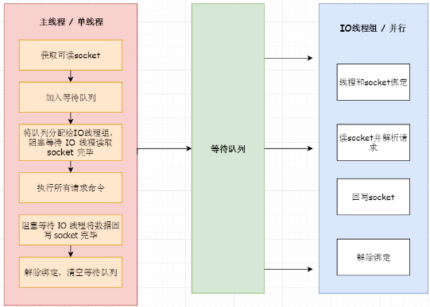
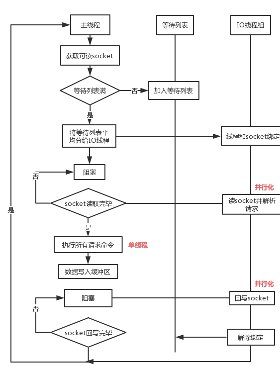
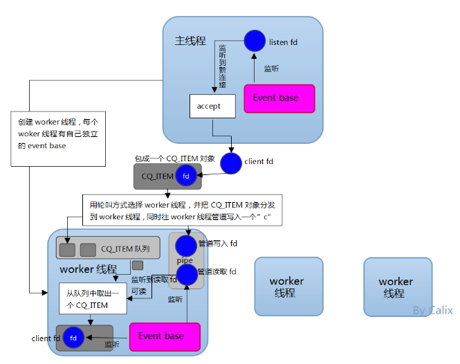
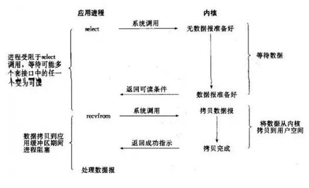
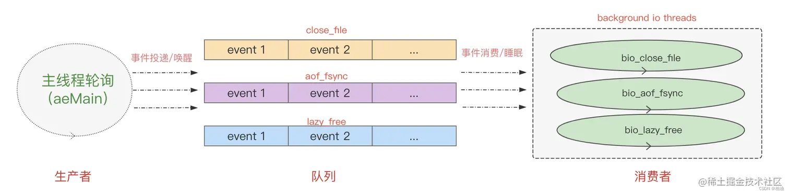
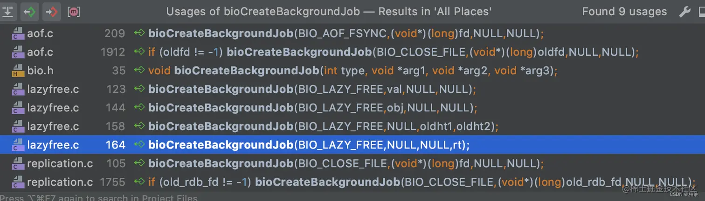

# 1. redis 是单线程吗？
**Redis 单线程指的是[接收客户端请求->解析请求 ->进行数据读写等操作->发送数据给客户端]这个过程是由[一个线程（主线程）来完成的]**，
这也是我们常说 Redis 是单线程的原因。

但是，**Redis 程序并不是单线程的**，Redis 在启动的时候，是会**启动后台线程**（BIO）的：

- **Redis 在 2.6 版本**，会启动 2 个后台线程，分别[处理关闭文件]、[AOF 刷盘]这两个任务；
- **Redis 在 4.0 版本之后**，新增了一个新的后台线程，用来[异步释放 Redis 内存]，也就是 lazyfree 线程。
  例如执行 [unlink key / flushdb async / flushall async] 等命令，会把这些删除操作交给后台线程来执行，好处是不会导致 Redis 主线程卡顿。
  因此，当我们要删除一个大 key 的时候，不要使用 del 命令删除，因为 del 是在主线程处理的，这样会导致 Redis 主线程卡顿，
  因此我们应该使用 [unlink 命令来异步删除大 key]。

之所以 Redis 为「关闭文件、AOF 刷盘、释放内存」这些任务创建单独的线程来处理，是因为这些任务的操作都是很耗时的，如果把这些任务都放在主线程来处理，
那么 Redis 主线程就很容易发生阻塞，这样就无法处理后续的请求了。

后台线程相当于一个消费者，生产者把耗时任务丢到任务队列中，消费者（BIO）不停轮询这个队列，拿出任务就去执行对应的方法即可。



关闭文件、AOF 刷盘、释放内存这三个任务都有各自的任务队列：

- BIO_CLOSE_FILE，关闭文件任务队列：当队列有任务后，后台线程会调用 close(fd) ，将文件关闭；
- BIO_AOF_FSYNC，AOF 刷盘任务队列：当 AOF 日志配置成 everysec 选项后，主线程会把 AOF 写日志操作封装成一个任务，也放到队列中。当发现队列有任务后，后台线程会调用 fsync(fd)，将 AOF 文件刷盘，
- BIO_LAZY_FREE，lazy free 任务队列：当队列有任务后，后台线程会 free(obj) 释放对象 / free(dict) 删除数据库所有对象 / free(skiplist) 释放跳表对象；


# 2. redis 为什么是单线程的？
- Redis 的大部分操作**都在内存中完成**，并且采用了高效的数据结构，因此 Redis 瓶颈可能是机器的内存或者网络带宽，而并非 CPU，
  既然 **CPU 不是瓶颈**，那么自然就采用单线程的解决方案了；
- Redis 采用单线程模型可以**避免了多线程之间的竞争**，省去了多线程切换带来的时间和性能上的开销，而且也不会导致死锁问题。
- Redis 采用了 **I/O 多路复用机制**处理大量的客户端 Socket 请求，IO 多路复用机制是指一个线程处理多个 IO 流，
  就是我们经常听到的 select/epoll 机制。简单来说，在 Redis 只运行单线程的情况下，该机制允许内核中，同时存在多个监听 Socket 和已连接 Socket。
  内核会一直监听这些 Socket 上的连接请求或数据请求。一旦有请求到达，就会交给 Redis 线程处理，这就实现了一个 Redis 线程处理多个 IO 流的效果。

# 3. redis 为什么这么快？
1. Redis 基于内存，内存的访问速度是磁盘的上千倍；
2. Redis 基于 Reactor 模式设计开发了一套高效的事件处理模型，主要是单线程事件循环和 IO 多路复用（Redis 线程模式后面会详细介绍到）；
3. Redis 内置了多种优化过后的数据结构实现，性能非常高。
4. redis 还有很多优化过的实现，如渐进式rehash等
5. redis 基于单线程避免了多线程之间竞争和切换的消耗，而且不会导致死锁问题

   
   
# 4. redis 单线程模型是什么样的

图中的蓝色部分是一个事件循环，是由主线程负责的，可以看到[网络 I/O 和命令处理 即文件事件处理器]都是单线程。 Redis [初始化]的时候，会做下面这几件事情：
1. 首先，调用 epoll_create() 创建一个 epoll 对象和调用 socket() 创建一个服务端 socket
2. 然后，调用 bind() 绑定端口和调用 listen() 监听该 socket；
3. 然后，将调用 epoll_ctl() 将 listen socket 加入到 epoll，同时注册「连接事件」处理函数

初始化完后，主线程就进入到一个[**事件循环函数**]，主要会做以下事情：

- 首先，先调用**处理发送队列函数**，看是发送队列里是否有任务，如果有发送任务，则通过 write 函数将客户端发送缓存区里的数据发送出去，如果这一轮数据没有发送完，就会注册写事件处理函数，等待 epoll_wait 发现可写后再处理。
- 接着，调用 epoll_wait 函数等待事件的到来：
    - 如果是**连接事件**到来，则会调用**连接事件处理函数**，该函数会做这些事情：
        调用 accpet 获取已连接的 socket ->  调用 epoll_ctl 将已连接的 socket 加入到 epoll -> 注册「读事件」处理函数；
    - 如果是**读事件**到来，则会调用**读事件处理函数**，该函数会做这些事情：
        调用 read 获取客户端发送的数据 -> 解析命令 -> 处理命令 -> 将客户端对象添加到发送队列 -> 将执行结果写到发送缓存区等待发送；
    - 如果是**写事件**到来，则会调用**写事件处理函数**，该函数会做这些事情：
      通过 write 函数将客户端发送缓存区里的数据发送出去，如果这一轮数据没有发送完，就会继续注册写事件处理函数，等待 [epoll_wait] 发现可写后再处理。

以上就是 Redis 单线模式的工作方式，如果你想看源码解析，可以参考这一篇：[为什么单线程的 Redis 如何做到每

# 5. 为什么redis 在6.0之前一直是单线程的？
我们都知道单线程的程序是无法利用服务器的多核 CPU 的，那么早期 Redis 版本的主要工作（网络 I/O 和执行命令）为什么还要使用单线程呢？我们不妨先看一下 Redis 官方给出的[FAQ](https://link.juejin.cn/?target=https%3A%2F%2Fredis.io%2Ftopics%2Ffaq)。


核心意思是：**CPU 并不是制约 Redis 性能表现的瓶颈所在**，更多情况下是受到内存大小和网络 I/O 的限制，所以 Redis 核心网络模型使用单线程并没有什么问题，
如果你想要使用服务的多核 CPU，可以在一台服务器上启动多个节点或者采用分片集群的方式。

除了上面的官方回答，选择单线程的原因也有下面的考虑。

1. 使用了单线程后，可维护性高，多线程模型虽然在某些方面表现优异，但是它却引入了程序执行顺序的不确定性，带来了并发读写的一系列问题，
   [**增加了系统复杂度、同时可能存在线程切换、甚至加锁解锁、死锁造成的性能损耗**]。
2. 单线程更容易维护

# 6. 为什么redis 在6.0之后引入多线程？
## 1. 提升网络IO的性能
虽然 Redis 的主要工作（网络 I/O 和执行命令）一直是单线程模型，但是**在 Redis 6.0 版本之后，也采用了多个 I/O 线程来处理网络请求**，
**这是因为随着网络硬件的性能提升，Redis 的性能瓶颈有时会出现在网络 I/O 的处理上**。

所以为了提高网络 I/O 的并行度，Redis 6.0 对于网络 I/O 采用多线程来处理。[**但是对于命令的执行，Redis 仍然使用单线程来处理]，
**所以大家**不要误解** Redis 有多线程同时执行命令。

Redis 官方表示，**Redis 6.0 版本引入的[多线程 I/O 特性对性能提升至少是一倍以上]**。

Redis 6.0 版本支持的 I/O  多线程特性，默认情况下 [I/O 多线程只针对发送响应数据（write client socket）]，并不会以多线程的方式处理读请求（read client socket）。
要想开启多线程处理客户端读请求，就需要把  Redis.conf  配置文件中的 io-threads-do-reads 配置项设为 yes。
官网描述[开启多线程读并不能有太大提升，因此一般情况下并不建议开启]

```c
//读请求也使用 io 多线程
io-threads-do-reads yes 
```
同时，Redis.conf  配置文件中提供了  IO 多线程个数的配置项。 redis 6.0 版本默认禁止使用多线程
```c
// io-threads N，表示启用 N-1 个 I/O 多线程（主线程也算一个 I/O 线程）
io-threads 4 
```
关于线程数的设置，官方的建议是如果为 4 核的 CPU，建议线程数设置为 2 或 3，如果为 8 核 CPU 建议线程数设置为 6，线程数一定要小于机器核数，[线程数并不是越大越好]。

因此，Redis 6.0 版本之后，Redis 在启动的时候，默认情况下会创建 6 个线程：

- Redis-server：Redis 的主线程，主要负责执行命令；
- bio_close_file、bio_aof_fsync、bio_lazy_free：三个后台线程，分别异步处理关闭文件任务、AOF 刷盘任务、释放内存任务；
- io_thd_1、io_thd_2、io_thd_3：三个 I/O 线程，io-threads 默认是 4，所以会启动 3（4-1）个 I/O 多线程，用来分担 Redis 网络 I/O 的压力。

Redis将所有数据放在内存中，内存的响应时长大约为100纳秒，对于小数据包，Redis服务器可以处理80,000到100,000 QPS，这也是Redis处理的极限了，
对于80%的公司来说，单线程的Redis已经足够使用了。

但随着越来越复杂的业务场景，有些公司动不动就上亿的交易量，因此需要更大的QPS。常见的解决方案是在分布式架构中对数据进行分区并采用多个服务器，但该方案有非常大的缺点，
例如要管理的Redis服务器太多，维护代价大；某些适用于单个Redis服务器的命令不适用于数据分区；数据分区无法解决热点读/写问题；数据偏斜，
重新分配和放大/缩小变得更加复杂等等。

从Redis自身角度来说，因为读写网络的read/write系统调用占用了Redis执行期间大部分CPU时间，瓶颈主要在于网络的 IO 消耗, 优化主要有两个方向:
• 提高网络 IO 性能，典型的实现比如使用 DPDK 来替代内核网络栈的方式
• 使用多线程充分利用多核，典型的实现比如 Memcached。
协议栈优化的这种方式跟 Redis 关系不大，支持多线程是一种最有效最便捷的操作方式。所以总结起来，redis支持多线程主要就是两个原因：
• 可以充分利用服务器 CPU 资源，目前主线程只能利用一个核
• 多线程任务可以分摊 Redis 同步 IO 读写负荷


# 7.redis 6.0的多线程是默认开启的吗？多线程的线程数如何设定
Redis6.0的多线程默认是禁用的，只使用主线程。如需开启需要修改redis.conf配置文件：io-threads-do-reads yes

开启多线程后，还需要设置线程数，否则是不生效的。同样修改redis.conf配置文件 io-thread 4

关于线程数的设置，官方有一个建议：4核的机器建议设置为2或3个线程，8核的建议设置为6个线程，
线程数一定要小于机器核数。还需要注意的是，线程数并不是越大越好，官方认为超过了8个基本就没什么意义了。


# 8. redis 使用多线程后性能提升如何？

Redis 作者 antirez 在 RedisConf 2019分享时曾提到：Redis 6 引入的多线程 IO 特性对性能提升至少是一倍以上
。国内也有大牛曾使用unstable版本在阿里云esc进行过测试，GET/SET 命令在4线程 IO时性能相比单线程是几乎是翻倍了。

说明1：这些性能验证的测试并没有针对严谨的延时控制和不同并发的场景进行压测。数据仅供验证参考而不能作为线上指标。

说明2：如果开启多线程，至少要[4核的机器，且Redis实例已经占用相当大的CPU耗时的]时候才建议采用，否则使用多线程没有意义。所以估计80%的公司开发人员看看就好。

# 9. redis6.0 多线程的实现机制


流程简述如下：

1. 主线程负责接收建立连接请求，获取 socket 放入全局等待读处理队列
2. 主线程处理完读事件之后，通过 RR(Round Robin) 将这些连接分配给这些 IO 线程
3. 主线程阻塞等待 IO 线程读取 socket 完毕
4. 主线程通过单线程的方式执行请求命令，请求数据读取并解析完成，但并不执行
5. 主线程阻塞等待 IO 线程将数据回写 socket 完毕
6. 解除绑定，清空等待队列

该设计有如下特点：

1. IO 线程要么同时在读 socket，要么同时在写，不会同时读或写
2. IO 线程只负责读写 socket 解析命令，不负责命令处理



# 10.开启多线程后，是否会存在线程并发安全问题

从上面的实现机制可以看出，Redis的多线程部分只是用来处理网络数据的读写和协议解析，
[执行命令仍然是单线程顺序执行]。所以我们不需要去考虑控制 key、lua、事务，LPUSH/LPOP 等等的并发及线程安全问题。

# 11. Redis6.0的多线程和Memcached多线程模型进行对比



如上图所示：Memcached 服务器采用 master-woker 模式进行工作，服务端采用 socket 与客户端通讯。
主线程、工作线程 采用 pipe管道进行通讯。
主线程采用 libevent 监听 listen、accept 的读事件，事件响应后将连接信息的数据结构封装起来，
根据算法选择合适的工作线程，将连接任务携带连接信息分发出去，相应的线程利用连接描述符建立与客户端的socket连接 并进行后续的存取数据操作。

两者的对比

相同点：都采用了 master线程-worker 线程的模型

不同点：
1. Memcached 执行主逻辑也是在 worker 线程里，模型更加简单，实现了真正的线程隔离，符合我们对线程隔离的常规理解。
2. 而 Redis 把处理逻辑交还给 master 线程，虽然一定程度上增加了模型复杂度，但也解决了线程并发安全等问题。

# 12.Redis作者是如何点评 “多线程”这个新特性的？

关于多线程这个特性，在6.0 RC1时，Antirez曾做过说明： Redis支持多线程有2种可行的方式：
1. 第一种就是像“memcached”那样，一个Redis实例开启多个线程，从而提升GET/SET等简单命令中每秒可以执行的操作。
   这涉及到I/O、命令解析等多线程处理，因此，我们将其称之为“I/O threading”。
   
2. 另一种就是允许在不同的线程中执行较耗时较慢的命令，以确保其它客户端不被阻塞，我们将这种线程模型称为“Slow commands threading”。

经过深思熟虑，Redis不会采用“I/O threading”，redis在运行时主要受制于网络和内存，所以提升redis性能主要是通过在多个redis实例，
特别是redis集群。接下来我们主要会考虑改进两个方面：

1. Redis集群的多个实例通过编排能够合理地使用本地实例的磁盘，避免同时重写AOF。

2.提供一个Redis集群代理，便于用户在没有较好的集群协议客户端时抽象出一个集群。

补充说明一下，Redis和memcached一样是一个内存系统，但不同于Memcached。多线程是复杂的，必须考虑使用简单的数据模型，执行LPUSH的线程需要服务其他执行LPOP的线程。

我真正期望的实际是“slow operations threading”，在redis6或redis7中，将提供“key-level locking”，使得线程可以完全获得对键的控制以处理缓慢的操作。


# 13 Redis线程中经常提到IO多路复用，如何理解？

这是IO模型的一种，即经典的Reactor设计模式，有时也称为异步阻塞IO。

多路指的是多个socket连接，复用指的是复用一个线程。多路复用主要有三种技术：select，poll，epoll。
epoll是最新的也是目前最好的多路复用技术。采用多路 I/O 复用技术可以让单个线程高效的处理多个连接请求（尽量减少网络IO的时间消耗），
且Redis在内存中操作数据的速度非常快（内存内的操作不会成为这里的性能瓶颈），主要以上两点造就了Redis具有很高的吞吐量。

# 14 redis的后台线程有哪些？
redis 共有三个后台线程，分别是 close_file、aof_fsync和lazy_free：

1. close_file 表示关闭相应文件描述符对应的文件（释放套接字、数据空间等）。
2. aof_fsync 表示 AOF 刷盘
3. lazy_free 表示惰性释放空间

```c
    // 设置线程名，方便做监控
    switch (type) {
    case BIO_CLOSE_FILE:
        redis_set_thread_title("bio_close_file");
        break;
    case BIO_AOF_FSYNC:
        redis_set_thread_title("bio_aof_fsync");
        break;
    case BIO_LAZY_FREE:
        redis_set_thread_title("bio_lazy_free");
        break;
    }

```

# 15 redis后台线程的执行逻辑
https://juejin.cn/post/7102780434739626014
这个方法逻辑本身并不复杂，每个线程启动后，进入该执行主体（该方法），然后通过无限 while 轮询处理队列中的事件，直到线程被挂起或者服务终止。

细心的你可能已经发现了，这就是典型的 [生产者-消费者] 模式，
1. 主线程负责生产任务事件，然后投递到 队列；
2， 后台线程就是我们的消费者，负责从队列取出任务事件并处理。
在 生产者-消费者 模式下，我们需要关注的是共享变量（队列），面临多线程的临界问题，所以就用了 [bio_mutex 临界变量（互斥量）]来控制并发。

在以上代码中的体现就是：

消费者：从队列取任务之前，先上锁，取到之后，立即释放锁；

生产者：往队列投递任务之前，先上锁，投递之后，立即释放锁。

# 16 redis 后台线程的触发机制
前面说到，这里使用了典型的 [生产者-消费者模式]，每一个后台线程都有其对应事件列表（队列），当有事件需要处理时，会发送到对应的后台线程队列，
再唤醒后台线程（如果对应线程处于休眠状态），然后执行。

我画了一张图来展示其处理流程，你可以看下：


现在，我们开始溯源，看看生产者（主线程）何时会投递任务事件。

首先，redis 作为典型的事件型驱动框架，信息交流是以事件为媒介，因此，任务事件也做了一层封装：

```cpp
// bio.c#bio_job
struct bio_job {
    time_t time; // job 的创建时间
    // 任务参数，如果有超过3个参数的话，可以定义一个指向结构体的指针
    void *arg1, *arg2, *arg3;
};
```
并提供了统一创建任务事件的方法 bioCreateBackgroundJob：
```cpp
// bio.c#bioCreateBackgroundJob
void bioCreateBackgroundJob(int type, void *arg1, void *arg2, void *arg3) {
    struct bio_job *job = zmalloc(sizeof(*job));

    job->time = time(NULL);
    job->arg1 = arg1;
    job->arg2 = arg2;
    job->arg3 = arg3;
    // 往队列投递任务之前先上锁，保证并发安全性
    pthread_mutex_lock(&bio_mutex[type]);
    listAddNodeTail(bio_jobs[type],job);
    bio_pending[type]++;
    pthread_cond_signal(&bio_newjob_cond[type]);
    // 投递完成后，释放锁
    pthread_mutex_unlock(&bio_mutex[type]);
}
```

调用方式
1. aof_fsync 调用：
    - 文件追加写之后刷盘（磁盘）
    - 文件 rewrite（重写）之后刷盘 主要是刷盘
        刷盘策略有三种
      1. AOF_FSYNC_NO： 表示[不显示调用 fsync 进行刷盘]，具体刷盘策略由操作系统内核自身策略决定。[效率最高，但丢数据的风险也最高]
      2. AOF_FSYNC_ALWAYS： [每条命令执行后都尝试通过 fsync 刷盘]。效率最低，但丢失数据的风险最低
      3. AOF_FSYNC_EVERYSEC：表示 [1s 执行一次刷盘]。效率和丢数据风险都属于中等，一般情况下都采用这种方式。
2.  lazyfree 删除空间：--大对象 unlink
    - DEL 命令
    - FLUSHALL / FLUSHDB 命令
3. 关闭文件：
    - AOF / RDB 产生的临时文件
    - replication 副本数据同步过程中的临时文件（比如 RDB 文件）
    - 数据刷盘 数据传输 数据重写过程中会产生空间占用较大的临时文件，这种[大临时文件的释放]

# 17 为什么 需要额外的后台线程？
一个大型应用系统的正常运转需要协调多方资源，网络、磁盘、内存甚至还要处理客户端特性化的需求等等，
每个模块都有各自的长短处，速度协调上往往会做出各种妥协。

redis 这种纯内存操作，[其瓶颈往往在于网络和内存]，而不是 CPU。我们需要一些[额外的线程来 分担 主线程的压力]，在这些模块之间做一些 适配 工作。
因此，单靠一个线程来处理所有事情，变成了一种奢求。
redis 中先后出现了一系列的后台线程，比如 close_file、aof_fsync 以及 lazy_free 都是为了解决这些问题。
这样的处理方式，让[主线程专心处理 主营业务 （客户端请求），减少了其后顾之忧]
