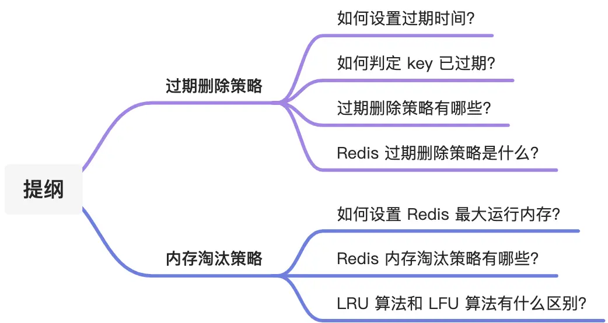
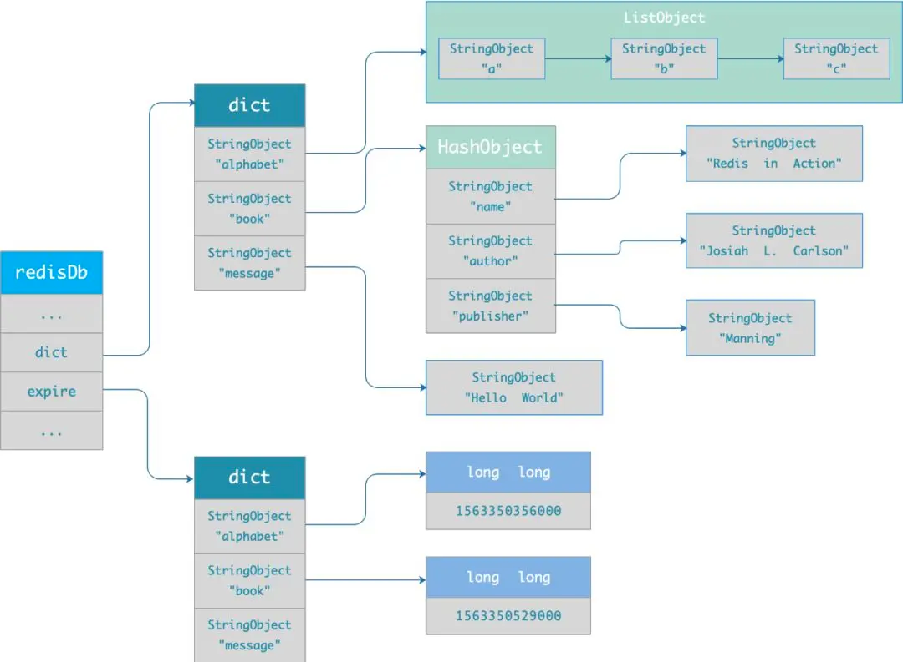
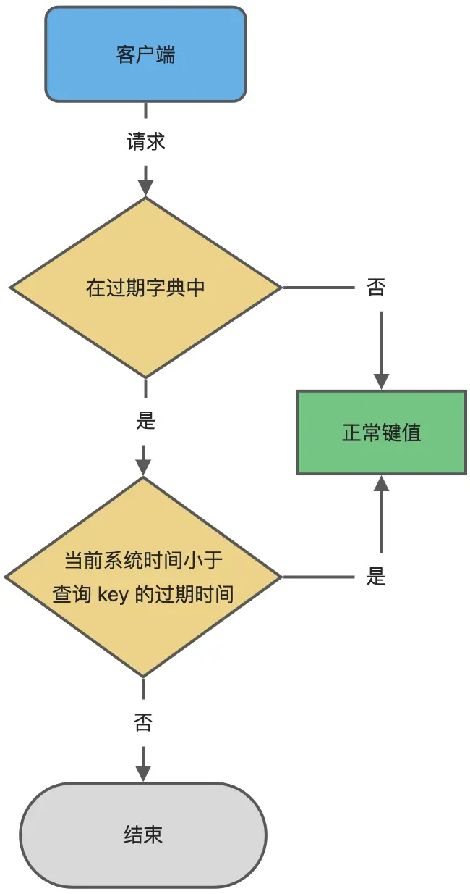
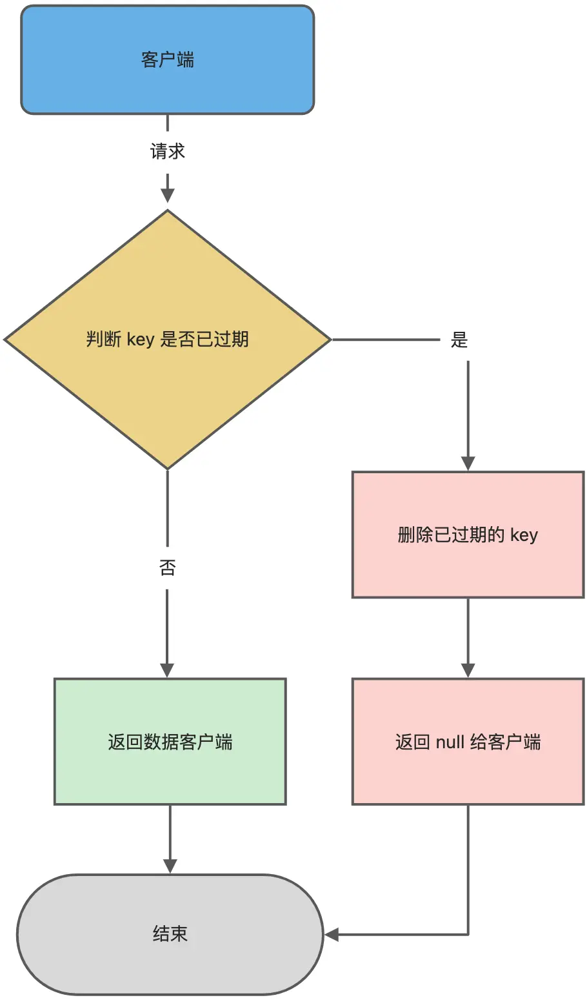
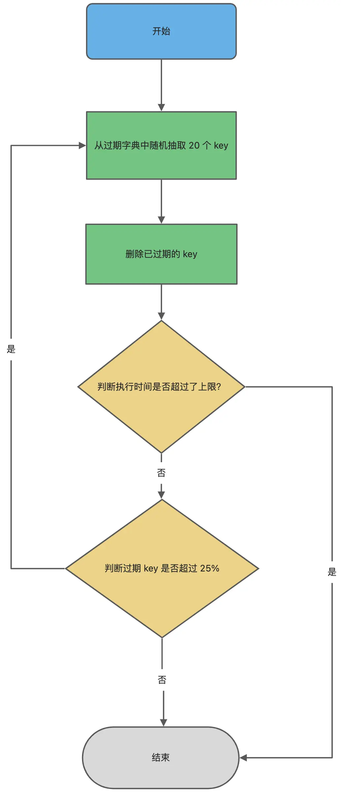

# 1. 过期删除策略

## 1.1 什么是过期数据
-  他是一种内存级数据库，所有数据均存放在内存中，ttl可以获取器状态
   -xx 具有时效性数据
   - -1：永久有效性性数据
   - -2：已经过期的数据 或被删除的数据 或未定义的数据
-  操作完成后del 释放锁
   过期数据真的被删除了吗？未必

## 1.2 Redis中数据删除策略的目标是?
目标：在内存和cpu之间寻找平衡，保证redis性能，防止内存泄漏

## 1.3 如何设置过期数据
先说一下对 key 设置过期时间的命令。
设置 key 过期时间的命令一共有 4 个：

- `expire <key> <n>`：设置 key 在 n 秒后过期，比如 expire key 100 表示设置 key 在 100 秒后过期；
- `pexpire <key> <n>`：设置 key 在 n 毫秒后过期，比如 pexpire key2 100000 表示设置 key2 在 100000 毫秒（100 秒）后过期。
- `expireat <key>  <n>`：设置 key 在某个时间戳（精确到秒）之后过期，比如 expireat key3 1655654400 表示 key3 在时间戳 1655654400 后过期（精确到秒）；
- `pexpireat <key>  <n>`：设置 key 在某个时间戳（精确到毫秒）之后过期，比如 pexpireat key4 1655654400000 表示 key4 在时间戳 1655654400000 后过期（精确到毫秒）

当然，在设置字符串时，也可以同时对 key 设置过期时间，共有 3 种命令：

- `set <key>  <value> ex <n>` ：设置键值对的时候，同时指定过期时间（精确到秒）；
- `set <key>  <value> px <n>` ：设置键值对的时候，同时指定过期时间（精确到毫秒）；
- `setex <key>  <n>  <value>`   ：设置键值对的时候，同时指定过期时间（精确到秒）。

如果你想查看某个 key 剩余的存活时间，可以使用 `TTL <key>` 命令。

```bash
# 设置键值对的时候，同时指定过期时间位 60 秒
> setex key1 60 value1
OK

# 查看 key1 过期时间还剩多少
> ttl key1
(integer) 56
> ttl key1
(integer) 52
```

如果突然反悔，取消 key 的过期时间，则可以使用 `PERSIST <key>` 命令。

```bash
# 取消 key1 的过期时间
> persist key1
(integer) 1

# 使用完 persist 命令之后，
# 查下 key1 的存活时间结果是 -1，表明 key1 永不过期 
> ttl key1 
(integer) -1
```

## 1.4 如何判定 key 已过期了？

每当我们对一个 key 设置了过期时间时，Redis  会把该 key 带上过期时间存储到一个**过期字典**（expires dict）中，也就是说「过期字典」保存了数据库中所有 key 的过期时间。

过期字典存储在 redisDb 结构中，如下：

```c
typedef struct redisDb {
    dict *dict;    /* 数据库键空间，存放着所有的键值对 */
    dict *expires; /* 键的过期时间 */
    ....
} redisDb;
```

过期字典数据结构结构如下：

- 过期字典的 key 是一个指针，指向某个键对象；
- 过期字典的 value 是一个 long long 类型的整数，这个整数保存了 key 的过期时间；

过期字典的数据结构如下图所示：



字典实际上是哈希表，哈希表的最大好处就是让我们可以用 O(1) 的时间复杂度来快速查找。当我们查询一个 key 时，Redis 
首先检查该 key 是否存在于过期字典中：

- 如果不在，则正常读取键值；
- 如果存在，则会获取该 key 的过期时间，然后与当前系统时间进行比对，如果比系统时间大，那就没有过期，否则判定该 key 已过期。

过期键判断流程如下图所示：



## 1.5 Redis的过期删除策略有哪些
在说 Redis 过期删除策略之前，先跟大家介绍下，常见的三种过期删除策略：

- 定时删除；
- 惰性删除；
- 定期删除；

接下来，分别分析它们的优缺点。

> 定时删除策略是怎么样的？

定时删除策略的做法是，**在设置 key 的过期时间时，同时创建一个[定时事件]，当时间到达时，由事件处理器自动执行 key 的删除操作。**

优点: 可以保证过期 key 会被尽快删除，也就是内存可以被尽快地释放。因此，定时删除对[内存是最友好的]。
缺点: 但是会占用大量的CPU资源去处理过期的数据，[影响响应时间和吞吐量]. 对cpu不友好
总结: 利用CPU的性能换取存储空间

> 惰性删除策略是怎么样的？

惰性删除策略的做法是，**[不主动删除过期键，每次从数据库访问 key 时，都检测 key 是否过期，如果过期则删除该 key]。**

优点
- 因为每次访问时，才会检查 key 是否过期，所以此策略只会使用很少的系统资源，因此，惰性删除策略对 CPU 时间最友好。

**缺点**：
- 如果一个 key 已经过期，而这个 key 又仍然保留在数据库中，那么只要这个过期 key 一直没有被访问，它所占用的内存就不会释放，
  造成了一定的内存空间浪费。所以，惰性删除策略对内存不友好。

> 定期删除策略是怎么样的？

定期删除策略的做法是，**每隔一段时间[「随机」从数据库中取出一定数量的 key 进行检查，并删除其中的过期 key。]**

优点
- 通过限制删除操作执行的时长和频率，来减少删除操作对 CPU 的影响，同时也能删除一部分过期的数据减少了过期键对空间的无效占用。

缺点
- 内存清理方面没有定时删除效果好，同时没有惰性删除使用的系统资源少。
- 难以确定删除操作执行的时长和频率。如果执行的太频繁，定期删除策略变得和定时删除策略一样， 对 CPU 不友好；
  如果执行的太少，那又和惰性删除一样了，过期 key 占用的内存不会及时得到释放。

通过调整[定时扫描的时间间隔和每次扫描的限定耗时]，可以在不同情况下使得CPU和内存资源达到最优的平衡效果。
(expires字典会保存所有设置了过期时间的key的过期时间数据，其中，key是指向键空间中的某个键的指针，
  value是该键的毫秒精度的UNIX时间戳表示的过期时间。键空间是指该Redis集群中保存的所有键。)
Redis中同时使用了[惰性过期和定期过期]两种过期策略


## 1.6 Redis 过期删除策略是什么？

前面介绍了三种过期删除策略，每一种都有优缺点，仅使用某一个策略都不能满足实际需求。

所以， **Redis 选择「惰性删除 + 定期删除」这两种策略配和使用**，以求在合理使用 CPU 时间和避免内存浪费之间取得平衡。

> Redis 是怎么实现惰性删除的？

Redis 的惰性删除策略由 db.c 文件中的 `expireIfNeeded` 函数实现，代码如下：

```c
int expireIfNeeded(redisDb *db, robj *key) {
    // 判断 key 是否过期
    if (!keyIsExpired(db,key)) return 0;
    ....
    /* 删除过期键 */
    ....
    // 如果 server.lazyfree_lazy_expire 为 1 表示异步删除，反之同步删除；
    return server.lazyfree_lazy_expire ? dbAsyncDelete(db,key) :
                                         dbSyncDelete(db,key);
}
```

Redis 在访问或者修改 key 之前，都会调用 expireIfNeeded 函数对其进行检查，检查 key 是否过期：

- 如果过期，则删除该 key，至于选择异步删除，还是选择同步删除，根据 `lazyfree-lazy-expire` 参数配置决定（Redis 4.0 版本开始提供参数），
  然后返回 null 客户端；
- 如果没有过期，不做任何处理，然后返回正常的键值对给客户端；

惰性删除的流程图如下：



> Redis 是怎么实现定期删除的？

再回忆一下，定期删除策略的做法：**每隔一段时间「随机」从数据库中取出一定数量的 key 进行检查，并删除其中的过期 key。**

*1、这个间隔检查的时间是多长呢？*

在 Redis 中，默认每秒进行 10 次过期检查一次数据库，此配置可通过 Redis 的配置文件 redis.conf 进行配置，配置键为 hz 它的默认值是 hz 10。

特别强调下，每次检查数据库并不是遍历过期字典中的所有 key，而是从数据库中随机抽取一定数量的 key 进行过期检查。

*2、随机抽查的数量是多少呢？*

我查了下源码，定期删除的实现在 expire.c 文件下的 `activeExpireCycle` 函数中，其中随机抽查的数量由 `ACTIVE_EXPIRE_CYCLE_LOOKUPS_PER_LOOP` 定义的，它是写死在代码中的，数值是 20。

也就是说，数据库每轮抽查时，会随机选择 20 个 key 判断是否过期。

接下来，详细说说 Redis 的定期删除的流程：

1. 从过期字典中随机抽取 20 个 key；
1. 检查这 20 个 key 是否过期，并删除已过期的 key；
1. 如果本轮检查的已过期 key 的数量，超过 5 个（20/4），也就是「已过期 key 的数量」占比「随机抽取 key 的数量」大于 25%，则继续重复步骤 1；如果已过期的 key 比例小于 25%，则停止继续删除过期 key，然后等待下一轮再检查。

可以看到，定期删除是一个循环的流程。

那 Redis 为了保证定期删除不会出现循环过度，导致线程卡死现象，为此增加了定期删除循环流程的时间上限，默认不会超过 25ms。

针对定期删除的流程，我写了个伪代码：

```c
do {
    //已过期的数量
    expired = 0；
    //随机抽取的数量
    num = 20;
    while (num--) {
        //1. 从过期字典中随机抽取 1 个 key
        //2. 判断该 key 是否过期，如果已过期则进行删除，同时对 expired++
    }
    
    // 超过时间限制则退出
    if (timelimit_exit) return;

  /* 如果本轮检查的已过期 key 的数量，超过 25%，则继续随机抽查，否则退出本轮检查 */
} while (expired > 20/4); 
```

定期删除的流程如下：



#

8.4 Redis的内存模型
used_memory：Redis分配器分配的内存总量（单位是字节），包括使用的虚拟内存（即swap）；Redis分配器后面会介绍。used_memory_human只是显示更友好。

used_memory_rss**：**Redis进程占据操作系统的内存（单位是字节），与top及ps命令看到的值是一致的；除了分配器分配的内存之外，used_memory_rss还包括进程运行本身需要的内存、内存碎片等，但是不包括虚拟内存。

mem_fragmentation_ratio**：**内存碎片比率，该值是used_memory_rss / used_memory的比值。

mem_allocator**：**Redis使用的内存分配器，在编译时指定；可以是 libc 、jemalloc或者tcmalloc，默认是jemalloc；截图中使用的便是默认的jemalloc。
8.5 Redis的内存划分
数据
作为数据库，数据是最主要的部分；这部分占用的内存会统计在used_memory中。

进程本身运行需要的内存 不会统计在used_memory
Redis主进程本身运行肯定需要占用内存，如代码、常量池等等；这部分内存大约几兆，在大多数生产环境中与Redis数据占用的内存相比可以忽略。这部分内存不是由jemalloc分配，因此不会统计在used_memory中。

缓冲内存
缓冲内存包括客户端缓冲区、复制积压缓冲区、AOF缓冲区等；其中，客户端缓冲存储客户端连接的输入输出缓冲；复制积压缓冲用于部分复制功能；AOF缓冲区用于在进行AOF重写时，保存最近的写入命令。在了解相应功能之前，不需要知道这些缓冲的细节；这 部分内存由jemalloc分配，因此会统计在used_memory中。
内存碎片
内存碎片是Redis在分配、回收物理内存过程中产生的。例如，如果对数据的更改频繁，而且数据之间的大小相差很大，可能导致redis释放的空间在物理内存中并没有释放，但redis又无法有效利用，这就形成了内存碎片。内存碎片不会统计在used_memory中

8.6 逐出算法的背景
新数据进入Redis时，如果内存不足怎么办？
-  Redis中使用内存存储数据，在执行每个命令前，会调用freeMemoryIfNeeded()检测内存是否充足，如果内存不足， Redis则要临时删除一些数据为当前指令清理存储空间，清理数据的策略称为逐出算法。
-  注意：逐出数据的过程不是100%能够清理出足够的可使用的内存空间，如果不成功则反复执行；当对所有的数据尝试完毕后，如果不能达到内存清理的要求将会出现错误信息（OOM）

8.7 逐出算法(内存淘汰)的相关配置
-  maxmemory 最大可使用内存：占用物理内存的比例，默认0表示不限制，通常设置在50%以上
-  maxmemory-sample  每次选取待删除数据的个数；
   选取数据时不会全库扫描，导致严重的性能消耗，降低读写性能，因此随机获取数据
-  maxmemory-policy  删除策略
    - 检测易失数据（可能会过期的数据集sever.db[i].expires）
      -volatile-lru:挑选最近最少使用的数据淘汰
      -volatile-lfu:挑选最近最少使用次数最少的数据淘汰
      -volatile-ttl:挑选将要过期的数据淘汰
      -volatile-random:任意选择数据淘汰

    - 检测全库数据（可能会过期的数据集sever.db[i].dict）
      -allkeys -lru:挑选最近最少使用的数据淘汰
    - allkeys -lfu:挑选最近最少使用次数最少的数据淘汰
        - allkeys -random:任意选择数据淘汰

      no-enviction（驱逐）：禁止驱逐数据（redis4.0默认策略），会引发OOM

配置策略的依据：
maxmemory-policy volatile-lru
使用INFO命令输出监控信息，查询缓存hit和miss次数，根据业务调优Redis配

8.8  Redis的内存淘汰策略(逐出算法)
Redis的内存淘汰策略是指在Redis的用于缓存的内存不足时，怎么处理需要新写入且需要申请额外空间的数据
（1）noeviction：当内存不足以容纳新写入数据时，新写入操作会报错。
（2）allkeys-lru：当内存不足以容纳新写入数据时，在键空间中，移除最近最少使用的key。（这个是最常用的）
（3）allkeys-random：当内存不足以容纳新写入数据时，在键空间中，随机移除某个key。设置过期时间的键空间选择性移除
（4）volatile-lru：当内存不足以容纳新写入数据时，在设置了过期时间的键空间中，移除最近最少使用的key。
（5）volatile-random：当内存不足以容纳新写入数据时，在设置了过期时间的键空间中，随机移除某个key。
（6）volatile-ttl：当内存不足以容纳新写入数据时，在设置了过期时间的键空间中，有更早过期时间的key优先移除。
8.9 Redis的内存淘汰策略和过期策略的区别
Redis的内存淘汰策略的选取并不会影响过期的key的处理。
内存淘汰策略用于处理内存不足时的需要申请额外空间的数据；
过期策略用于处理过期的缓存数据

8.10 Redis的内存用完了会发生什么？
如果达到设置的上限，Redis的写命令会返回错误信息（但是读命令还可以正常返回。）或者你可以配置内存淘汰机制，当Redis达到内存上限时会冲刷掉旧的内容。

8.11 Redis如何做内存优化
好好利用Hash,list,sorted set,set等集合类型数据，因为通常情况下很多小的Key-Value可以用更紧凑的方式存放到一起。尽可能使用散列表（hashes），散列表（是说散列表里面存储的数少）使用的内存非常小，所以你应该尽可能的将你的数据模型抽象到一个散列表里面。比如你的web系统中有一个用户对象，不要为这个用户的名称，姓氏，邮箱，密码设置单独的key，而是应该把这个用户的所有信息存储到一张散列表里面
8.12 Redis 回收进程如何工作的？
1. 一个客户端运行了新的命令，添加了新的数据。
   2.Redis检查内存使用情况，如果大于maxmemory的限制， 则根据设定好的策略进行回收。
   3.一个新的命令被执行，等等。
   4.所以我们不断地穿越内存限制的边界，通过不断达到边界然后不断地回收回到边界以下
   如果一个命令的结果导致大量内存被使用（例如很大的集合的交集保存到一个新的键），不用多久内存限制就会被这个内存使用量超越。
