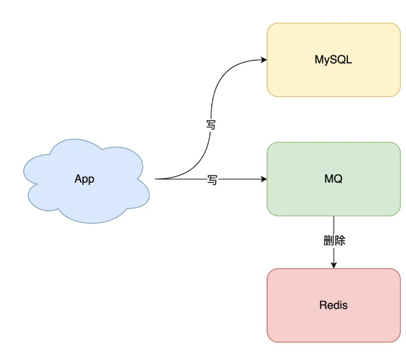
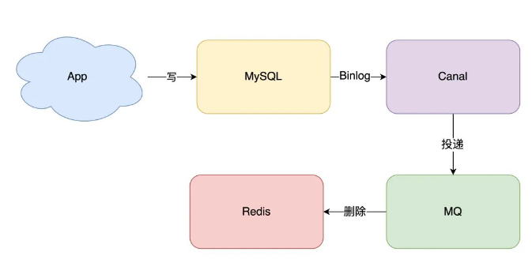

# 引入缓存提高性能{定时刷新}
随着业务量的增长，项目的请求增加，如果继续向数据库中 读取数据，就会产生性能问题。
这个阶段通常的做法就是引入**缓存**提高性能， 最简单的做法就是**全量数据**刷新到缓存中
- 数据库的数据，全量刷入缓存（不设置失效时间）
- 写请求只更新数据库，不更新缓存
- 启动一个定时任务，定时把数据库的数据，更新到缓存中

优点：
- 所有的读请求都可以直接【命中】缓存，不需要查询数据库，性能非常高

缺点
1. 缓存利用率低，不经常访问的缓存还一直留在缓存中
2. 数据不一致，因为定时刷新，缓存和数据库之间存在不一致的行为

适合【体量小】 【数据一致性要求不高】的业务
   
# 缓存利用率和一致性问题
## 如何提高缓存利用率
1. 写请求依旧只写数据库
2. 读请求先读缓存，如果缓存不存在，则从数据库读取，并重建缓存
3. 同时，写入缓存中的数据，都设置失效时间
   
   
## 数据一致性问题
要想保证缓存和数据库「实时」一致，那就不能再用定时任务刷新缓存了。
所以，当数据发生更新时，我们不仅要操作数据库，还要一并操作缓存。
具体操作就是，修改一条数据时，不仅要更新数据库，也要连带缓存一起更新。
但数据库和缓存都更新，又存在先后问题，那对应的方案就有 2 个：
1. 先更新缓存，后更新数据库
2. 先更新数据库，后更新缓存

哪个方案更好呢？

先不考虑并发问题，正常情况下，无论谁先谁后，都可以让两者保持一致，但现在我们需要重点考虑「异常」情况。

因为操作分为两步，那么就很有可能存在「第一步成功、第二步失败」的情况发生。

### 1.先更新缓存，后更新数据库
如果缓存更新成功了，但数据库更新失败，那么此时缓存中是最新值，但数据库中是「旧值」。

虽然此时读请求可以命中缓存，拿到正确的值，但是，一旦缓存「失效」，就会从数据库中读取到「旧值」，重建缓存也是这个旧值。

这时用户会发现自己之前修改的数据又「变回去」了，对业务造成影响。

### 2.先更新数据库，后更新缓存

如果数据库更新成功了，但缓存更新失败，那么此时数据库中是最新值，缓存中是「旧值」。

之后的读请求读到的都是旧数据，只有当缓存「失效」后，才能从数据库中得到正确的值。

这时用户会发现，自己刚刚修改了数据，但却看不到变更，一段时间过后，数据才变更过来，对业务也会有影响。

可见，无论谁先谁后，但凡后者发生异常，就会对业务造成影响。那怎么解决这个问题呢？

这里我们还需要重点关注：并发问题。
# 并发引起的一致性问题
假设我们采用「先更新数据库，再更新缓存」的方案，并且两步都可以「成功执行」的前提下，如果存在并发，情况会是怎样的呢？

有线程 A 和线程 B 两个线程，需要更新「同一条」数据，会发生这样的场景：

线程 A 更新数据库（X = 1）
线程 B 更新数据库（X = 2）
线程 B 更新缓存（X = 2）
线程 A 更新缓存（X = 1）
最终 X 的值在缓存中是 1，在数据库中是 2，发生不一致。

也就是说，A 虽然先于 B 发生，但 B 操作数据库和缓存的时间，却要比 A 的时间短，执行时序发生「错乱」，最终这条数据结果是不符合预期的。

除此之外，我们从「缓存利用率」的角度来评估这个方案，也是不太推荐的。

这是因为每次数据发生变更，都「无脑」更新缓存，但是缓存中的数据不一定会被「马上读取」，这就会导致缓存中可能存放了很多不常访问的数据，浪费缓存资源。

而且很多情况下，写到缓存中的值，并不是与数据库中的值一一对应的，很有可能是先查询数据库，再经过一系列「计算」得出一个值，才把这个值才写到缓存中。

由此可见，这种「更新数据库 + 更新缓存」的方案，不仅缓存利用率不高，还会造成机器性能的浪费。

所以此时我们需要考虑另外一种方案：**删除缓存**。

# 删除缓存可以保证一致性吗？
删除缓存对应的方案也有 2 种：

先删除缓存，后更新数据库
先更新数据库，后删除缓存
经过前面的分析我们已经得知，但凡「第二步」操作失败，都会导致数据不一致。

这里我不再详述具体场景，你可以按照前面的思路推演一下，就可以看到依旧存在数据不一致的情况。

这里我们重点来看「并发」问题。
1) 先删除缓存，后更新数据库

如果有 2 个线程要并发「读写」数据，可能会发生以下场景：

线程 A 要更新 X = 2（原值 X = 1）
线程 A 先删除缓存
线程 B 读缓存，发现不存在，从数据库中读取到旧值（X = 1）
线程 A 将新值写入数据库（X = 2）
线程 B 将旧值写入缓存（X = 1）
最终 X 的值在缓存中是 1（旧值），在数据库中是 2（新值），发生不一致。

可见，先删除缓存，后更新数据库，当发生「读+写」并发时，还是存在数据不一致的情况。

2) 先更新数据库，后删除缓存---推荐方案

依旧是 2 个线程并发「读写」数据：

缓存中 X 不存在（数据库 X = 1）
线程 A 读取数据库，得到旧值（X = 1）
线程 B 更新数据库（X = 2)
线程 B 删除缓存
线程 A 将旧值写入缓存（X = 1）
最终 X 的值在缓存中是 1（旧值），在数据库中是 2（新值），也发生不一致。

这种情况「理论」来说是可能发生的，但实际真的有可能发生吗？

其实概率「很低」，这是因为它必须满足 3 个条件：但是并不保证不会发生
1. 缓存刚好已失效
2. 读请求 + 写请求并发
3. 更新数据库 + 删除缓存的时间（步骤 3-4），要比读数据库 + 写缓存时间短（步骤 2 和 5）

仔细想一下，条件 3 发生的概率其实是非常低的。

因为写数据库一般会先「加锁」，所以写数据库，通常是要比读数据库的时间更长的。

这么来看，「先更新数据库 + 再删除缓存」的方案，是可以保证数据一致性的。

所以，我们应该采用这种方案，来操作数据库和缓存。

好，解决了并发问题，我们继续来看前面遗留的，第二步执行「失败」导致数据不一致的问题。

# 如何保证两步都执行成功
前面我们分析到，无论是更新缓存还是删除缓存，只要第二步发生失败，那么就会导致数据库和缓存不一致。

保证第二步成功执行，就是解决问题的关键。

想一下，程序在执行过程中发生异常，最简单的解决办法是什么？

答案是：重试。

是的，其实这里我们也可以这样做。

无论是先操作缓存，还是先操作数据库，但凡后者执行失败了，我们就可以发起重试，尽可能地去做「补偿」。

那这是不是意味着，只要执行失败，我们「无脑重试」就可以了呢？

答案是否定的。现实情况往往没有想的这么简单，失败后立即重试的问题在于：

立即重试很大概率「还会失败」
「重试次数」设置多少才合理？
重试会一直「占用」这个线程资源，无法服务其它客户端请求
看到了么，虽然我们想通过重试的方式解决问题，但这种「同步」重试的方案依旧不严谨。

那更好的方案应该怎么做？

答案是：**异步重试**。什么是》异步重试？

## 异步重试---增加MQ
其实就是把重试请求写到「消息队列」中，然后由专门的消费者来重试，直到成功。

或者更直接的做法，为了避免第二步执行失败，我们可以把操作缓存这一步，直接放到消息队列中，由消费者来操作缓存。

到这里你可能会问，写消息队列也有可能会失败啊？而且，引入消息队列，这又增加了更多的维护成本，这样做值得吗？

这个问题很好，但我们思考这样一个问题：如果在执行失败的线程中一直重试，还没等执行成功，此时如果项目「重启」了，那这次重试请求也就「丢失」了，那这条数据就一直不一致了。

所以，这里我们必须把重试或第二步操作放到另一个「服务」中，这个服务用「消息队列」最为合适。这是因为消息队列的特性，正好符合我们的需求：

消息队列保证可靠性：写到队列中的消息，成功消费之前不会丢失（重启项目也不担心）
消息队列保证消息成功投递：下游从队列拉取消息，成功消费后才会删除消息，否则还会继续投递消息给消费者（符合我们重试的场景）
至于写队列失败和消息队列的维护成本问题：

写队列失败：操作缓存和写消息队列，「同时失败」的概率其实是很小的
维护成本：我们项目中一般都会用到消息队列，维护成本并没有新增很多
所以，引入消息队列来解决这个问题，是比较合适的。这时架构模型就变成了这样：

## 订阅数据库变更日志，再操作缓存
那什么时候操作缓存呢？这就和数据库的「变更日志」有关了。

拿 MySQL 举例，当一条数据发生修改时，MySQL 就会产生一条变更日志（Binlog），
我们可以订阅这个日志，拿到具体操作的数据，然后再根据这条数据，去删除对应的缓存。

订阅变更日志，目前也有了比较成熟的开源中间件，例如阿里的 canal，使用这种方案的优点在于：

无需考虑写消息队列失败情况：只要写 MySQL 成功，Binlog 肯定会有
自动投递到下游队列：canal 自动把数据库变更日志「投递」给下游的消息队列
当然，与此同时，我们需要投入精力去**维护 canal 的高可用和稳定性。**

# 主从库延迟和延迟双删的问题

第一个问题，还记得前面讲到的「先删除缓存，再更新数据库」方案，导致不一致的场景么？

这里我再把例子拿过来让你复习一下：

2 个线程要并发「读写」数据，可能会发生以下场景：

线程 A 要更新 X = 2（原值 X = 1）
线程 A 先删除缓存
线程 B 读缓存，发现不存在，从数据库中读取到旧值（X = 1）
线程 A 将新值写入数据库（X = 2）
线程 B 将旧值写入缓存（X = 1）
最终 X 的值在缓存中是 1（旧值），在数据库中是 2（新值），发生不一致。

第二个问题：是关于「读写分离 + 主从复制延迟」情况下，缓存和数据库一致性的问题。

在「先更新数据库，再删除缓存」方案下，「读写分离 + 主从库延迟」其实也会导致不一致：

线程 A 更新主库 X = 2（原值 X = 1）
线程 A 删除缓存
线程 B 查询缓存，没有命中，查询「从库」得到旧值（从库 X = 1）
从库「同步」完成（主从库 X = 2）
线程 B 将「旧值」写入缓存（X = 1）
最终 X 的值在缓存中是 1（旧值），在主从库中是 2（新值），也发生不一致。

那怎么解决这类问题呢？

最有效的办法就是，把缓存删掉。

但是，不能立即删，而是需要「延迟删」，这就是业界给出的方案：[缓存延迟双删策略]。

按照延时双删策略，这 2 个问题的解决方案是这样的：

[解决第一个问题]：在线程 A 删除缓存、更新完数据库之后，先「休眠一会」，再「删除」一次缓存。

[解决第二个问题]：线程 A 可以生成一条「延时消息」，写到消息队列中，消费者延时「删除」缓存。

这两个方案的目的，都是为了把缓存清掉，这样一来，下次就可以从数据库读取到最新值，写入缓存。

但问题来了，这个「延迟删除」缓存，延迟时间到底设置要多久呢？

问题1：延迟时间要大于「主从复制」的延迟时间
问题2：延迟时间要大于线程 B 读取数据库 + 写入缓存的时间
但是，这个时间在分布式和高并发场景下，其实是很难评估的。

很多时候，我们都是凭借经验大致估算这个延迟时间，例如延迟 1-5s，只能尽可能地降低不一致的概率。

所以你看，采用这种方案，也只是尽可能保证一致性而已，极端情况下，还是有可能发生不一致。

所以实际使用中，我还是建议你采用「[先更新数据库，再删除缓存]」的方案，同时，要尽可能地保证「主从复制」不要有太大延迟，降低出问题的概率。

### 读写锁（强一致）：
使用Redisson实现读写锁，在读的时候添加共享锁，可以保证读读不互斥，读写互斥。当我们更新数据的时候，添加排他锁，它是读写，读读都互斥，这样就能保证在写数据的同时是不会让其他线程读数据的，避免了脏数据。这里面需要注意的是读方法和写方法上需要使用同一把锁才行。

### 异步通知（延时一致）：
1、使用RabbitMQ中间件，在数据发生更新后发一条消息到MQ，缓存服务监听MQ消息更新缓存。由于消息需要经过MQ，会有一定的延迟，所以是延时一致。

2、采用的阿里的canal组件实现数据同步：不需要更改业务代码，部署一个canal服务。canal服务把自己伪装成mysql的一个从节点，当mysql数据更新以后，canal会读取binlog数据，然后在通过canal的客户端获取到数据，更新缓存即可。

方案比较和选择：
强一致性 vs 延时一致性：根据业务需求选择合适的数据一致性方案，权衡一致性级别和性能开销。
性能和可靠性权衡：评估不同方案在性能和可靠性方面的特点，并根据需求做出选择。
根据业务需求选择方案：考虑业务的实际需求，例如数据更新的频率、对数据实时性的要求以及系统的可扩展性。

# 可以做到强一致吗

看到这里你可能会想，这些方案还是不够完美，我就想让缓存和数据库「强一致」，到底能不能做到呢？

其实很难。

要想做到强一致，最常见的方案是 2PC、3PC、Paxos、Raft 这类一致性协议，但它们的性能往往比较差，而且这些方案也比较复杂，还要考虑各种容错问题。

相反，这时我们换个角度思考一下，我们引入缓存的目的是什么？

没错，性能。

一旦我们决定使用缓存，那必然要面临一致性问题。性能和一致性就像天平的两端，无法做到都满足要求。

而且，就拿我们前面讲到的方案来说，当操作数据库和缓存完成之前，只要有其它请求可以进来，都有可能查到「中间状态」的数据。

所以如果非要追求强一致，那必须要求所有更新操作完成之前期间，不能有「任何请求」进来。

虽然我们可以通过加「分布锁」的方式来实现，但我们要付出的代价，很可能会超过引入缓存带来的性能提升。

所以，既然决定使用缓存，就必须容忍「一致性」问题，我们只能尽可能地去降低问题出现的概率。

同时我们也要知道，缓存都是有「失效时间」的，就算在这期间存在短期不一致，我们依旧有失效时间来兜底，这样也能达到最终一致。