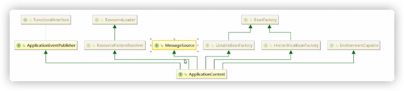

# spring 框架的诞生

框架概念的出现：
- framework 是基于基础技术之上，从众多业务中抽取出的通用解决方案
- 框架是一个半成品，使用框架规定的语法开发可提高开发效率，可用简单代码就能完成复杂的基础业务
- 框架内部使用大量的设计模式，算法，底层代码操作技术，如反射、内省、xml解析，注解解析等
- 框架一般都具备扩展性
- 有了框架，我们可将精力尽可能投入在纯业务开发上而不用去费心技术实现以及一些辅助业务

java中常用的框架

不同语言，不同领域都有属于自己的框架，使用框架开发是作为程序员的最基础的底线。

java语言中的框架，可分为基础框架和服务框架
- 基础框架：完成基本业务操作的框架，如MyBatis, Spring, SpringMVC, Struts2, Hibernate等
- 服务框架：特定领域的框架，一般还可以对外提供服务框架，如MQ, ES,Nacos等

# spring 框架的概念
- spring是分层的java SE/EE应用**full-stack轻量级**开源框架，
- 以IOC(inverse of control：反转控制）和AOP(Aspect Oriented Programming:面向切面编程)为内核 
- 提供了展现层spring mvc 和持久层spring JDBCTemplate 以及业务层事务管理等众多企业级应用技术，
- 还能整合开源世界众多著名的第三方框架和类库，逐渐成为使用最多的java EE企业应用开源框
  
# spring 框架的优势
1、方便解耦，简化开发

      Spring 就是一个大工厂，可以将所有对象的创建和依赖关系的维护交给 Spring 管理。避免硬编码造成的过度耦合
      用户也不必再为单例模式类，属性文件解析等这些很底层的需求编写代码，更专注于上层的应用
2、方便集成各种优秀框架

      Spring 不排斥各种优秀的开源框架，其内部提供了对各种优秀框架（如 Struts2、Hibernate、MyBatis 等）的直接支持。
3、降低 Java EE API 的使用难度

      Spring 对 Java EE 开发中非常难用的一些 API（JDBC、JavaMail、远程调用等）都提供了封装，使这些 API 应用的难度大大降低。
4、方便程序的测试

      Spring 支持 JUnit4，可以通过注解方便地测试 Spring 程序。
5、AOP 编程的支持

      Spring 提供面向切面编程，可以方便地实现对程序进行权限拦截和运行监控等功能。
      许多不容易用 传统OOP实现的功能可通过AOP轻松实现

6、声明式事务的支持

      只需要通过配置就可以完成对事务的管理，而无须手动编程。提高开发效率和质量

# ApplicationContext和BeanFactory的区别
1.	BeanFactory是Spring的早期接口，成为Spring的Bean工厂，ApplicationContext是后期更高级的接口，称之为Spring容器
2.	ApplicationContext在BeanFactory基础上对功能进行扩展，如：监听功能，国际化功能等。BeanFactory的API更偏向底层，ApplicationContext的API大多数是对这些底层API的封装
3.	Bean创建的主要逻辑和功能都被BeanFactory中，ApplicationContext不仅继承BeanFactory，而且ApplicationContext内部还维护着BeanFactory的引用，所以ApplicationContext与BeanFactory既有继承(is-a)关系又有has-a关系
4.	Bean的初始化时机不同，原始BeanFactory是在首次调用getBean时 才进行Bean的创建而ApplicationContext则是配置文件加载，容器一创建就将Bean都实例化并初始化
      

      

