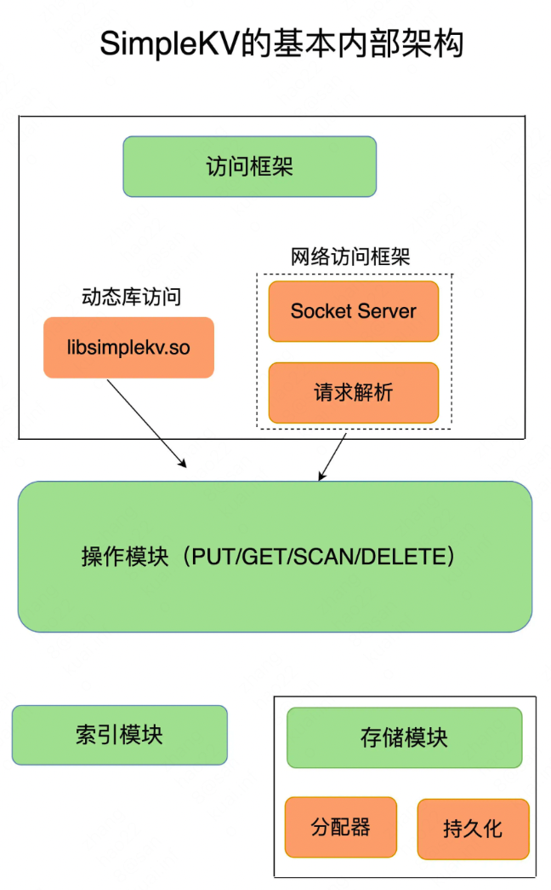

# 如何涉及一个简单的KV数据库

下面的内容仅供设计一个简单的KV数据库。 如果想要实现一个功能更强的KV数据库的话，还需要考虑：
1. 更加丰富的数据类型、
2. 数据压缩、过期机制、数据淘汰策略、集群化、高可用等功能，
3. 另外还可以增加统计模块、通知模块、调试模块、元数据查询等辅助功能。

## 数据模型
对于KV数据库而言，其基本的数据模型是KV模型，K一般是String类型，V可以是多种类型，
比如String、Hash、List等等。像Memcached的V只能是String类型，
Redis的V支持String、Hash、List、Set等。一般来说，支持的V类型越多，他的应用场景就越广泛。

## 操作接口

对于KV数据库而言，PUT、GET、DELETE、SCAN是他的基本操作集合。如果我们的业务还要求KV数据库具备更多的功能，
那么我们还可以在此基础上增加新的操作接口。比如一个比较高频的需求是根据用户id判断用户是否存在， 那么我们可以在增加一个EXIST操作接口。

当然，当一个KV数据库的V类型多样化时，就需要包含相应的操作接口。例如，Redis 的V有List类型， 因此它的接口就要包括对List的V的操作。

## KV的保存位置
一般考虑的位置无非就是内存和外存。

保存在内存的好处是[读写很快]，毕竟内存的访问速度一般都在百 ns 级别。但是潜在的风险是一旦掉电，所有的数据都会丢失。
保存在外存，虽然可以避免数据丢失，但是受限于磁盘的慢速读写（通常在几 ms 级别），KV数据库的整体性能会被拉低。
因此，如何进行设计选择，我们通常需要考虑键值数据库的主要应用场景。比如，[缓存场景下的数据需要能快速访问但允许丢失]，
那么，用于此场景的KV数据库通常采用内存保存KV数据。

## 访问框架设计 → 访问模式：

访问模式通常有两种：

1.通过函数库调用的方式供外部应用使用。
    比如上图中的 libsimplekv.so，就是以[动态链接库的形式链接]到我们自己的程序中，提供键值存储功能。--ROCKSDB

2. REDIS等 通过网络框架以 [Socket 通信的形式对外提供键值对操作]。这种形式可以提供广泛的键值存储服务。 
   网络框架中包括 Socket Server 和协议解析。不同的键值数据库服务器和客户端交互的协议并不相同，
   我们在对键值数据库进行二次开发、新增功能时，必须要了解和掌握键值数据库的通信协议，这样才能开发出兼容的客户端。
   通过网络框架提供键值存储服务，一方面扩大了键值数据库的受用面，但另一方面，也给键值数据库的性能、运行模型提供了不同的设计选择，
   带来了一些潜在的问题。

## 索引模块设计 → KV对定位：
索引的类型有很多，常见的有Hash、B+树、字典树等。不同的索引结构在性能、空间消耗、并发控制等方面具有不同的特征。
例如，Memcached 和 Redis 采用哈希表作为 key-value 索引，而 RocksDB 则采用[跳表]作为内存中 key-value 的索引。

一般而言，内存键值数据库（例如 Redis）采用哈希表作为索引，很大一部分原因在于，其KV数据基本都是保存在内存中的，
而内存的高性能随机访问特性可以很好地与哈希表 O(1) 的操作复杂度相匹配。

需要注意的是，如果[KV数据库的V支持不同类型]，那么当我们通过K定位到V后还需要在V这个数据结构中做进一步查询。

## 存储模块设计（分配器）→ 如何分配内存：
在C中常用的内存分配器有 glibc 的 malloc 和 free，因此一般KV数据库并不需要特别考虑内存空间的管理问题。
但是KV数据库的键值对通常大小不一，glibc的分配器在处理随机的大小内存块分配时，表现并不好。一旦保存的键值对数据规模过大，
就可能会造成较严重的内存碎片问题。因此，分配器是键值数据库中的一个关键因素。

## 存储模块设计（持久化） → 如何做到重启后快速提供服务：
因为磁盘管理要比内存管理复杂，简单的KV数据库可以直接采用了文件形式，将键值数据通过调用本地文件系统的操作接口保存在磁盘上
那么此时就只需要考虑何时将内存中的键值数据保存到文件中就可以了。

一种方式是，对于每一个键值对都对其进行落盘保存，这虽然让数据更加可靠，但是，因为每次都要写盘，数据库的性能会受到很大影响。

另一种方式是，只是周期性地把内存中的键值数据保存到文件中，这样可以避免频繁写盘操作的性能影响。但一个潜在的代价是数据仍然有丢失的风险。
